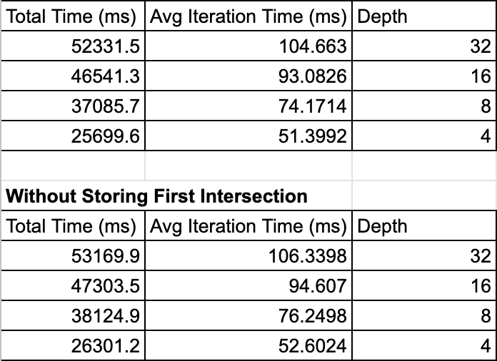
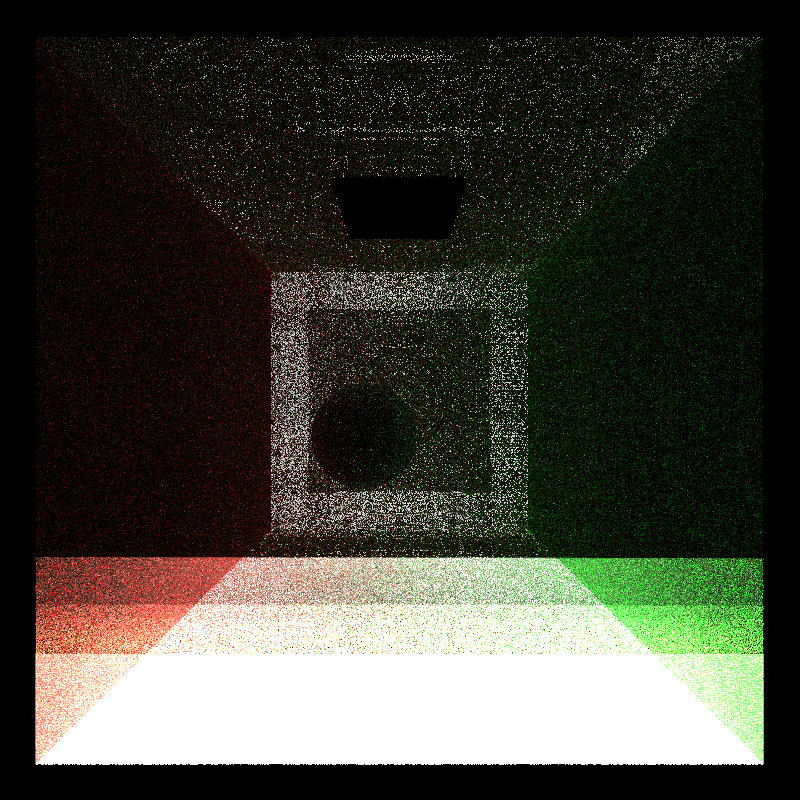

CUDA Path Tracer
================

**University of Pennsylvania, CIS 565: GPU Programming and Architecture, Project 3**
* Sydney Miller
  * [LinkedIn](https://www.linkedin.com/in/sydney-miller-upenn/)
* Tested on: GTX 222 222MB (CETS Virtual Lab)

### README

### Part 1

#### Sorting Intersections and Path Segements Based on Material
When a scene is large and there are many materials, this feature increases performance. Since there is branching involved with every different material, it is faster if threads all in the same warp branch the same, otherwise the threads would have to wait for the diverging threads. 

#### Performance Benefit Across Max Ray Depths with Caching the First Bounce Intersectioon 
These experiments were run with 500 iterations and used a Cuda timer. The runtime increases as depth increases, but caching the first intersection increases the runtime for all of the depths testes.

#### Bloopers

