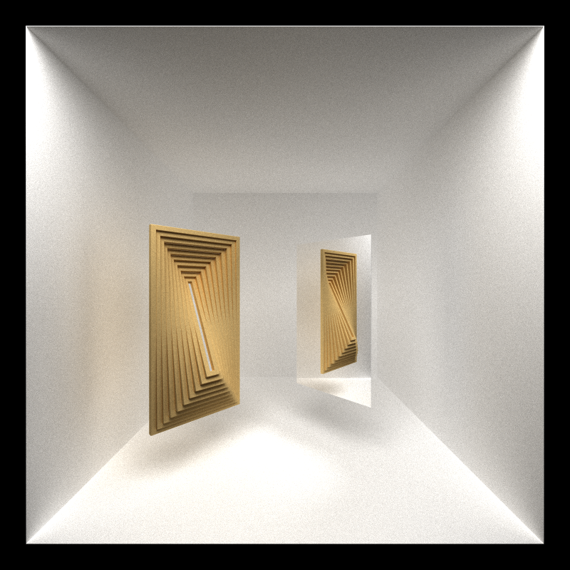
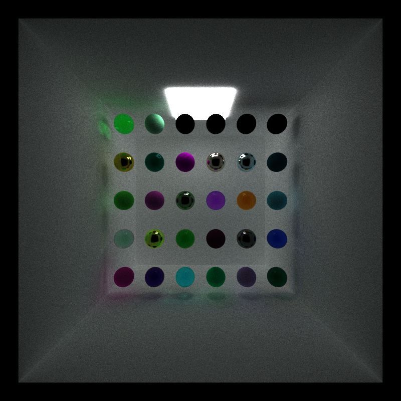
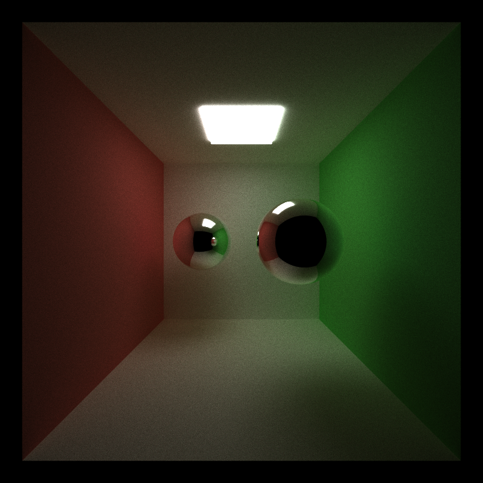
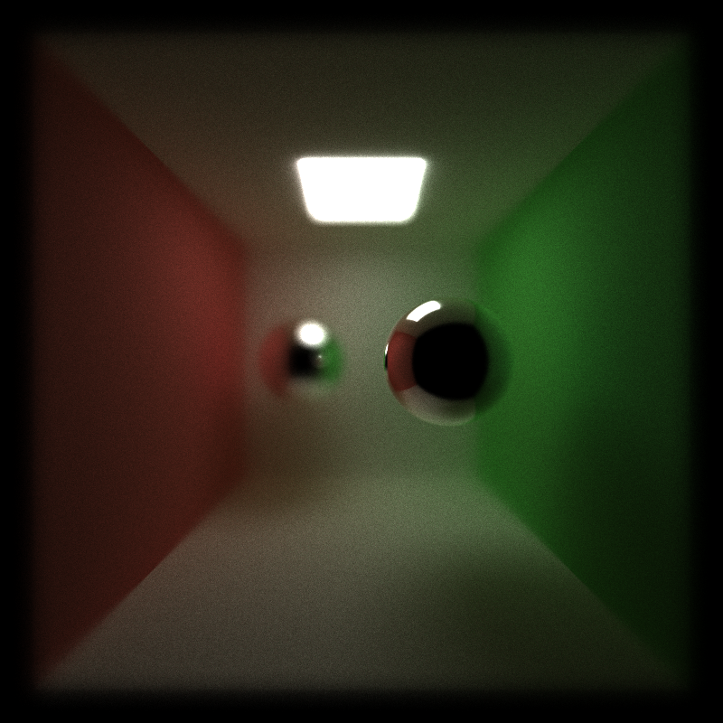
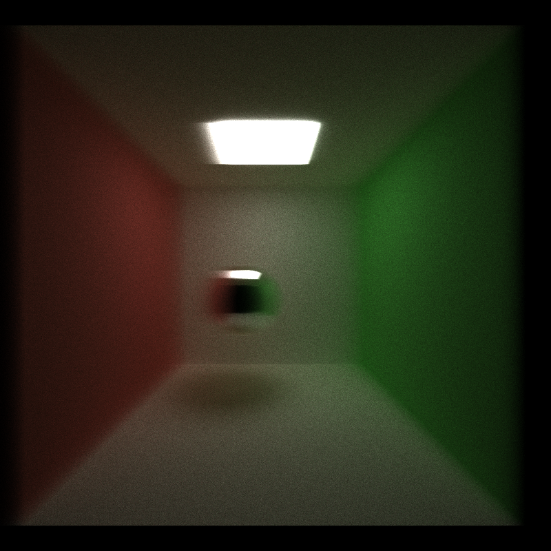
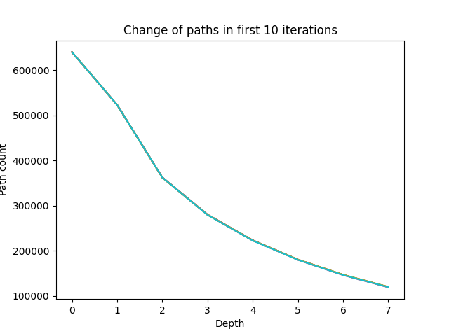
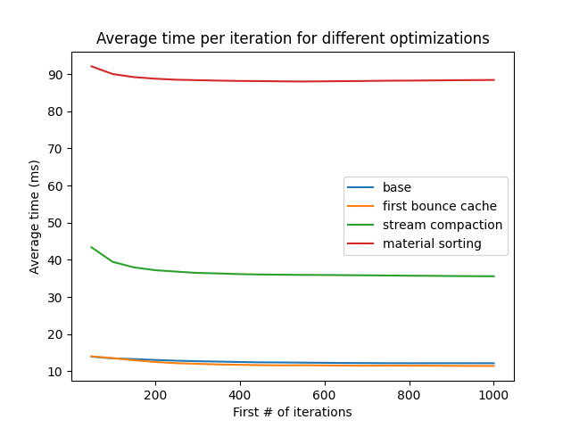
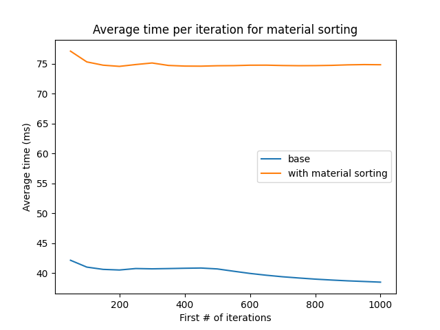

CUDA Path Tracer
================

**University of Pennsylvania, CIS 565: GPU Programming and Architecture, Project 3**

* Shenyue Chen
  * [LinkedIn](https://www.linkedin.com/in/shenyue-chen-5b2728119/), [personal website](http://github.com/EvsChen)
* Tested on: Windows 10, Intel Xeon Platinum 8259CL @ 2.50GHz 16GB, Tesla T4 (AWS g4dn-xlarge)

### Output

Custom OBJ file loading

Scenes used for materials sorting test

Two balls

Two balls with depth of field

Motion blur

### Features
Part 1
* Specular and diffuse shading
* Stream compaction to terminate rays
* Materials sorting
* First bounce cache

Part 2
* .OBJ file loading using [tinyobj](https://github.com/tinyobjloader/tinyobjloader)
* Motion blur
* Refraction and Schlick approximation

Part 3
* Depth of field
* Anti-aliasing
* [Small script](./scenes/gen_scene.py) for scene generation

### Performance analysis
#### Stream compaction for path termination
Below is the change of paths in the first 10 iterations of the cornell box image, with the basic diffuse and specular shading.

From the plot we can observe that the number of paths reduces greatly when the depth increases, because many rays terminated by not intersecting or intersecting with a light source. The number of paths is equal to the number of threads we launched in each kernel run. Therefore we increase the thread utilization by reducing the number of threads in kernel launch configuration.

#### Different optimization techniques
In this section, we measured the average time per iteration for the basic cornell box scene with different optimization techniques, for the first 1000 iterations. The result can be seen in the plot below.

We notice the the first bounce cache can improve the performance by a little bit. But the other parts seem to play a negative role. I assume this is because the scene is too simple and the sorting overhead is much over than the optimization is causes.

#### Material sorting testing
Specifically, I want to see whether more materials will affect the effect of optimization caused by the material sorting. So I created a scene of more than 30 materials and 30 objects, [materials.txt](./scenes/materials.txt). The rendered scene is on the top of the readme. And the time measures is shown below. 

Unfortunately, the sorting still decreases the performance. But the overhead is not so serious compared to the simple scene.