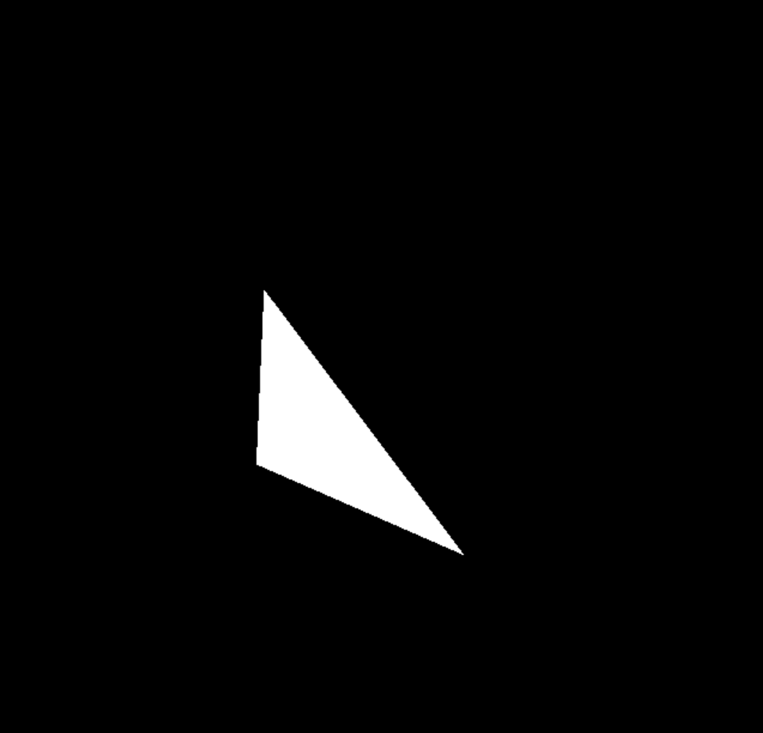
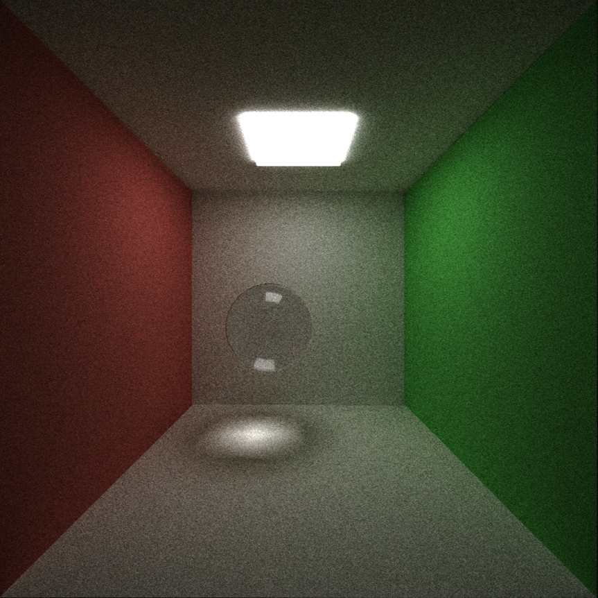
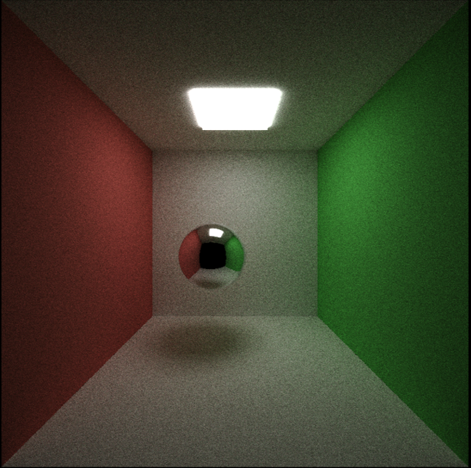
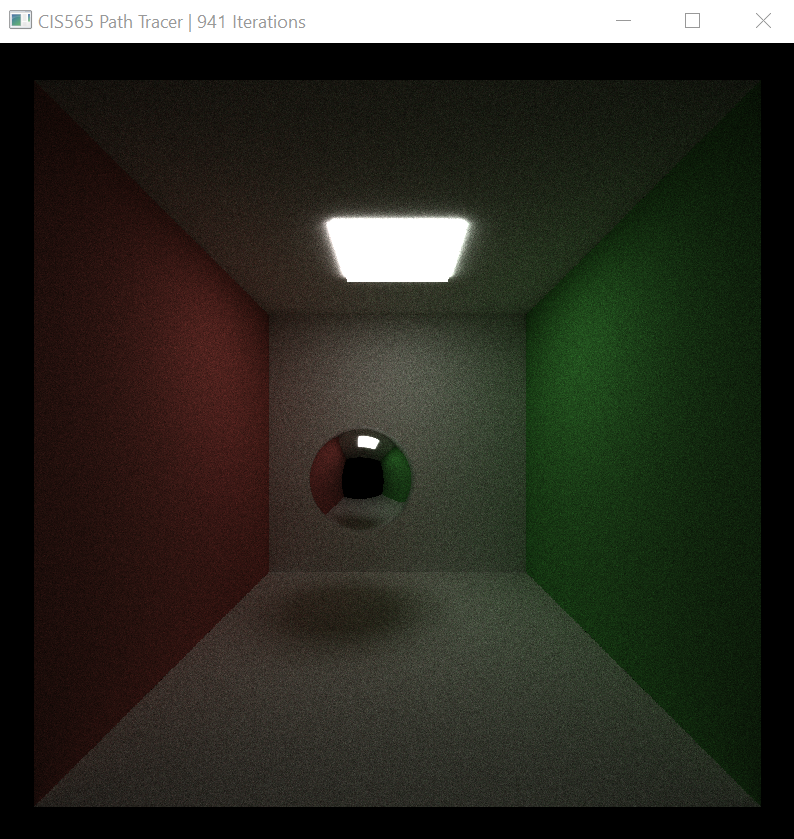
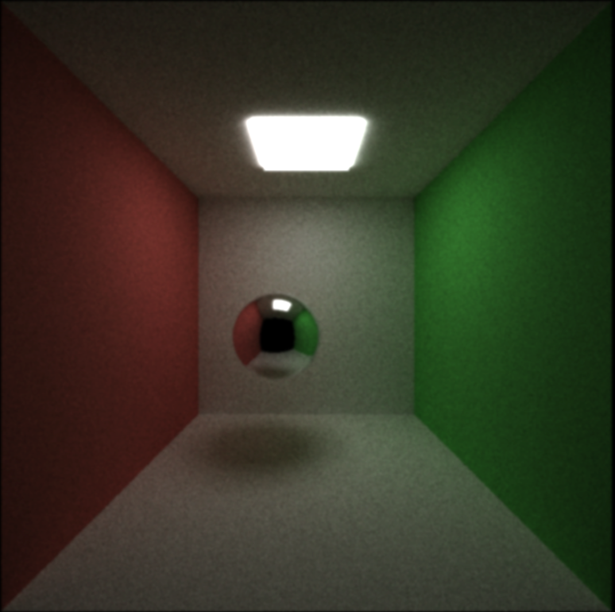
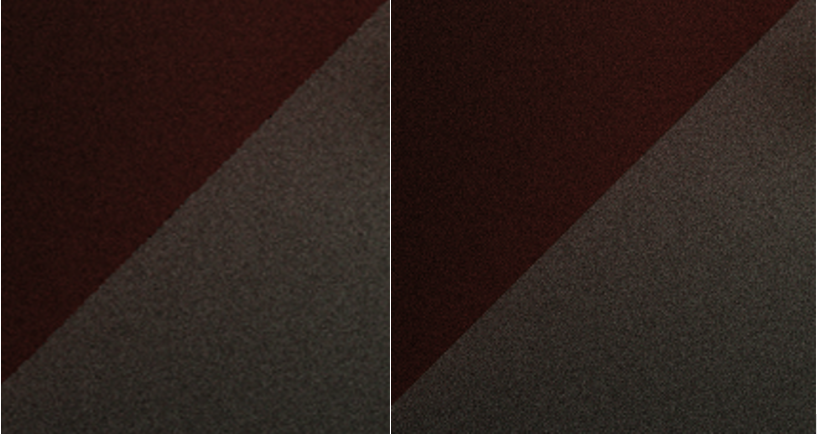

CUDA Path Tracer
================

**University of Pennsylvania, CIS 565: GPU Programming and Architecture, Project 3**

Nuofan Xu, Windows 10, AMD Ryzen 3800X, RTX2080 Super

A CUDA-accelerated path tracer: a global-illumination renderer.


*(The walls are implemented as diffusing surface, and the ball is implemented as perfect specular surface.)*
**

## Features
-Basic pathtracer
-Refractive, Reflective, and Diffused surfaces
-Depth of Field
-Direct Lighting

### Material Surfaces

The pathtracer supports the following material surfaces:

* diffuse: light scatters uniformly from the surface
* specular/reflective (perfect): light reflects perfectly off the surface.
* refractive (using [Schlick's Approximation][wiki-schlick] of the Fresnel
  effect to blend reflective and refractive light bounces).

  [wiki-schlick]: https://en.wikipedia.org/wiki/Schlick%27s_approximation

### Triangle checking ###


### Refractive Ball ###

*(The ball is implemented with 1.5 refraction rate)*

### Direct Light ### 
To get a direct lighting effect in our images we want to make the last bounce of each ray hit a light source. We do this by randomly selecting a point on a randomly selected light and setting the direction of the ray to that point. The first image is without direct lighting, and the second one we can see is overall brighter with the direct lighting enabled.



### Depth of Field

Depth of field simulates a physical aperture by varying the origin and direction
of rays shot from the camera. DOF is defined with a focal distance from the
camera, at which objects are perfectly in focus, and an aperture radius,
defining the amount of variance added to each ray.




*(no DOF; DOF with distance 5.5, aperture 0.4; around 1000 iterations each)*

### Antialiasing

Camera rays are shot from the camera's position in the direction of a pixel.
Antialiasing jitters the target of the ray within a pixel. This is a brief
computation that happens once per pixel per iteration; it has little impact on
performance.



*(Enlargement of antialiasing along wall corners (right) vs no antialiasing (left))*


### Stream compaction.

This pathtracer uses `thrust::remove_if` to perform stream compaction on dead
rays.

I also implemented a [GPU-shared-memory, work-efficient stream compaction
algorithm][p2-shared-mem]. Unfortunately I couldn't integrate that into this
project -- I suspect there are memory errors when I translated the stream
compaction to handle pathtracing structs rather than integer values.

  [p2-shared-mem]: https://github.com/terrynsun/CIS565-P2-Stream-Compaction


The type of scene has a large effect on the number of rays alive in a scene, as
expected. The type of box (closed/open) tends to define the trend line for how
many rays terminate at each bounce (by leaving the scene). The type of light
defines how many rays terminate on the very first ray shoot, but only has a
small effect on the trend line on rays terminating.


The first two bounces are faster because rays are still relatively clustered
(and thus would hit the same execution path within a warp). The third bounce
seems particularly affected by branching ray paths; after that, execution time
begins to shorten, probably due to more rays terminating.

Comparisons done with the demo scene at the top of this README (found in
`scenes/main.txt`) at 700x700. Open scenes have the front wall removed. Large
lights are 10x10 (entire ceiling); normal lights are 6x6.

## Run

To build: `make`

To run: `build/cis565_path_tracer SCENE_FILE.txt`.

Some sample scene files are found in `scenes/`.

### Controls

* Esc to save an image and exit.
* Space to save an image. Watch the console for the output filename.
* W/A/S/D and R/F move the camera. Arrow keys rotate.

### Scene File Format

This project uses a custom scene description format. Scene files are flat text
files that describe all geometry, materials, lights, cameras, and render
settings inside of the scene. Items in the format are delimited by empty lines,
and comments can be added using C-style `// comments`.

The camera is defined in the following fashion:

```
CAMERA //camera header
RES        (float x) (float y) //resolution
FOVY       (float fovy)        //vertical field of view half-angle.
ITERATIONS (float interations) //how many iterations to render the image before saving
DEPTH      (int depth)         //maximum depth (number of times the path will bounce)
FILE       (string filename)   //file to output render to upon completion
EYE        (float x) (float y) (float z) //camera's position in worldspace
VIEW       (float x) (float y) (float z) //camera's view direction
UP         (float x) (float y) (float z) //camera's up vector
DOF        (float focal dist) (float aperture radius)
```

Textures are defined in the following fashion:

```
TEXTURE (image name)
```

Materials are defined in the following fashion:

```
MATERIAL  (material ID)                 //material header
RGB       (float r) (float g) (float b) //diffuse color
SPECX     (float specx)                 //specular exponent
SPECRGB   (float r) (float g) (float b) //specular color
REFRIOR   (float ior)       //index of refraction for Fresnel effects
EMITTANCE (float emittance) //the emittance of the material; >0 is a light source
TEXTURE   (int textureid)   //texture corresponding to diffuse coloring
NORMAL    (int textureid)   //texture corresponding to a normal map
```

Objects are defined in the following fashion:

```
OBJECT (object ID)     //object header
(cube OR sphere)
material (material ID) //material to assign this object
TRANS (float x) (float y) (float z) //translation
ROTAT (float x) (float y) (float z) //rotation
SCALE (float x) (float y) (float z) //scale
```