CUDA Path Tracer
================

**University of Pennsylvania, CIS 565: GPU Programming and Architecture, Project 3**

* Sydney Miller
  * [LinkedIn](https://www.linkedin.com/in/sydney-miller-upenn/)
* Tested on: GTX 222 222MB (CETS Virtual Lab)

Table of contents
=================
   * [Overview of Path Tracing](#Overview)
   * [Features Overview](#features)
      * [BSDF Evaluation: Diffuse, Specular-Reflective, Refractive](#bsdf-evaluation)
      * [Physically-based depth-of-field](#depth-of-field)
      * [Stochastic Sampled Antialiasing](#stochastic-sampled-antialiasing)
      * [Obj Mesh Loading](#obj-mesh-loading)
      * [Procedural Shapes](#procedural-shapes)
      * [Procedural Shapes](#procedural-shapes)
      * [Procedural Textures](#procedural-textures)
      * [Better Hemisphere Sampling](#better-hemisphere-sampling)
  * [Optimizations ](#optimizations)
    * [Stream Compaction](#stream-compaction)
    * [Materials Contigious in Memory](#materials-contigious-in-memory)
    * [Cache First Intersection](#cache-first-intersection)
    * [Mesh Bounding Box](#mesh-bounding-box)
  * [Performance Analysis](#performance-analysis)
    * [Steam Compaction with Open and Closed Scenes](#steam-compaction-with-open-an-closed-scenes)
    * [Chaching First Intersection with Varying Depths](#chaching-first-intersection-with-varying-depths)

# Overview

# Features

## BSDF Evaluation

| Diffuse | Reflective | Refractive |
| ------------- | ----------- |----------- |
|   |  | 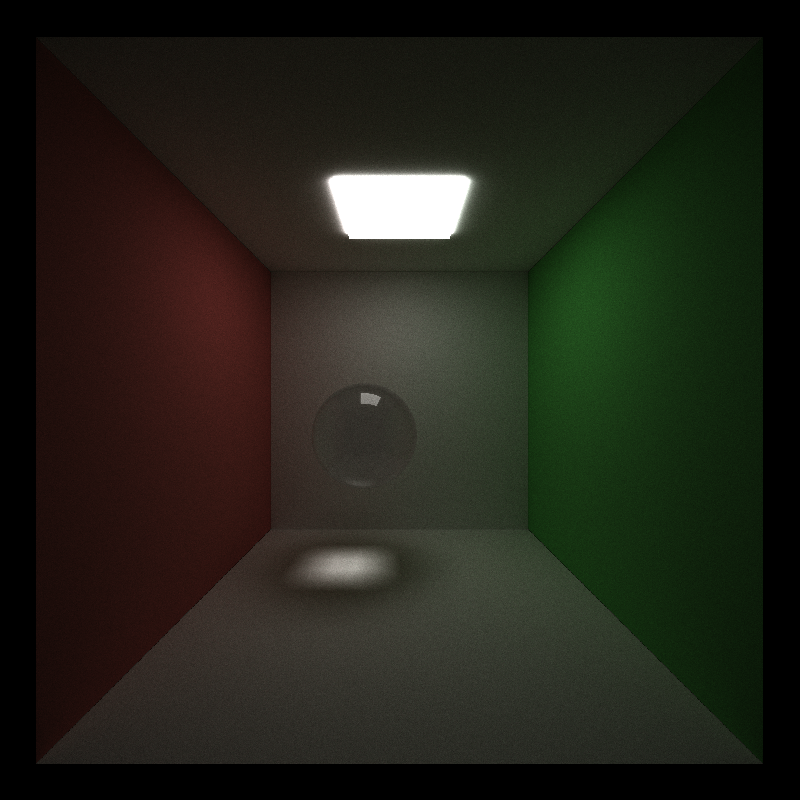 |
| Diffuse Blue | Reflective Blue | Refractive Blue |
| 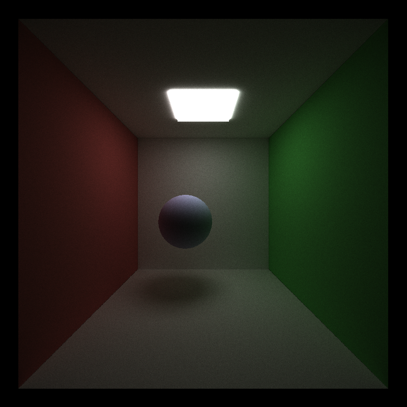  | 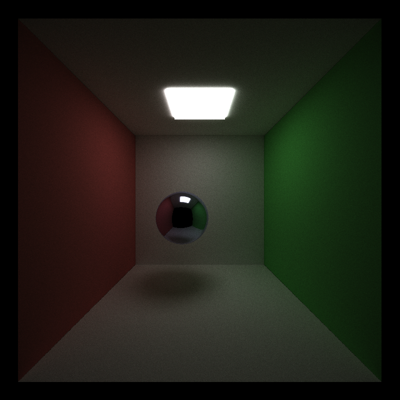 | 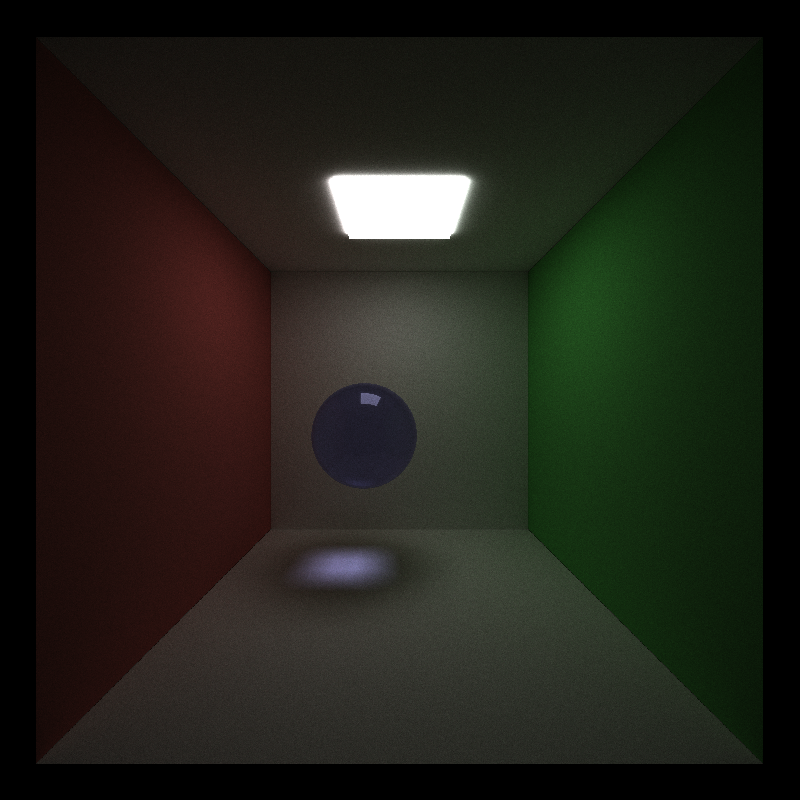 |

## Physically-based Depth-of-Field
| No Depth of Field | Depth of Field |
| ------------- | ----------- |
|   | 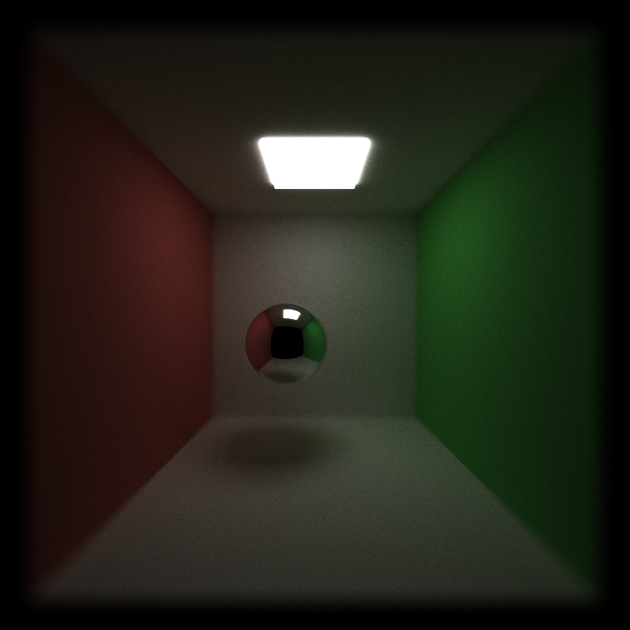 |

## Stochastic Sampled Antialiasing
| No Antialiasing | Antialiasing |
| ------------- | ----------- |
|   | 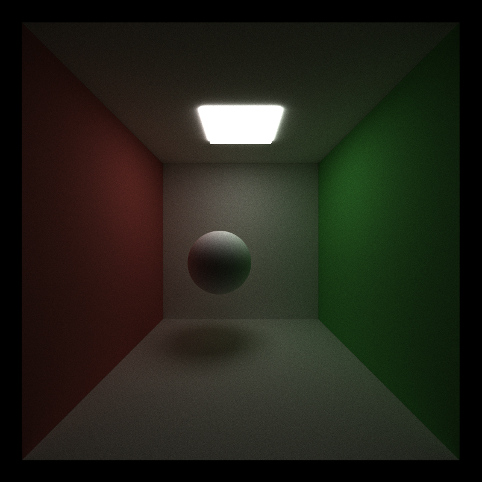 |

## Obj Mesh Loading
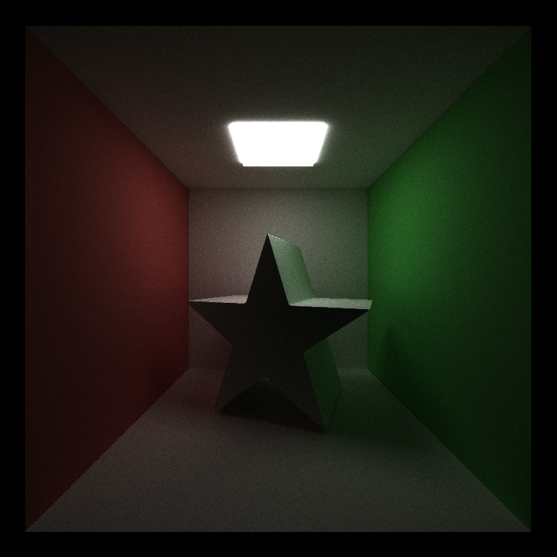

## Procedural Shapes
| ------------- | ----------- |
| 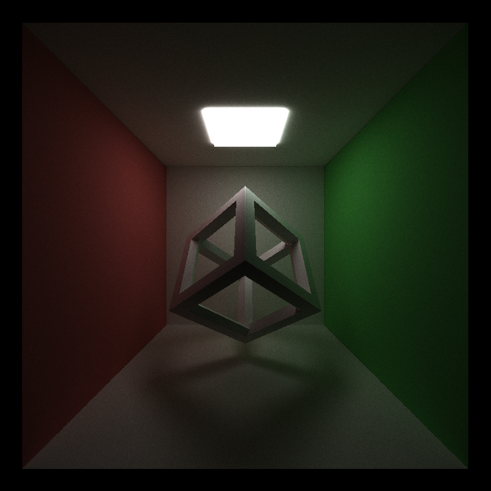  | 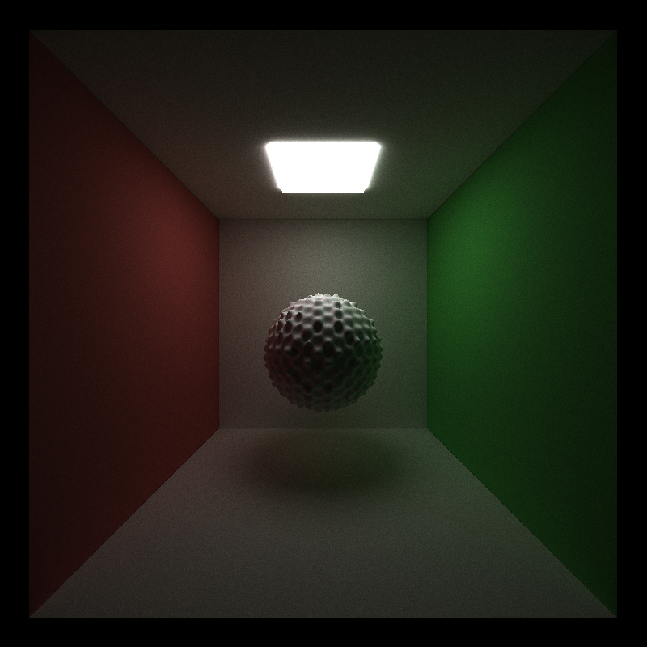 |

## Procedural Textures
| ------------- | ----------- |
| 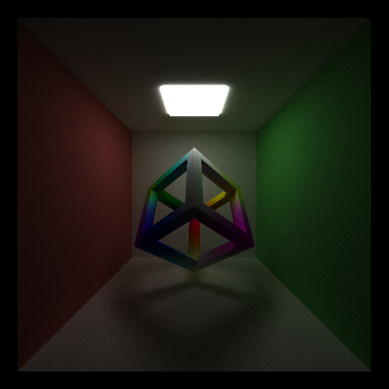  | 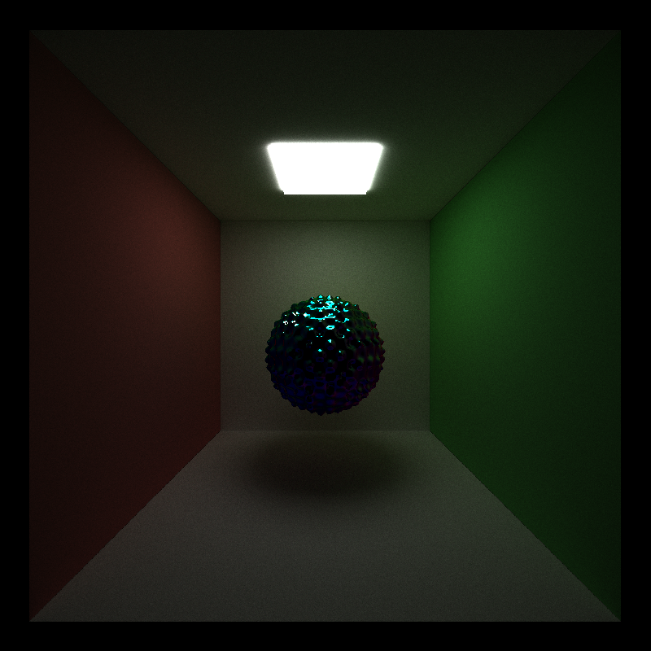 |

## Better Hemisphere Sampling

# Optimizations

## Stream Compaction

## Materials Contigious in Memory

## Cache First Intersection

## Mesh Bounding Box

# Performance Analysis

## Steam Compaction with Open and Closed Scenes

## Chaching First Intersection with Varying Depths

