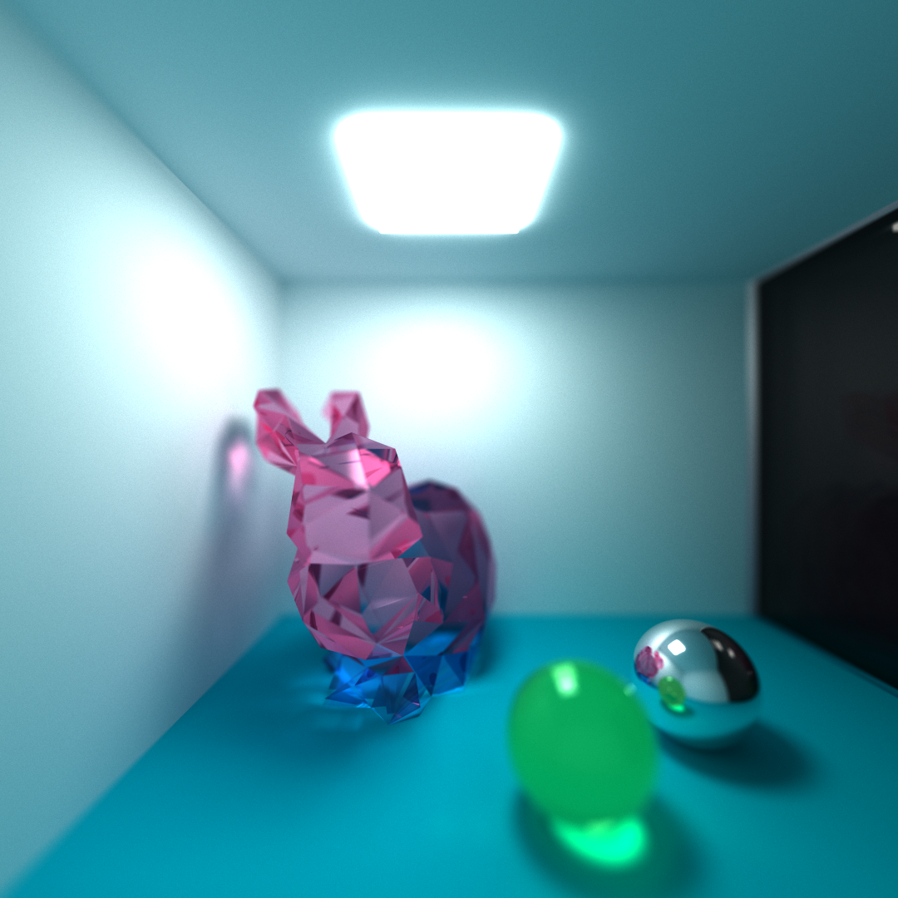
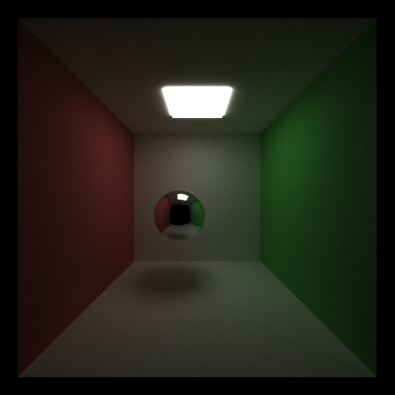
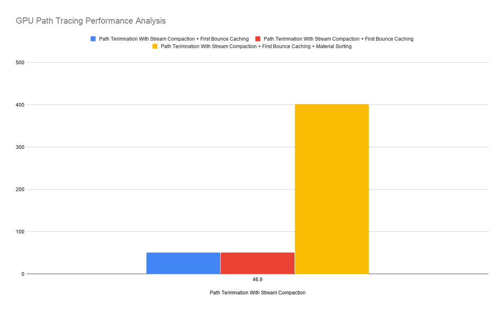

CUDA Path Tracer
================

**University of Pennsylvania, CIS 565: GPU Programming and Architecture, Project 3**

* Jacky Lu
  * [LinkedIn](https://www.linkedin.com/in/jacky-lu-506968129/)

# README
## Features
### * Path Continuation/Termination With Stream Compaction
### * Material Sorting And Contiguous Material Memory
### * First Bounce Caching
### * Probabilistic BSDF
### * Physically-Based Depth Of Field
### * OBJ File Loading
### * Bounding Box Intersection Culling
### * Stratified Sampling
### * Stochastic Sampled Antialiasing

=================================================================
## Results
### Ray Depth: 32 | Samples Per Pixel: 100,000 | Resolution: 1080 x 1080

### Ray Depth: 32 | Samples Per Pixel: 100,000 | Resolution: 1080 x 1080
### Depth of field enabled: 
### Focal Distance: 8.5 | Lens Radius: 0.5

### Interactive Demo
### Ray Depth: 8 | Samples Per Pixel: 5,000 | Resolution: 800 x 800

#### Bunny Model Credit:
Low Poly Stanford Bunny (http://www.thingiverse.com/thing:151081) by johnny6 is licensed under the Creative Commons - Attribution - Non-Commercial license.
http://creativecommons.org/licenses/by-nc/3.0/

### Performance Analysis (Default Scene File Settings):

