CUDA Path Tracer
================

**University of Pennsylvania, CIS 565: GPU Programming and Architecture, Project 3**

* Xuecheng Sun
* Tested on: Windows 10, R7 3700x @3.7GHz, RTX 2070 super 8GB

### Customized Scene: The Arsenal

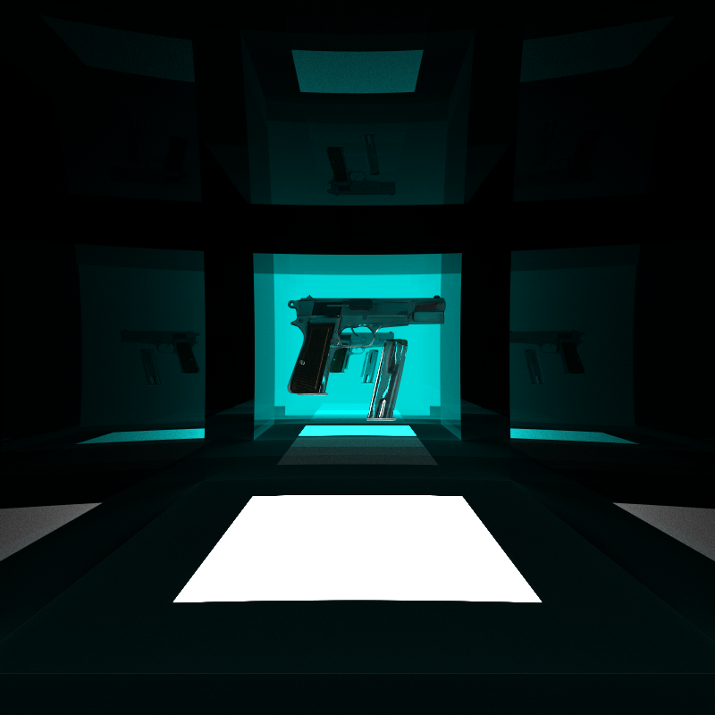

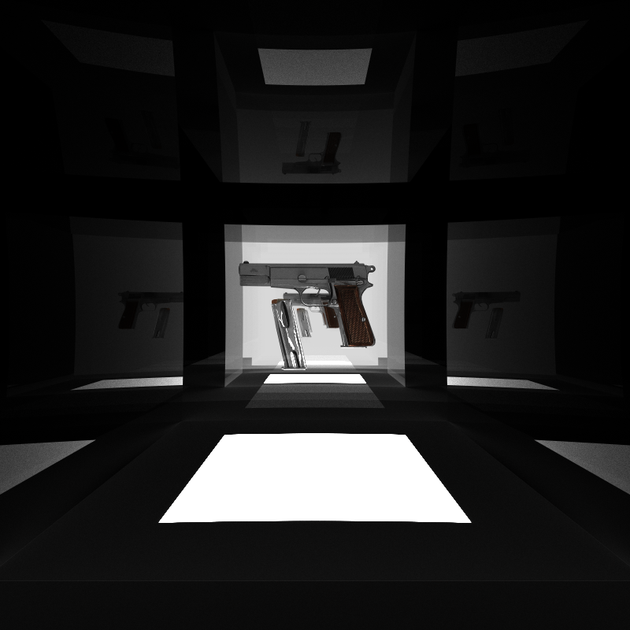

### Path Tracer Part 1

**Finished Feature:** 

	1. Specular and Diffuse Ray Scatter
 	2. Basic stream compaction of stop thread
 	3. First bounce caching

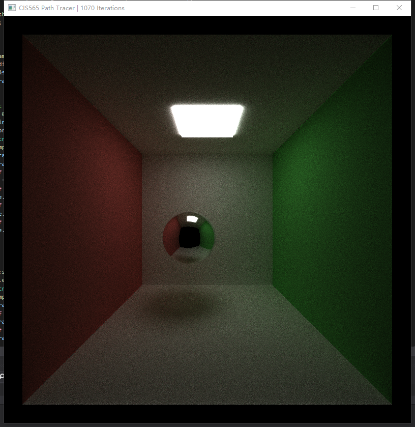

**Benchmark for First Ray Cache**

1. Sorted material can reduce the divergence in a thread warp which can significantly boost the render speed.

2. First bounce cache always provide a constant value improvement with different depth setting

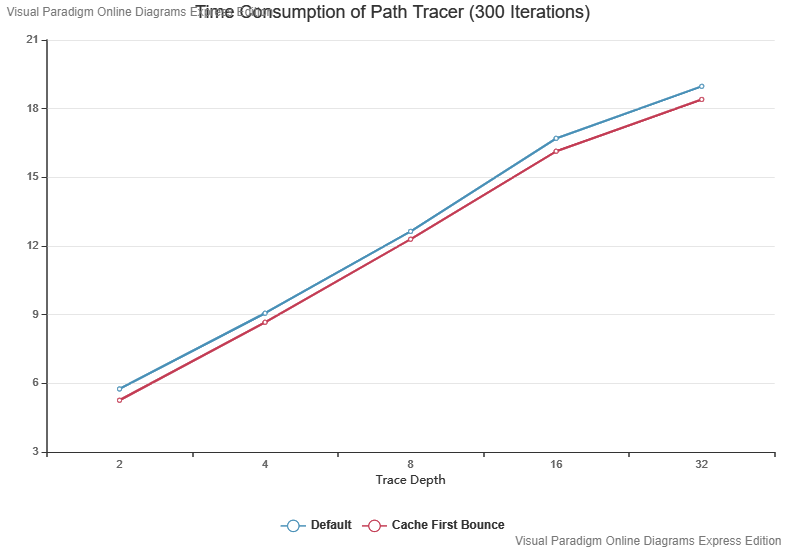

### Path Tracer Part 2 and 3

**1.  Different Materials**

Implemented perfect refractive, perfect reflective and Schlick's approximation fresnel materials:

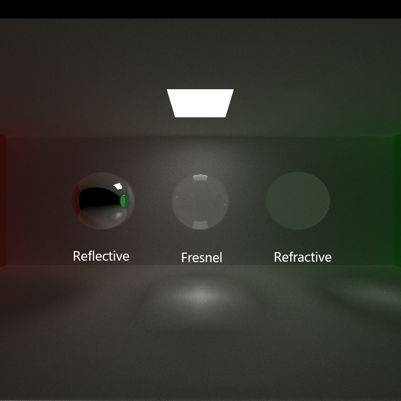

**2. Depth of Field and AA**

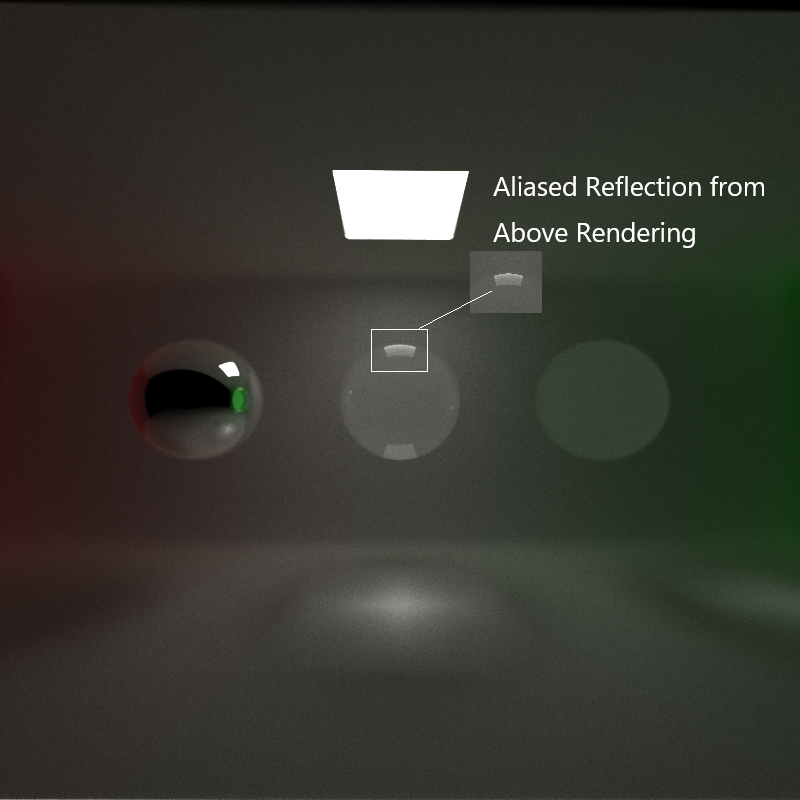

**3.Arbitrary Mesh(GLTF) Import**

​	**Extra Points: Texture Mapping: Base Color, Normal and Roughness**

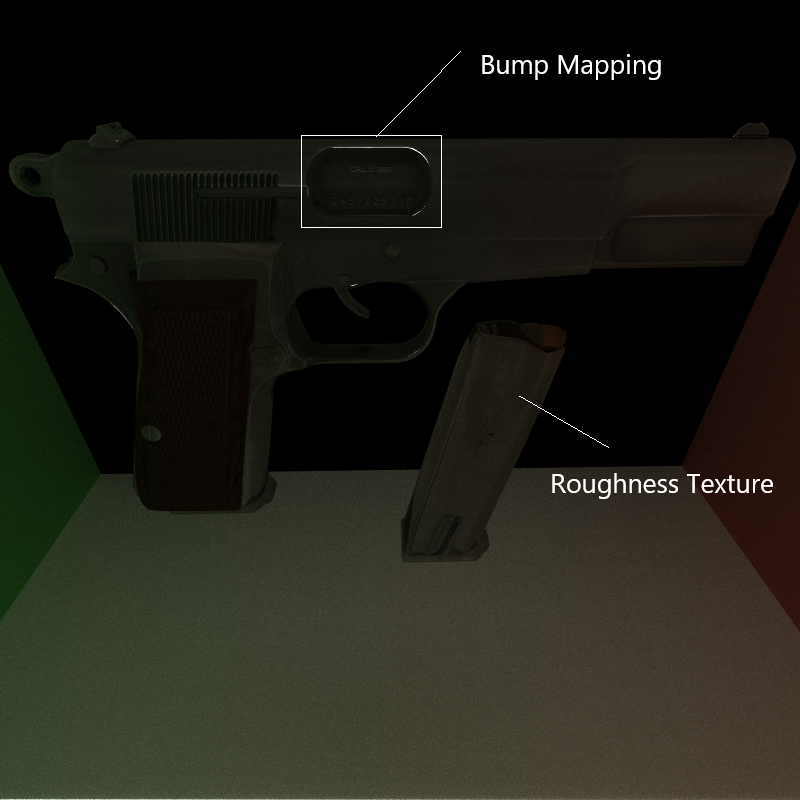

**4. Direct Light**

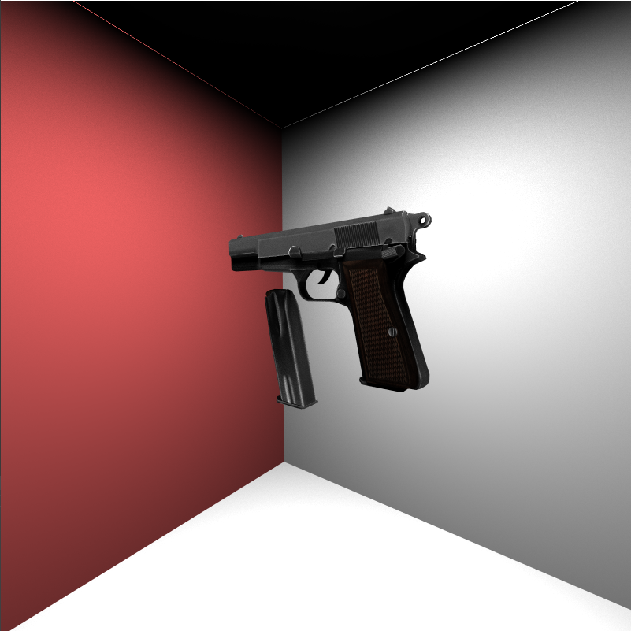

**5. Advance Sampling Method: Halton Sequence**

**Halton Direct Light Sampling**

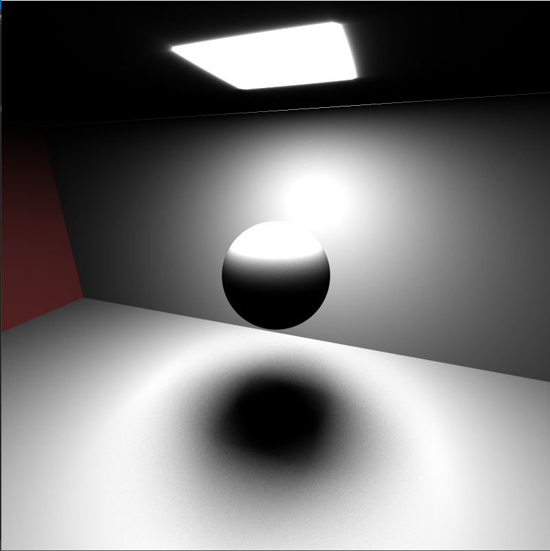

**Random Direct Light Sampling as Reference**

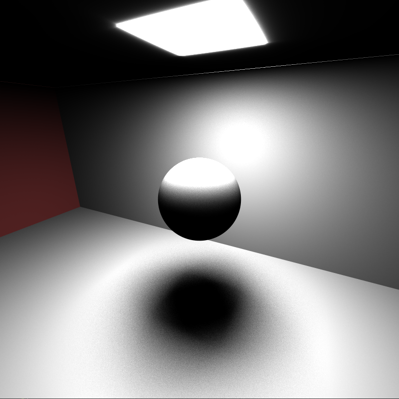

Shadows under Halton Sampling are more regularized.

**6. Octree(Partially)**

I build the octree for primitives and triangle but find for mesh triangles, it always aggregates in the root node which finally slow down the rendering. 

### Benchmark for Bounding Box

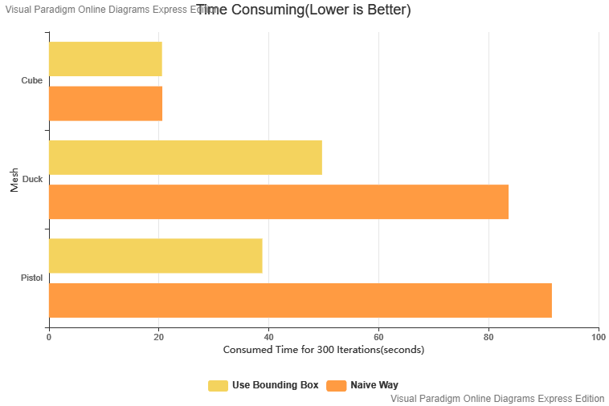

For a very simple mesh such as cube the bounding box didn't help much for the rendering speed, but if we render a more complex mesh like pistol or duck which have more than 4000 triangles, the bounding box improved the performance greatly.

### Third Libraries

Tinygltf libraries: GLTF Loader