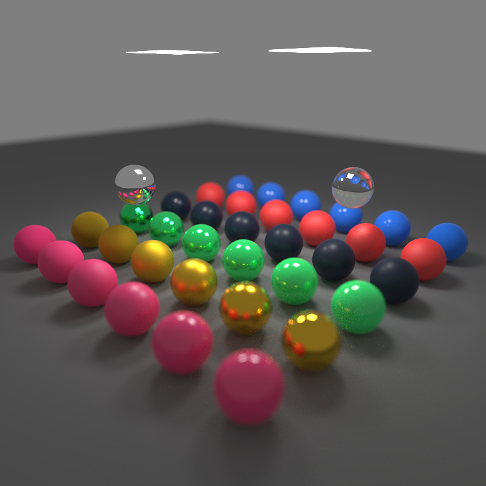
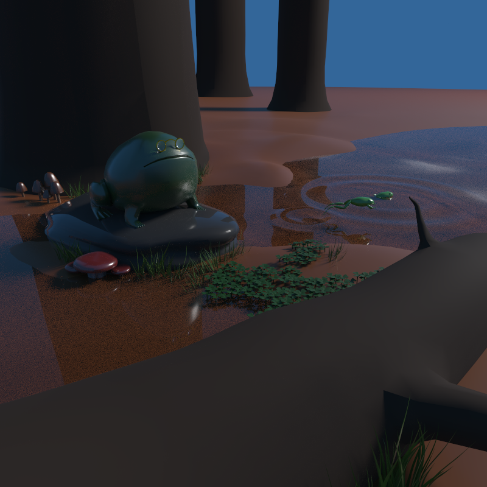
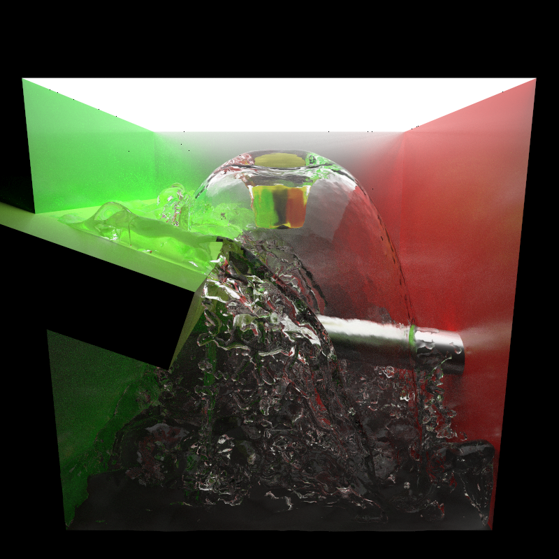
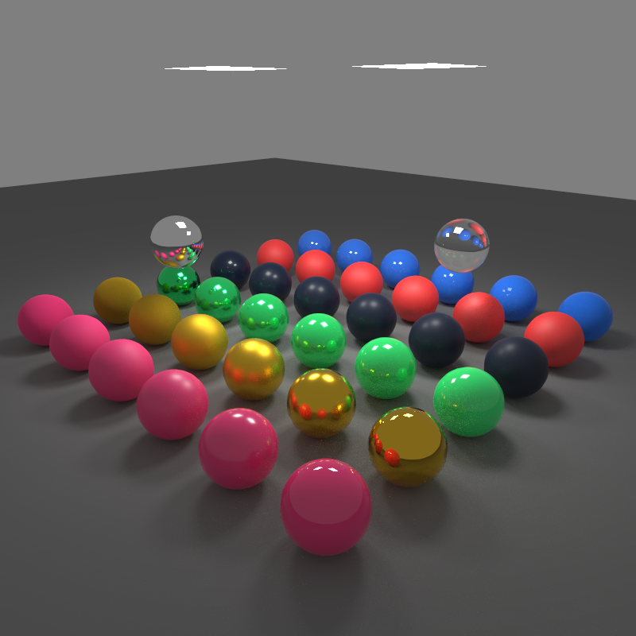
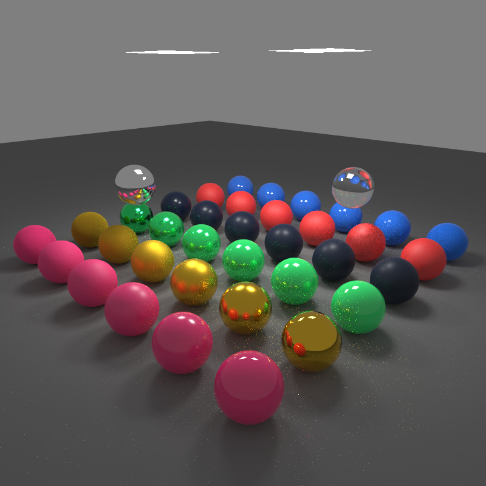
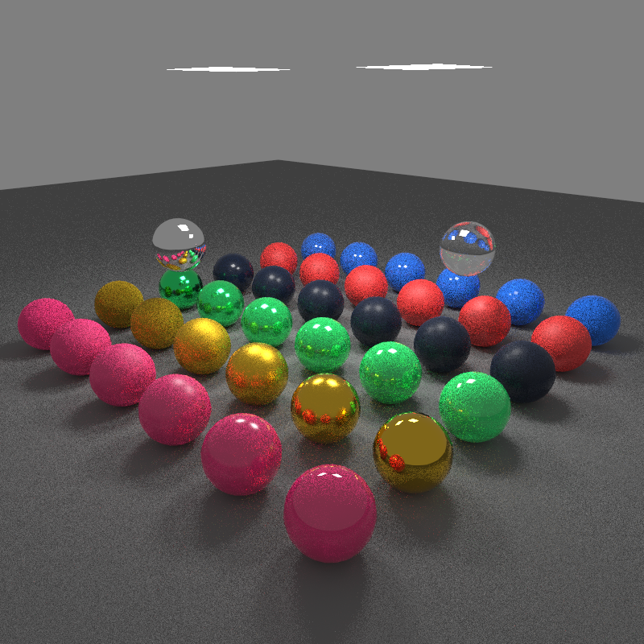

CUDA Path Tracer
================

**University of Pennsylvania, CIS 565: GPU Programming and Architecture, Project 3**

* Xuanyi Zhou
* Tested on: Windows 10, i7-9750H @ 2.60GHz 32GB, RTX 2060 6GB

Exhibition of different Disney materials with depth-of-field. The scene is composed of 29646 triangles. This image uses 4096 samples and took about 4 minutes (18 FPS) to render.

A scene I modeled for the course FNAR 567, consisting of 266988 triangles. Disney materials are used extensively in the scene. This image uses 1024 samples and took about 2 min 40 s (6 FPS) to render.

A scene produced by the fluid simulator I wrote last semester, consisting of 392080 triangles. This image uses 1024 samples and took about 6 min 40 s (2.5 FPS) to render.

# Features

## Disney BRDF

The Disney BRDF is a physically-based bidirectional reflectance distribution function with intuitive and artist-friendly parameters. This path tracer implements an isotropic version of it which includes the following attributes: base color, roughness, metallic, specular, specular tint, sheen, sheen tint, clearcoat, and clearcoat gloss. An exhibition of these materials can be seen in the image above, where each row of spheres, from bottom left to top right, exhibit varying non-metallic roughness, metallic roughness, metallic, clearcoat glossiness, sheen, and specularity.

In addition to the evaluation of this BRDF, this path tracer also implements importance sampling which greatly improves convergence speed. While it's possible to render diffuse surfaces with just uniform or cosine-weighted sampling, it's virtually impossible to obtain a converged render containing specular materials. Furthermore, while the adoption of importance sampling alters the paths taken, the sampling process itself requires little computation.

The implementation of this feature referenced [Disney's implementation in BRDF explorer](https://github.com/wdas/brdf/blob/main/src/brdfs/disney.brdf) and [Shin-Chin's blog post about implementing the BRDF in Arnold](http://shihchinw.github.io/2015/07/implementing-disney-principled-brdf-in-arnold.html). This implementation corrects a mistake in Shin-Chin's implementation of importance sampling of the clearcoat lobe. The Disney implementation multiplies the clearcoat lobe weight by 1/4, but this would usually make the clearcoat reflections too dark. This implementation mirrors Shin-Chin's implementation and omits the coefficient.

This feature does not benefit from being implemented on the GPU besides the parallelism. The importance sampling process includes a three-way branch, but it's unclear whether it can be eliminated. Moreover, the sampling strategy does not take into accouint the validity of outgoing rays, and it can be modified to generate higher-quality samples.

## Multiple Importance Sampling

A render of the Disney scene with 256 samples, rendered with MIS.

A render of the Disney scene with 256 samples, rendered with only importance sampling.

Multiple importance sampling (MIS) is a commonly-used variance reduction technique. For each bounce, two additional samples, one for a randomly-chosen light and one according to the BSDF, are taken, and their contribution are weighted according to their PDF values.

Very different noise characteristics can be observed in the two images above. Multiple importance sampling greatly reduces variance on the floor and on most spheres. However, it also introduces fireflies in the render near specular surfaces.

Since multiple importance sampling takes two additional samples per intersection and performs intersection tests, it's understandably slower than naive sampling. For example, 1000 samples of the Disney scene took 79.877 seconds with MIS, but only 53.493 seconds without MIS.

This feature does not benefit from being implemented on the GPU besides the parallelism. In fact, since this is a relatively costly operation that is executed conditionally based on the type of material, it could lead to warp divergence. Sorting the path segments by material ID is a potential way to accelerate this. Unfortunately in practice the cost of sorting outweighs the benefit it brings.

## Bounding Volume Hierarchy

The path tracer implements bounding volume hierarchies in the form of AABB trees. The tree is constructed using the method described by the PBR book and references [my previous implementation](https://github.com/lukedan/libfluid/blob/master/include/fluid/renderer/aabb_tree.h). The tree is traversed iteratively using a stack. Without a bounding volume hierarchy, it would be virtually impossible to render scenes with hundreds of thousands of triangles.

This feature does not benefit from being implemented on the GPU besides the parallelism. As an optimization, instead of performing performing geometry intersection tests immediately when reaching a leaf node, the geometry indices are added to an array and are tested at regular intervals, which in theory should reduce warp divergence. However, testing different array sizes revealed very little differences in execution times.

## Stratified Sampling

Stratified sampling is used to speed up convergence. This feature does not benefit from being implemented on the GPU besides the parallelism. In order for this method to be feasible on the GPU, instead of generating sample individually for each pixel, a series of sample pools are generated by generating and shuffling an array of stratified grid indices. One pool is generated for each of the three samples of each iteration, and threads simply go through these samples. Samples for subpixel positions, depth of field, and light sampling are generated similarly.

This feature does not benefit from being implemented on the GPU besides the parallelism. Thanks to the usage of unified sample pools, its performance impact is minimal.
