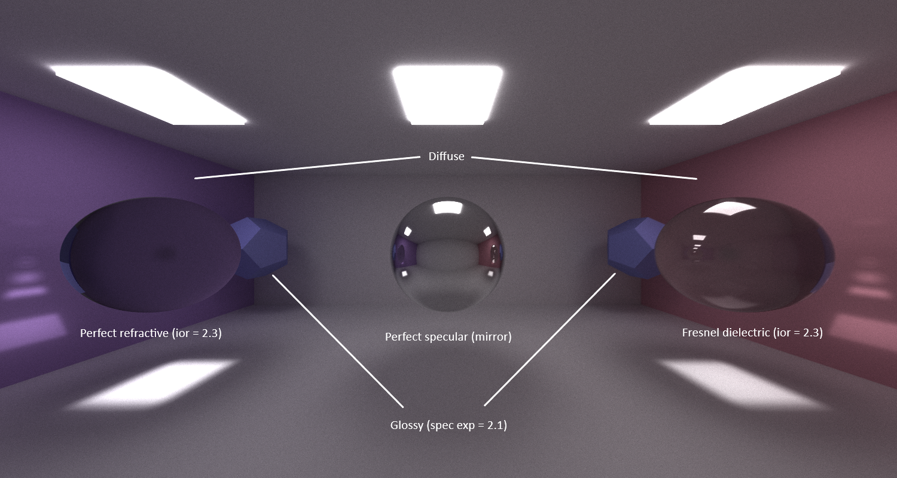
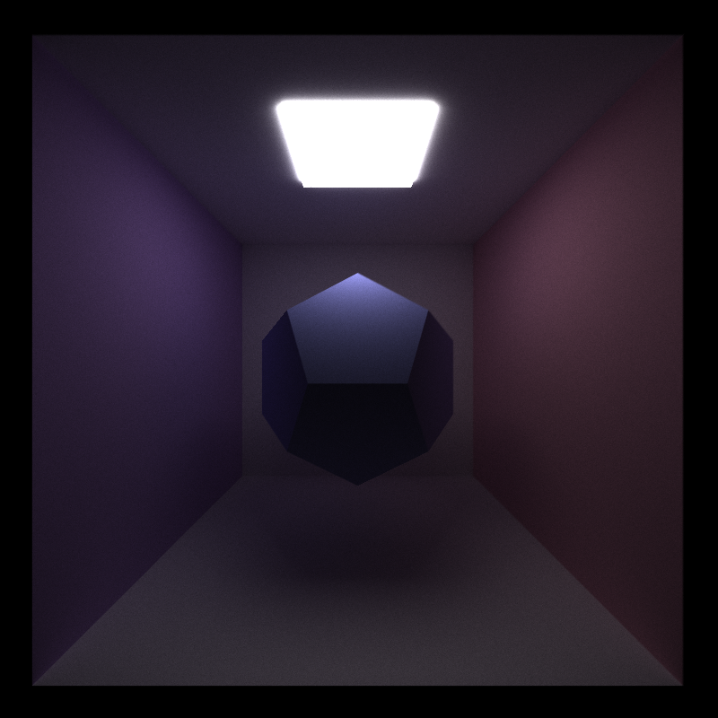
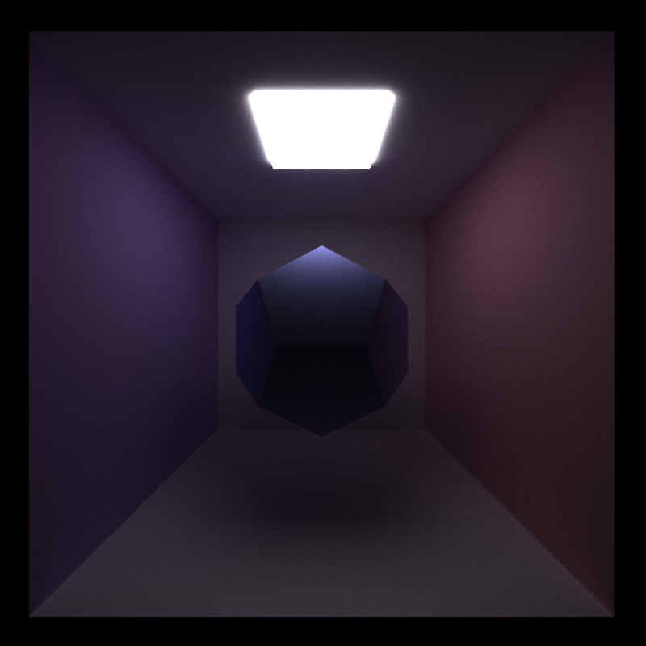
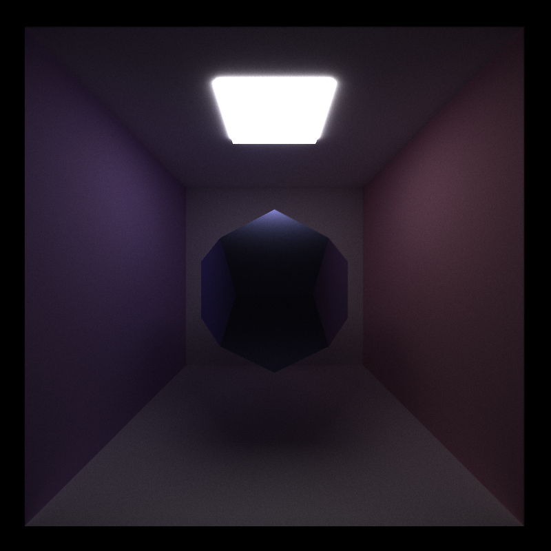

CUDA Path Tracer
================

**University of Pennsylvania, CIS 565: GPU Programming and Architecture, Project 3**

* Name: Gizem Dal
  * [LinkedIn](https://www.linkedin.com/in/gizemdal), [personal website](https://www.gizemdal.com/)
* Tested on: Predator G3-571 Intel(R) Core(TM) i7-7700HQ CPU @ 2.80 GHz 2.81 GHz - Personal computer

## Sneak Peek ##

*Scene: Specular Box; Iterations: 8000; Material sort: disabled; Ray depth: 8; Anti-aliasing: enabled*

## Project Description ##

This is a CUDA-based path tracer capable of rendering globally-illuminated images very quickly with the power of parallelization.

**Features**

* Shading Kernel with BSDF Evaluation
  * Uniform diffuse
  * Perfect specular reflective (mirror)
  * Perfect specular refractive (glass)
  * Fresnel dielectric
  * Imperfect specular (glossy)
* Path Continuation/Termination with Stream Compaction
* Toggleable continuous storage of paths and intersections by material type
* Toggleable first bounce intersection cache to be used by subsequent iterations
* Anti-aliasing rays with sub-pixel samples
* Arbitrary GLTF mesh loading with toggleable bounding volume intersection culling
* Camera depth of field
* Hierarchical Spatial Structure - Octree (In progress)
* Stratified sampling (In progress)

## Material Overview ##

Material shading is split into different BSDF evaluation functions based on material type. Supported materials include diffuse, mirror, glass, fresnel dielectric and glossy materials. Diffuse material scattering is computed by using cosine-weighted samples within a hemisphere. Fresnel dielectric materials are defined in the scene file with an index of refraction, which is used by BSDF evaluation to compute the probability of refracting versus reflecting the scatter ray. Mirror material scattering function reflects the ray along the surface normal while glossy reflection happens within a lobe computed by the specular exponent of the material.

**Imperfect Specular Reflection**

Exponent = 2.1 | Exponent = 4.5 | Exponent = 8.5
:---: | :---: | :---: 
 |  | 

Lower specular exponent values give results that are closer to diffuse scattering while larger specular exponent values result in larger highlights.

## Features Overview ##

**GLTF Mesh Loading**
[Icosahedron](https://people.sc.fsu.edu/~jburkardt/data/obj/icosahedron.obj) | [Magnolia](https://people.sc.fsu.edu/~jburkardt/data/obj/magnolia.obj) | [Duck](https://github.com/KhronosGroup/glTF-Sample-Models/tree/master/2.0/Duck)
:---: | :---: | :---:
 |  | 

Bounding volume intersection culling is applied at the ray-geometry intersection test to reduce the number of rays that have to be checked against the entire mesh by first checking rays against a volume that completely bounds the mesh. This feature is implemented as toggleable for performance analysis purposes.

In order to smoothen the triangles on round GLTF meshes, the intersection normal is computed from the barycentric interpolation of the 3 normals from the triangle vertices.

**Depth of Field**

Focal Distance = 30, Lens Radius = 2.5 | Focal Distance = 20, Lens Radius = 2.5
:---: | :---:
 | 

The scene camera can be set to enable focal distance and lens radius to get a depth of field effect. Geometries located at the focal distance within the lens radius will stay in focus while other geometry around the scene will be distorted.

## Insights ##

It is important to note that anti-aliasing and first bounce cache do not work together, since the pixel samples will differ per iteration and cached first bounces from the first iteration won't match the generated ray direction in further iterations. In order to provide flexibility, I set first bounce cache usage as a toggleable feature rather than the default, so that anti-aliasing could be enabled if the first bounce cache is not used.

Anti-aliasing enabled | Anti-aliasing disabled
:---: | :---: |
 | 

Another interesting observation I have is that using material sort results in more stable render results compared to naive approach. The two images below, both rendered with 4950 iterations, are renders from the same camera position. The render on the left is taken by sorting rays by material type while the one on the right is rendered by the naive approach.

Material sort enabled | Material sort disabled
:---: | :---: |
 | 

## Performance Analysis ##

The performance analysis is based on the following parameters:
* Number of iterations
* Ray depth
* Render mode

I analyzed 4 render modes, which are Naive (no use of first bounce cache or material sort), Cache, Material Sort and Cache + Material Sort combined. I used a GPU timer to measure how long each mode takes with different iteration and ray depth values. This timer is wrapped up as a performance timer class, which uses the CUDAEvent library, in order to measure the time cost conveniently. The timer is started right before the iteration loop and is terminated once a certain number of iterations is reached. The measured time excludes the initial cudaMalloc() and cudaMemset() operations for the path tracer buffers, but still includes the cudaGLMapBuffer operations.

**Iterations versus Measured Performance (in seconds) (Depth=8, Scene: Cornell Box)**

**Iterations versus Measured Performance (in seconds) (Depth=16, Scene: Cornell Box)**

It seems like sorting rays by material type results in a much slower performance with a simple scene like Cornell Box. It is possible that material sort provides efficiency with much larger and complex scenes. If we disable material sort, caching the first bounce results in a slightly faster runtime compared to the naive approach. Caching the first bounce seems to improve render performance more significantly when the number of iterations and ray depth increases.

