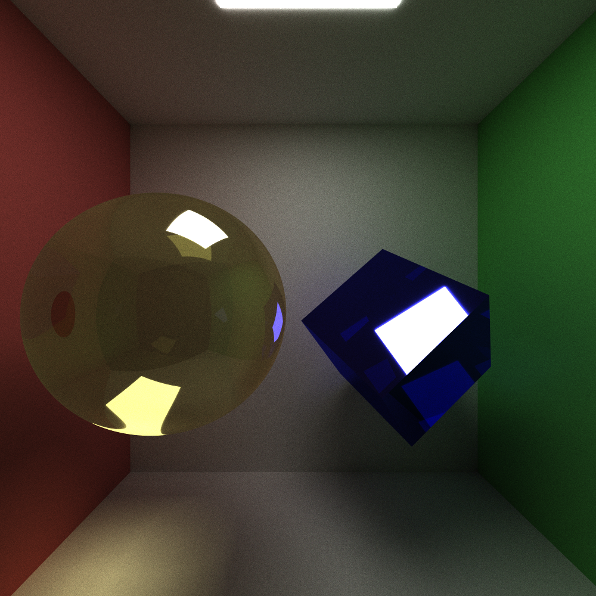

CUDA Path Tracer
================

3D Model Credit: [Rồng by @Husky on Sketchfab](https://sketchfab.com/3d-models/rong-b61cffbfbe66495b97a9a101b1859bbc?cursor=bz0xJnA9MjQ5)

**University of Pennsylvania, CIS 565: GPU Programming and Architecture, Project 3**
* Haorong Yang
* [LinkedIn](https://www.linkedin.com/in/haorong-henry-yang/)
* Tested on: Windows 10 Home, i7-10750H @ 2.60GHz 16GB, GTX 2070 Super Max-Q (Personal)

## Features:  
### Graphics 
  * Bidirectional Scattering Distribution Functions: Ideal Diffuse, Specular Reflection, Refraction
  * Physically-based depth-of-field (by jittering rays within an aperture)
  * Stochastic Sampled Antialiasing
  * Arbitrary Mesh loading  
  
### Optimization
  * Path termination using stream compaction
  * Sorting pathSegments by material type
  * Acceleration by caching first bounce

### Physically-Based Depth of Field
No Depth of Field          |   With Depth of Field
:-------------------------:|:-------------------------:
|  |

### Stochastic Sampled Antialiasing
No Anti Aliasing           |  With Anti Aliasing
:-------------------------:|:-------------------------:
|  |

Sorting the ray/path segments by material type will increase performance by making memory access contiguous hence more efficient; when there are a lot of materials, but not so much when there are limited materials, for example, in the conrell box test scene.

