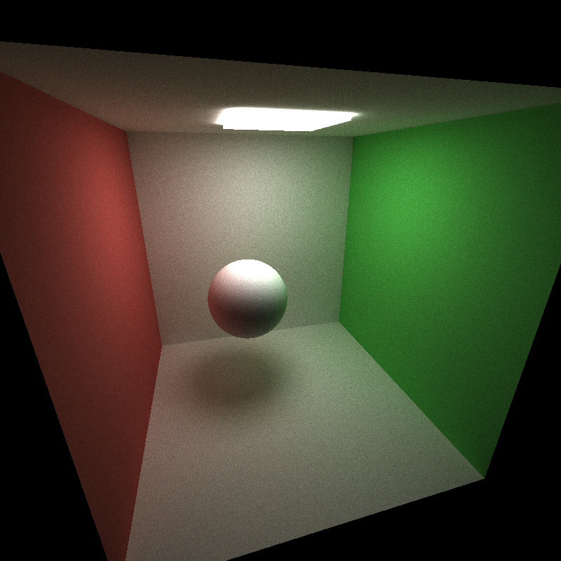
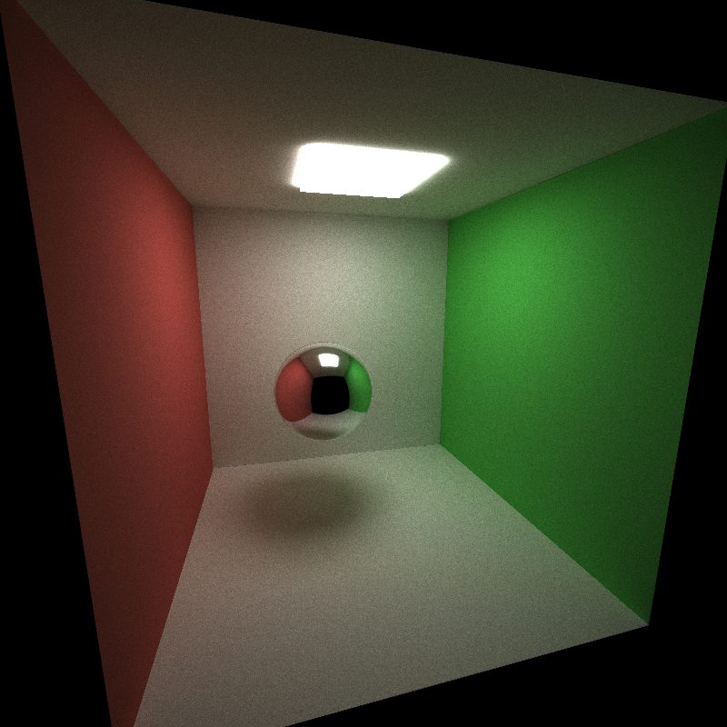
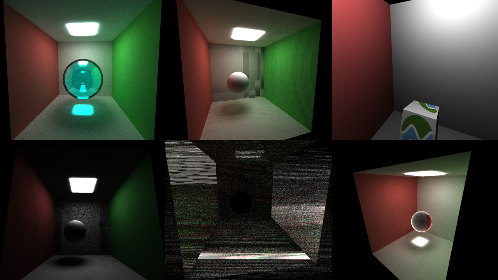

CUDA Path Tracer -- mid project
================

**University of Pennsylvania, CIS 565: GPU Programming and Architecture**

* Jiarui Yan
  * [LinkedIn](https://www.linkedin.com/in/jiarui-yan-a06bb5197?lipi=urn%3Ali%3Apage%3Ad_flagship3_profile_view_base_contact_details%3BvRlITiOMSt%2B9Mgg6SZFKDQ%3D%3D), [personal website](https://jiaruiyan.pb.online/), [twitter](https://twitter.com/JerryYan1997), etc.
* Tested on: Windows 10 Home, i7-9700K @ 3.60GHz 16GB DDR4 RAM, RTX 2070 SUPER 8GB Dedicated GPU memory (Personal desktop)

## Features

* Ideal Diffuse surfaces

* Perfectly specular-reflective surfaces

* Path continuation/termination

* material sort

* cache the first bounce intersections for re-use across all subsequent iterations

## Result

### Ideal Diffuse surfaces

### Perfectly specular-reflective surfaces

## Blooper

## Performance analysis

### Why material sort can affect rendering performance

Material sort can be beneficial to the performance because expensive BSDF computations lead to longer computation for some rays. As a result, the rays' BSDF computation that takes less time would just wait for the expensive ones. Therefore, sort them can help performance. However, according to my experiment, when I conduct tests for app with material sort and without matierial sort under 3000 iterations, the material sort one takes 104709 milliseconds, and the no material sort one takes 50011
milliseconds. I think this is caused by the fact that BSDF computation now is happened in a large kernel and it is done by if-else branches, which means different BSDF computation now just have no difference.

### Cache first bounce influence for different max ray depths

The experiments are conducted on the same number of iterations which is 3000 iterations for different max ray depths. 

As we can see from the graph above, with more depth, the performance is natually going to be bad. Besides, the experiments using first bounce cache always perform better than their counterparts that don't use it. 