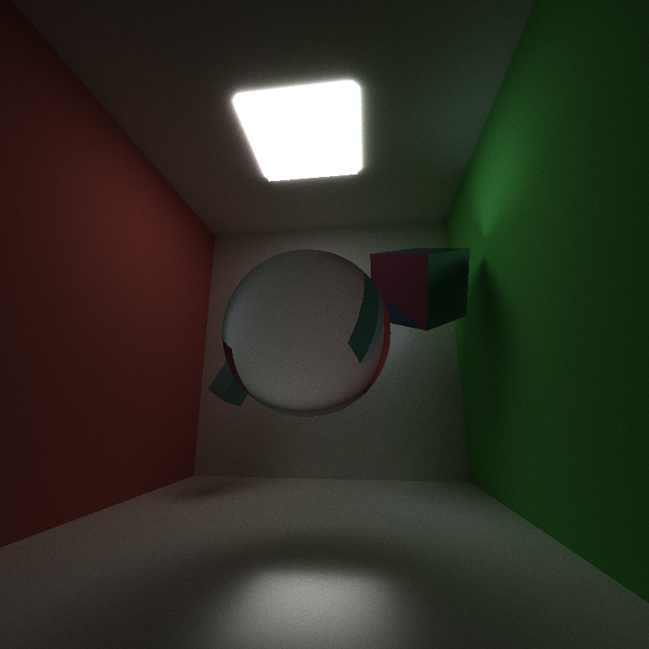

CUDA Path Tracer - Mid Progress
================

**University of Pennsylvania, CIS 565: GPU Programming and Architecture, Project 3**

* Name: Gizem Dal
  * [LinkedIn](https://www.linkedin.com/in/gizemdal), [personal website](https://www.gizemdal.com/)
* Tested on: Predator G3-571 Intel(R) Core(TM) i7-7700HQ CPU @ 2.80 GHz 2.81 GHz - Personal computer (borrowed my friend's computer for the semester)

**Project Description**

This is a CUDA-based path tracer capable of rendering globally-illuminated images very quickly with the power of parallelization. This README will feature the path-tracer components implemented for the mid-point progress.

**Mid Progress Features**

* Shading Kernel with BSDF Evaluation
  * Uniform diffuse
  * Perfect specular reflective (mirror)
  * Perfect specular refractive (glass)
* Path Continuation/Termination with Stream Compaction
* Toggleable continuous storage of paths and intersections by material type
* Toggleable first bounce intersection cache to be used by subsequent iterations

**Performance Analysis**

The performance analysis is based on the following parameters:
* Number of iterations
* Ray depth
* Render mode

I analyzed 4 render modes, which are Naive (no use of first bounce cache or material sort), Cache, Material Sort and Cache + Material Sort combined. I used a GPU timer to measure how long each mode takes with different iteration and ray depth values. This timer is wrapped up as a performance timer class, which uses the CUDAEvent library, in order to measure the time cost conveniently.
