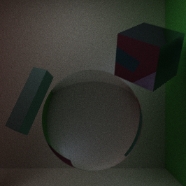
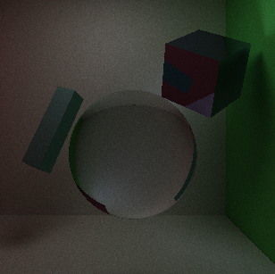
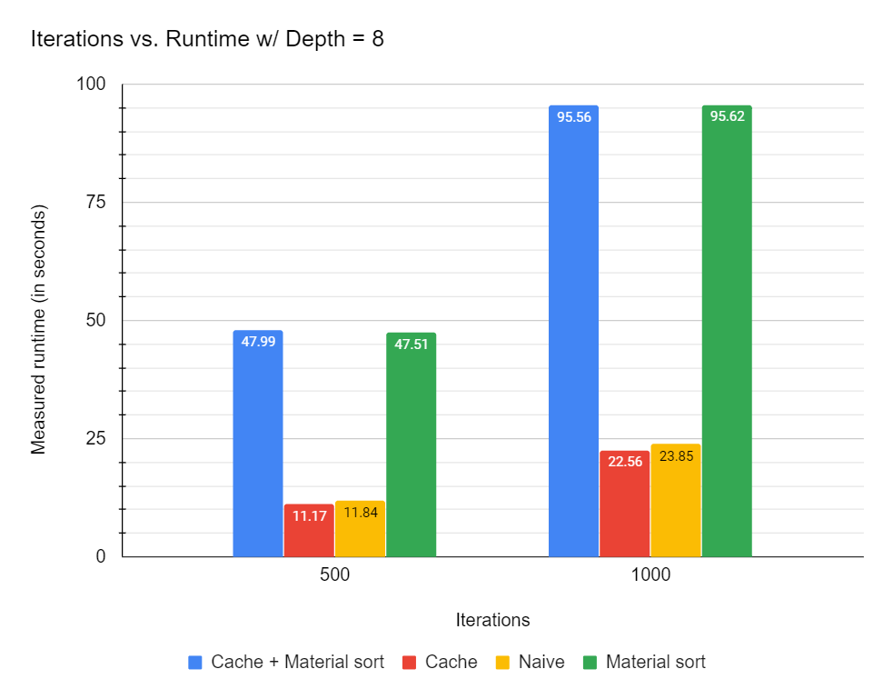

CUDA Path Tracer
================

**University of Pennsylvania, CIS 565: GPU Programming and Architecture, Project 3**

* Name: Gizem Dal
  * [LinkedIn](https://www.linkedin.com/in/gizemdal), [personal website](https://www.gizemdal.com/)
* Tested on: Predator G3-571 Intel(R) Core(TM) i7-7700HQ CPU @ 2.80 GHz 2.81 GHz - Personal computer

## Sneak Peek ##

*Scene: Cornell Box; Iterations: 5000; Material sort: enabled; Ray depth: 8; Anti-aliasing: enabled*

## Project Description ##

This is a CUDA-based path tracer capable of rendering globally-illuminated images very quickly with the power of parallelization. This README will feature the path-tracer components implemented for the mid-point progress.

**Mid Progress Features**

* Shading Kernel with BSDF Evaluation
  * Uniform diffuse
  * Perfect specular reflective (mirror)
  * Perfect specular refractive (glass)
* Path Continuation/Termination with Stream Compaction
* Toggleable continuous storage of paths and intersections by material type
* Toggleable first bounce intersection cache to be used by subsequent iterations
* Anti-aliasing rays with sub-pixel samples

## Insights ##

It is important to note that anti-aliasing and first bounce cache do not work together, since the pixel samples will differ per iteration and cached first bounces from the first iteration won't match the generated ray direction in further iterations. In order to provide flexibility, I set first bounce cache usage as a toggleable feature rather than the default, so that anti-aliasing could be enabled if the first bounce cache is not used. The two examples below show how anti-aliasing improves the render quality. The image on the left benefits from anti-aliasing while the one on the right doesn't use it.

 

Another interesting observation I have is that using material sort results in more stable render results compared to naive approach. The two images below, both rendered with 4950 iterations, are renders from the same camera position. The render on the left is taken by sorting rays by material type while the one on the right is rendered by the naive approach.

 

## Performance Analysis ##

The performance analysis is based on the following parameters:
* Number of iterations
* Ray depth
* Render mode

I analyzed 4 render modes, which are Naive (no use of first bounce cache or material sort), Cache, Material Sort and Cache + Material Sort combined. I used a GPU timer to measure how long each mode takes with different iteration and ray depth values. This timer is wrapped up as a performance timer class, which uses the CUDAEvent library, in order to measure the time cost conveniently. The timer is started right before the iteration loop and is terminated once a certain number of iterations is reached. The measured time excludes the initial cudaMalloc() and cudaMemset() operations for the path tracer buffers, but still includes the cudaGLMapBuffer operations.

**Iterations versus Measured Performance (in seconds) (Depth=8, Scene: Cornell Box)**

**Iterations versus Measured Performance (in seconds) (Depth=16, Scene: Cornell Box)**

It seems like sorting rays by material type results in a much slower performance with a simple scene like Cornell Box. It is possible that material sort provides efficiency with much larger and complex scenes. If we disable material sort, caching the first bounce results in a slightly faster runtime compared to the naive approach. Caching the first bounce seems to improve render performance more significantly when the number of iterations and ray depth increases.

