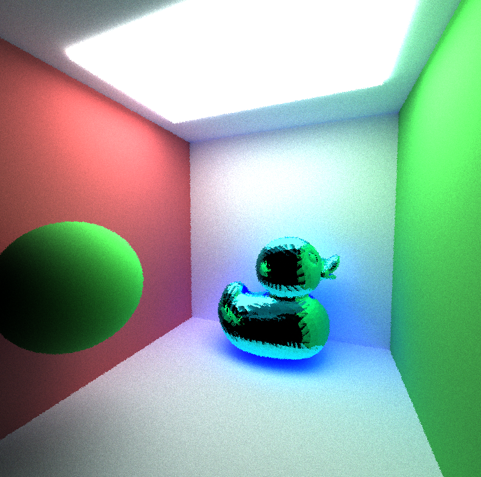
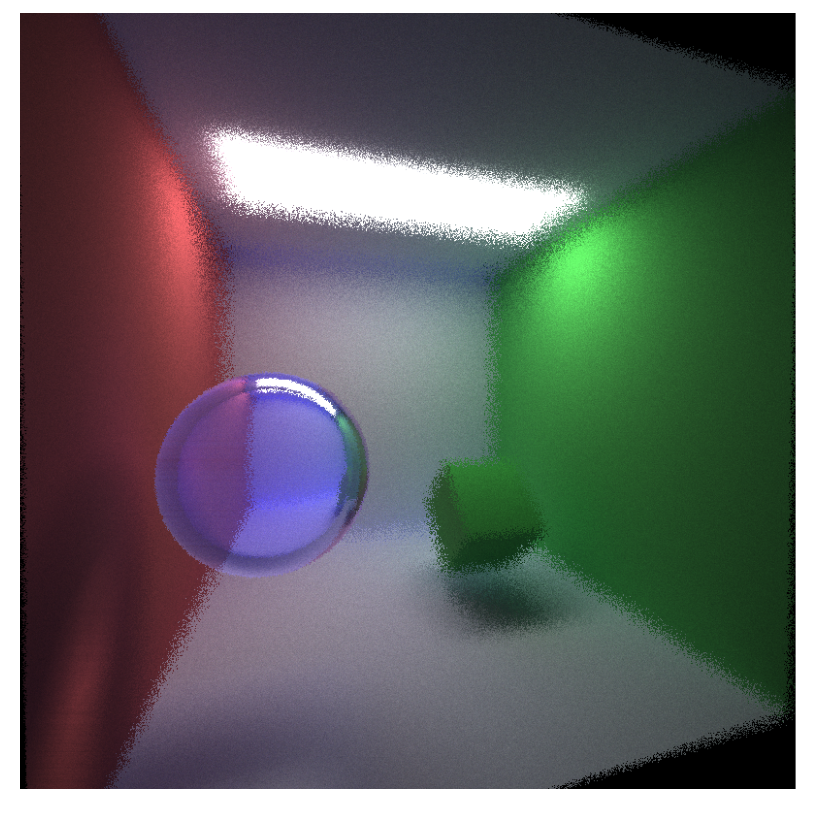
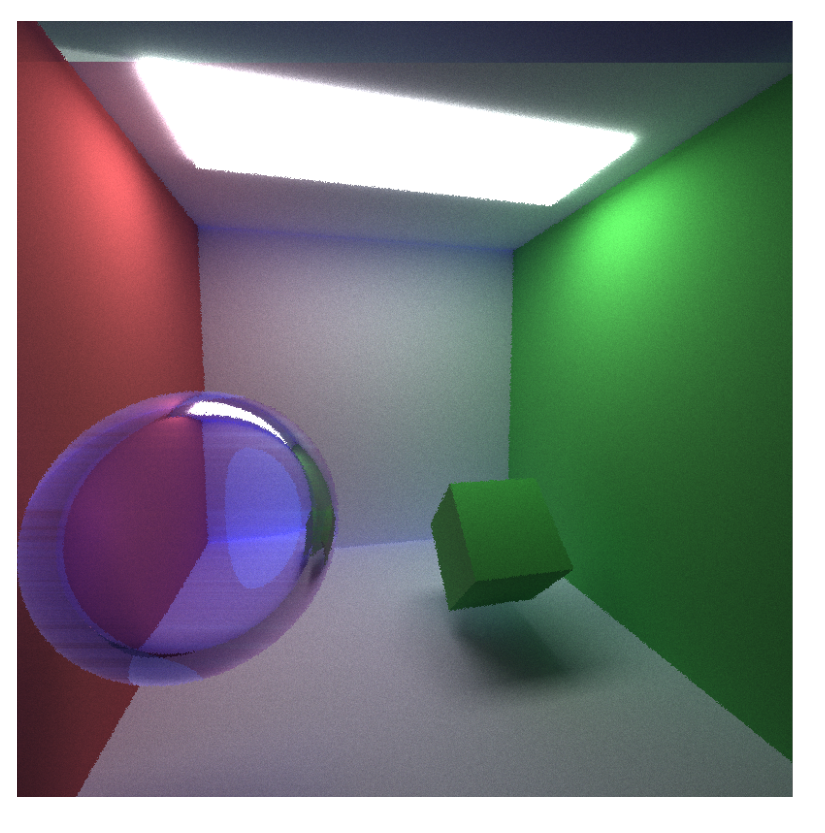
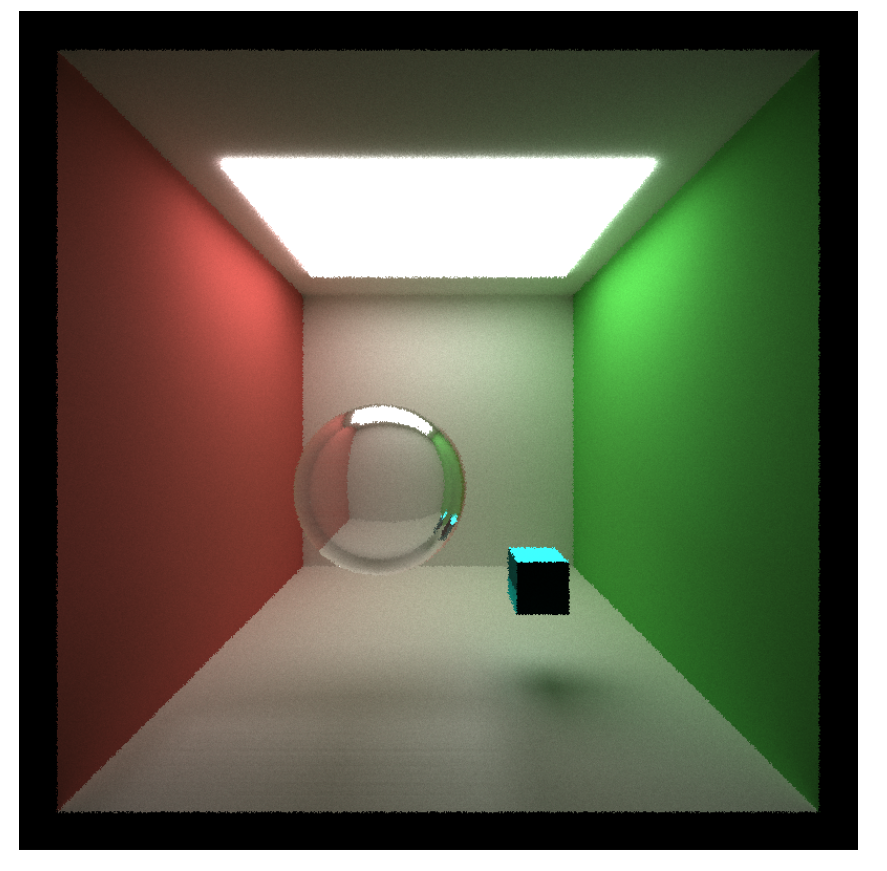

CUDA Path Tracer
================

**University of Pennsylvania, CIS 565: GPU Programming and Architecture, Project 3**

NAME: CHETAN PARTIBAN 

GPU: GTX 970m (Compute Capability 5.2) 

Tested on Windows 10, i7-6700HQ @ 2.60 GHz 16Gb, GTX 970m 6Gb (Personal Laptop) 

### 

For this Project, I have implemented a relatively simple path traced renderer. I have implemented a shader that uses a BSDF kernel to shade rays as they propogate through the world. In this case, if an object is specular then I have it perform a specular reflection with 70% probability and a cosine-weighted scatter with 30% probability. For diffuse surfaces, they always follow the cosine-weighted scattering to propagate to another ray. The render above was made using my renderer and took about 2 minutes to render on a GTX970m. I also utilized the partitioning functionality in thrust to perform stream compaction, so that as rays propagate, we can ignore "terminated" rays and focus our computation on the rays still continuing. 

Some of the features that I implemented in this second half of the project were: loading GLtf files to add more complex meshes, implemeting refracative objects, adding depth of field simulation, adding stochastic anti-aliasing, adding jitter-noise based hemisphere sampling and adding direct lighting. Here are some renders showcasing some of these main features that I have added.

For the first part of the project, one optimization I made was caching the first bounce. I found that this gave slight performance improvements in my setup. However, I think that these improvements would increase if there were more pixels being rendered (e.g. more rays being traced) as well as if there were more objects in the scene (more intersections to check). Since these two parameters are relatively low in the current run I have been testing with, the improvements are generally marginal.

Another optimization I made was sorting the path/intersections by the material at the intersection before shading. This optimization should allow for more efficient GPU utilization because there is less branching in the code at the warp level since adjacent paths in the array should be usually of the same material, and therefore would follow the same control flow in the BSDF shading kernel. In my scenario, this actually resulted in a large drop in performance. This is because almost all of the materials in my scenario are the same, with the only difference being the spheres. This means that, for most warps, behavior was already homogenous regardless of whether or not I was sorting. On top of this, the sorting itself is not necessarily a cheap operation, particularly for the first bounces, since there are quite a few rays being traced already. Something else that I noticed was that, when using thrust to sort, the sorting algorithm used is dependent on the implementation. When sorting by an array of integers as the keys, thrust implements Radix Sort O(N). If I was using a custom comparator to directly compare the ShadeableIntersections, it would use merge-sort. I therefore copied out the materialId from each intersection into a new array of integers and sorted the Intersections and the Paths together using the array of materialIds as the key so I could take advantage of Radix Sort, and this did seem to give some improvement to performance, that would only increase as the number of paths being traced increases. 

