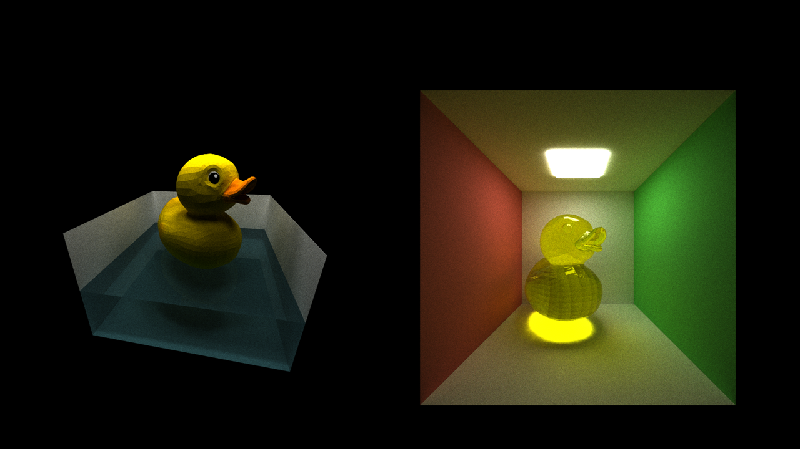
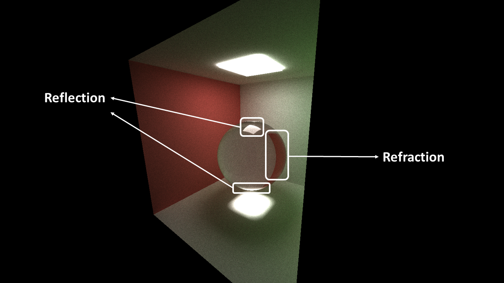
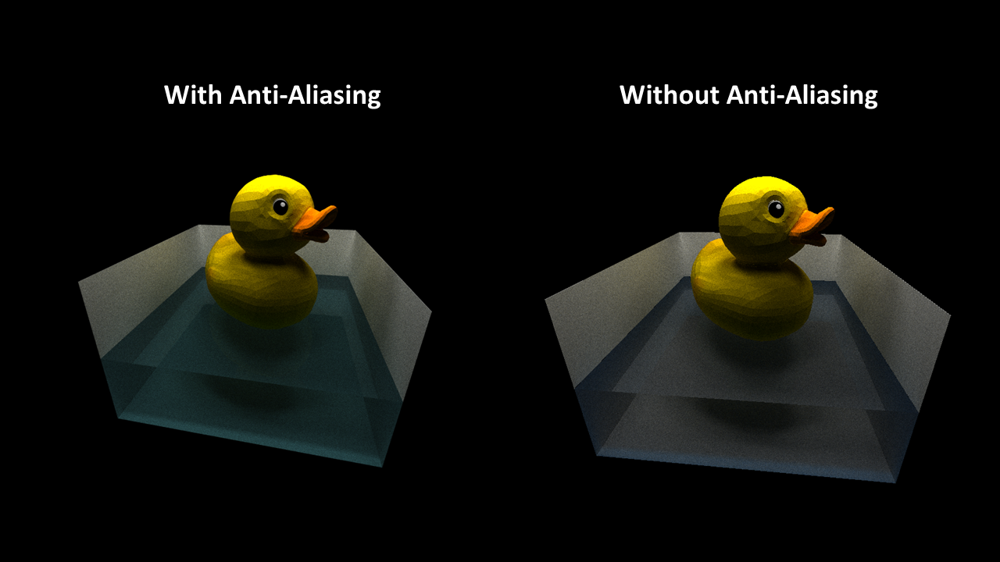
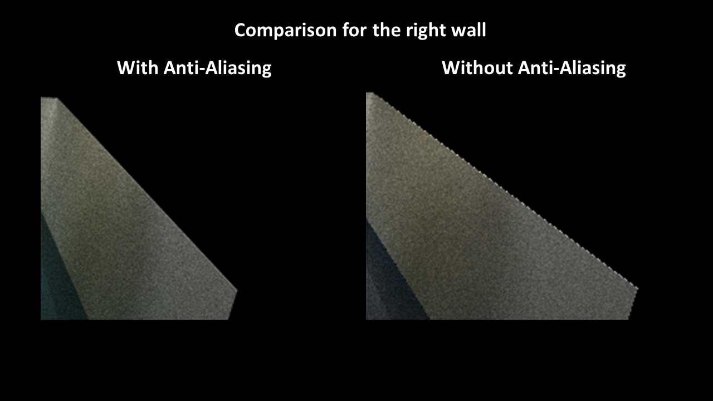
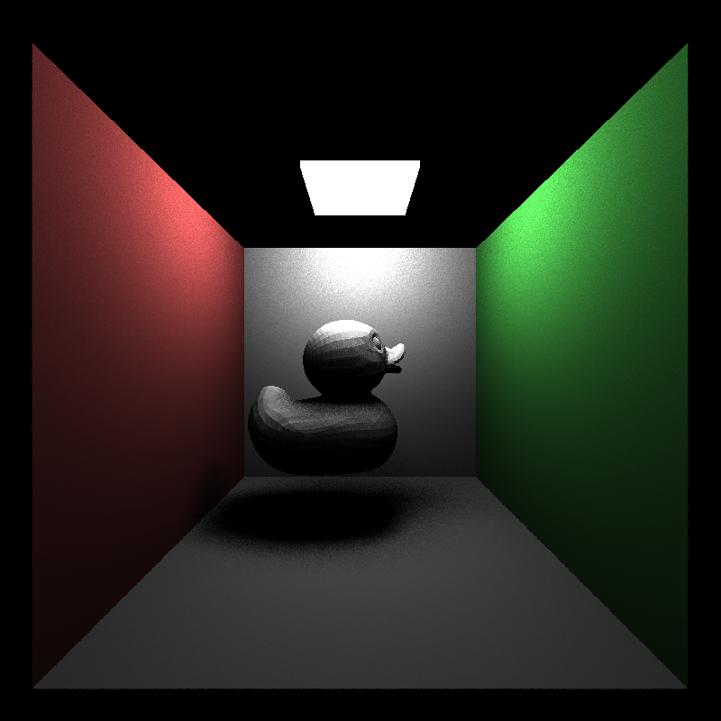
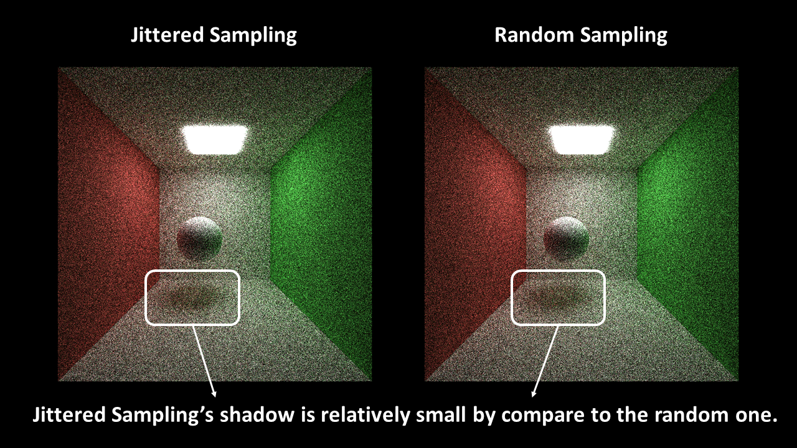
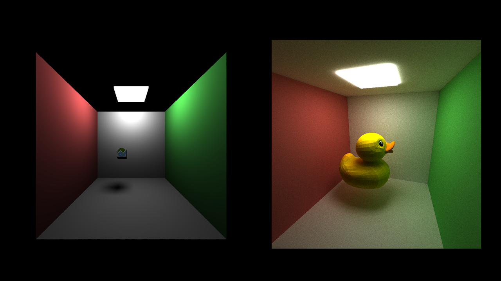
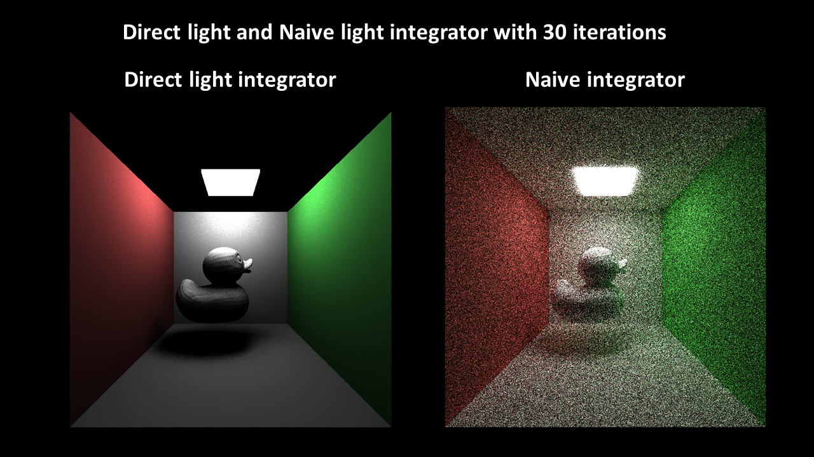
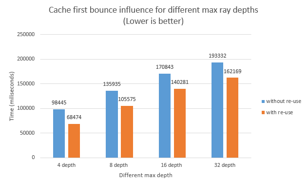

CUDA Path Tracer
================

**University of Pennsylvania, CIS 565: GPU Programming and Architecture**

* Jiarui Yan
  * [LinkedIn](https://www.linkedin.com/in/jiarui-yan-a06bb5197?lipi=urn%3Ali%3Apage%3Ad_flagship3_profile_view_base_contact_details%3BvRlITiOMSt%2B9Mgg6SZFKDQ%3D%3D), [personal website](https://jiaruiyan.pb.online/), [twitter](https://twitter.com/JerryYan1997), etc.
* Tested on: Windows 10 Home, i7-9700K @ 3.60GHz 16GB DDR4 RAM, RTX 2070 SUPER 8GB Dedicated GPU memory (Personal desktop)

## Features

* Refraction with Frensel effects

* Physically-based depth-of-field

* Stochastic Sampled Antialiasing

* Arbitrary mesh loading and rendering with tinygltf

* Better hemisphere sampling methods (Jittered)

* Texture mapping

* Direct lighting

## Result

### Refraction with Frensel effects

For refraction with Frensel effects, we want a refractive material to have reflection effects because in our life, material normally has both reflective effect and refractive effect. Here is an example for the glass ball. As we can see, we can see reflection on the glass ball from the light source and the focused light on the floor and refraction of the red wall can also be seen on this ball. 

### Physically-based depth-of-field

For the depth of field, it uses the thin lens camera model from [PBRT 6.2.3]. Here in the example, I gradually increase the focal length. At first, it is not clear because the focal length is in front of the duck model. Then, the duck becomes clear as the focal length is increased. Finally, it becomes unclear again as the focal length gets away from the suitable one. Besides, in order to make this process clear, this rendering is done on direct light integrator, which can give us a relative good result quickly. 

### Stochastic Sampled Antialiasing

As for antialiasing, this project use Stochastic Sampled Antialiasing method. It basically means for each iteration, shooting light from the camera would be jittered by a random number. In this way, undesirable artifacts can be avoided. Here is an example. As we can see, the left hand side rendering has less artifacts than the right hand sided one. In order to make it more obvious, let's take a look at the right wall.

As we can see from the zoomed view of the right wall, the right hand side rendering has clear pixel like wall, while the left hand side one is much more smooth than its counterpart. It is achieved by Stochastic Sampled Antialiasing, because for each pixel it can average a little bit different color from adjacency instead of color from one hit point.

### Arbitrary mesh loading and rendering with tinygltf

For this project, I use gltf2.0 as my mesh format. Meanwhile, I also use a thrid party library named "tinygltf" to facilicate my work. Here is an example of loading an arbitrary mesh. All the models and textures used in this project are got from the official github page of the gltf2.0.

Another things needs to be noted is that I put the absolute path into the scene file for loading a target mesh. Therefore, if you want to build this project on your machine and try your own 3D models, please remember change these paths in the scene file. Besides, I didn't include mine in this project and they are just from the offical site and they have same names.

### Better hemisphere sampling methods (Jittered)

Besides, I also implement two sampling methods in this project. They are Jittered sampling and Random sampling. Jittered sampling's sampling directions would concentrate more to the top of hemisphere, which can help integrator get more good sampling information by comare to the totally random one. Here is an comparsion between them. As we can see, the Jittered one's shadow is relative small. Meanwhile, although they have difference at first, they are almost same finally. 

### Texture mapping

As for texturing mapping, tinygltf has already prodvide useful API to load .gltf files with textures. Besides, .gltf file would also provide UV information for triangles. Therefore, we can map texture color on the mesh by finding the corresponding pixel indices calculated from UV coordinates.

### Direct lighting

As you can see from the rendering before, there are some relatively unclear images with lots of noise. They are produced by navie integrator. One good thing about the navie integrator is that it can provude global illumation. However, owing to the fact that a path would bounce in the scene for lots of times before it hits the light source, it also takes lots of time to get a clear rendering result. Normally, in order to get a clear result, it will take 3000 iterations. However, for direct lighting integrator, 30 iterations is normally enough, because at first bounce, it directly finds a point on the light source. As a result, it is really fast but it doesn't have indirect light color. Here is an example compares their results when the render only runs 30 iterations.

## Blooper

## Performance analysis

### Why material sort can affect rendering performance

Material sort can be beneficial to the performance because expensive BSDF computations lead to longer computation for some rays. As a result, the rays' BSDF computation that takes less time would just wait for the expensive ones. Therefore, sort them can help performance. However, according to my experiment, when I conduct tests for app with material sort and without matierial sort under 3000 iterations, the material sort one takes 104709 milliseconds, and the no material sort one takes 50011
milliseconds. I think this is caused by the fact that BSDF computation now is happened in a large kernel and it is done by if-else branches, which means different BSDF computation now just have no difference.

### Cache first bounce influence for different max ray depths

The experiments are conducted on the same number of iterations which is 3000 iterations for different max ray depths. 

As we can see from the graph above, with more depth, the performance is natually going to be bad. Besides, the experiments using first bounce cache always perform better than their counterparts that don't use it. 

## Third party software

* [tinygltf](https://github.com/syoyo/tinygltf/)
