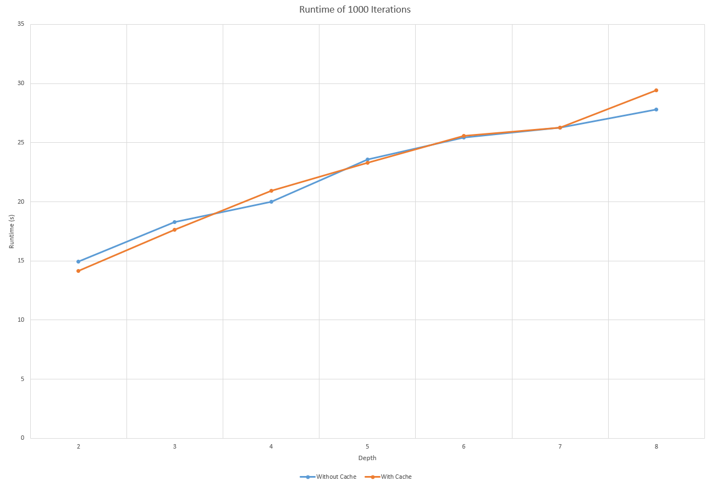

CUDA Path Tracer
================

**University of Pennsylvania, CIS 565: GPU Programming and Architecture, Project 3**

* Xuanyi Zhou
* Tested on: Windows 10, i7-9750H @ 2.60GHz 32GB, RTX 2060 6GB

### Mid-Project Report

#### Sort by Material Index

Sorting by material index did not yield any performance gains. In fact, it slows down the program due to the additional computation required by sorting on the GPU. Since the scene is simple and does not use many materials, the additional cost of sorting far outweighs the cost of divergent if branches.

#### Caching the first bounce

Below is the graph of runtime comparison between tracing with and without cache:

It can be seen that caching the first bounce provides some speedup when the depth is extremely low, but then quickly loses the advantage when the number of bounces becomes larger. Since the scene is relatively simple, performing interseciton tests for an iteration is not particularly costly; for large scenes, this cost can be reduced using bounding volume hierarchies. In addition to not being able to provide much advantage, it's also tricky to handle antialiasing, depth of field, motion blur, and probably other effects with this optimization on. Therefore, it's probably not worthwhile to have this cache.
