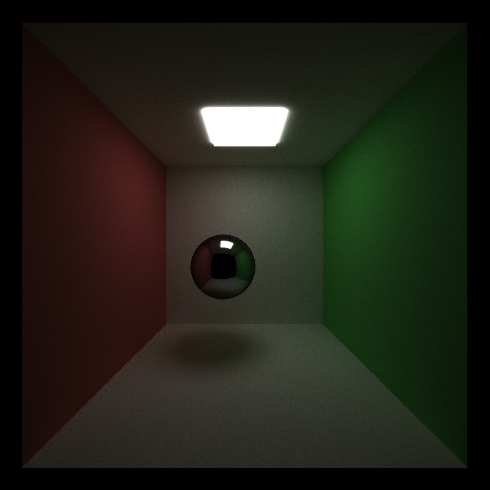

CUDA Path Tracer
================

**University of Pennsylvania, CIS 565: GPU Programming and Architecture, Project 3**

* Jilin Liu
  * [LinkedIn](https://www.linkedin.com/in/jilin-liu-61b273192/), [twitter](https://twitter.com/Jilin18043110).
* Tested on: Windows 10, i7-8750H @ 2.20GHz, 16GB, GTX 1050Ti 4096MB (personal)

## Features and Results

This is a GPU-based Monte Carlo path tracer implemented in C++ and CUDA.

Features:
1. A shading kernel with BSDF evaluation for diffuse material and perfect specular reflection material.
2. Path continuation/termination using Stream Compaction.
3. Sorting pathSegments based on material types to make the same material contiguous in memory. 
4. A cache for the first bounce intersections for re-use across all subsequent iterations.

## Performance Analysis

### Sorting pathSegments based on material types

To avoid divergence of threads when processing different materials, we would like the same material to be contiguous in memory. However, after sorting the path segments, the algorithm runs actually much slower for Cornell Box. The reason is that this scene does not contain many different types of materials and sorting is very expensive. A much wiser implementation would be required to achieve better performance.

### Cache first bounce intersections for re-use

This idea is good, especially when our camera is still and want to get more iterations of path tracing. But the performance gain is still limited for Cornell Box. The reason is that there are merely few objects in the scene, thus doing a intersection check would not cost much, especially for a GPU implementation. This should be much more helpful when we add more objects or meshes to the scene.

