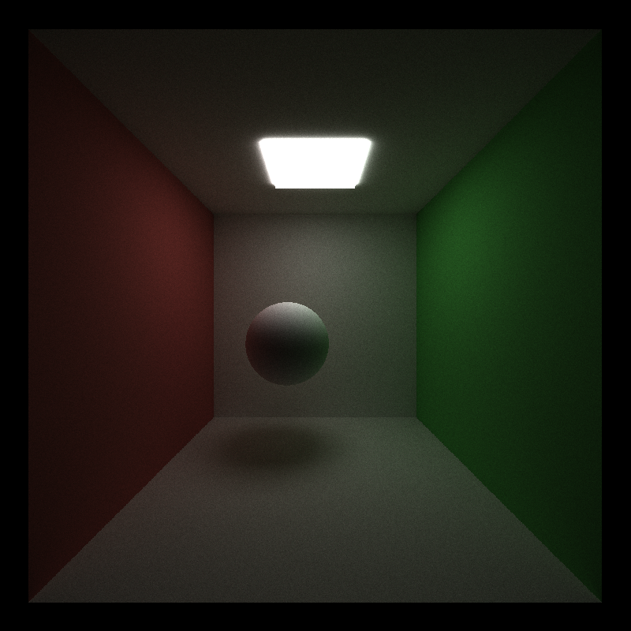

CUDA Path Tracer
================

**University of Pennsylvania, CIS 565: GPU Programming and Architecture, Project 3**

* Keyi Yu
  * [LinkedIn](https://www.linkedin.com/in/keyi-linda-yu-8b1178137/)
* Tested on: Windows 10, i7-10750H @ 2.60GHz 16GB, GeForce RTX 2070 with Max-Q 8228MB (My Machine)


Contents
-------------------------------------
- [Introduction](#Introduction)
- [Basic Path Tracing](#Basic-Path-Tracing)
  - [Generate Rays from Camera](#Generate-Rays-from-Camera)
  - [Compute Intersections](#Compute-Intersections)
  - [Scatter Rays](#Scatter-Rays)
  - [Shade Rays](#Shade-rays)
  - [Gather Colors](#Gather-Colors)
- [Performance Analysis](#Performance-Analysis)
- [Debug](#Debug)
- [Questions](#Questions)
- [Extra Credit](#Extra-Credit)
- [Reference](#Reference)

## Introduction
In this project, I implemented a CUDA-based path tracer capable of rendering globally-illuminated images very quickly.



## Core Features
### Generate Rays from Camera
The first step is to cast a ray from the camera to each pixel on the screen. The key point is to represent the screen point in the world coordinate. One naive approach is to do the inverse transformation but matrix computation is inefficient. Another way is to use the method shown in the picture below(Prof Adam Mally's CIS560 Slides).


### Compute Intersections
Now we can compute the intersection between the ray and objects in the world coordinate. One naive approch is to go through all the objects in the world and for each ray, whether there is an intersection between them. We also need to find the t which represent the depth from the camera to the object because we can only see the object in front.

### Scatter Rays
If a ray hit an object, it will bounce and generate a new ray. I use Bidirectional Scattering Distribution Functions(BSDF) to compute the new ray including the color, the direction adn the start position. At present, I just use a naive approach and will improve it in the next part. The peusdo code is:
```
generate a random number n01 from [0, 1]
if n01 < specular exponent:
    new ray color *= 0.5 * specular color + 0.5 * diffuse color
    new ray direction = 0.5 * specular direction + 0.5 * diffuse direction
else :
    new ray color *= diffuse color
    new ray direction = diffuse direction
```

### Shade Material
This step is to shade all the rays. There are three cases in general:
```
if ray hits a light:
    ray color *= light color
    remaining bounces = 0
else if ray hits an object:
    if this ray is the last bounce:
        ray color = black
        remaining bounces = 0
    else
        scatter rays
        remaining bounces--
else if ray hits nothing
    ray color = black
    remaining bounces = 0
```

### Path tracing
With all the functions above, we can do the path tracing in the following steps:
```
generate rays from camera
while # of bounce < bounce limits:
    compute intersections to determine the color of each ray
    shade material
    bounce depth++
gather colors and apply to the image
```
The basic path tracing can be improved in several ways. [This section](#Improvement-and-Performance-Analysis) will show some techniques.


## Improvement and Performance Analysis
### Stream Compaction
Since not all the rays will hit an object and bounce, we need to eliminate some useless rays to reduce computation. Stream compaction helps here. I use stream compaction to select those will bounce and put the rest aside. From the left figure, we can see that over 10K rays will be eliminated after each bounce. Right figure shows that the duration is decreasing each time more intuitively.


Remaining rays            |  Duration of path tracning
:-------------------------:|:-------------------------:
 | 

### Sorting by materials


### Cache the first bounce

## Debug
1. remove_if vs partition

When I used remove_if to filter ending ray, the light is black. remove_if doesn't put the removed elements anywhere; the elements after the new end will have their old values, so some of the removed elements might be missing, and some of the preserved elements might be duplicated. [Answer on stackovwerflow](#https://stackoverflow.com/questions/3521352/difference-between-partition-and-remove-functions-in-c)  So I used partition to do stream compaction.

Bug            |  Fixed
:-------------------------:|:-------------------------:
 | 


2. Wrong specular color

Firstly, I only add diffuse color. When I try to add specular color, the result looks werid. Because not all rays should have specular colors, I need to compare a random number with the specular exponent to determine whether the ray has spuclar color.

Bug            |  Fixed
:-------------------------:|:-------------------------:
 | 

3. thrust::device_ptr vs device raw ptr

 I need to convert raw ptr to thrust::device_ptr before using thrust functions. Otherwise, error occurs.

 4. last bounce termination

I noticed that my image is a little lighter than the reference image. At the beginning, I think it is a small problem and the rendering image may differ on different machines. However, I found images posted on Piazza were exacly the same with the reference image, so I realized that there was a bug in my code. Thanks for Tea Tran's reponse on Piazza, I found my bug. Although some rays still have remaining bounces when the depth reaches the maximum depth, the last ray should also be colored black because it means that the ray doesn't hit a light within the maximum bounce. If not, the last ray will be colored with other colors, which make my rendering image a litte lighter.

 Bug            |  Fixed
:-------------------------:|:-------------------------:
 | 