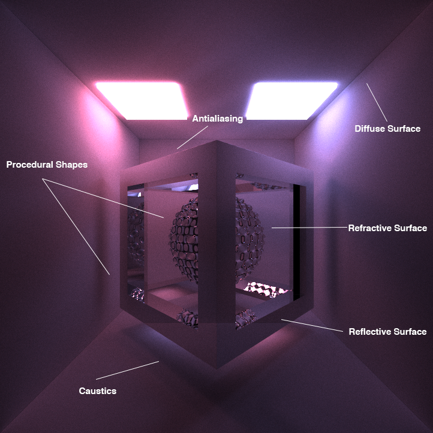
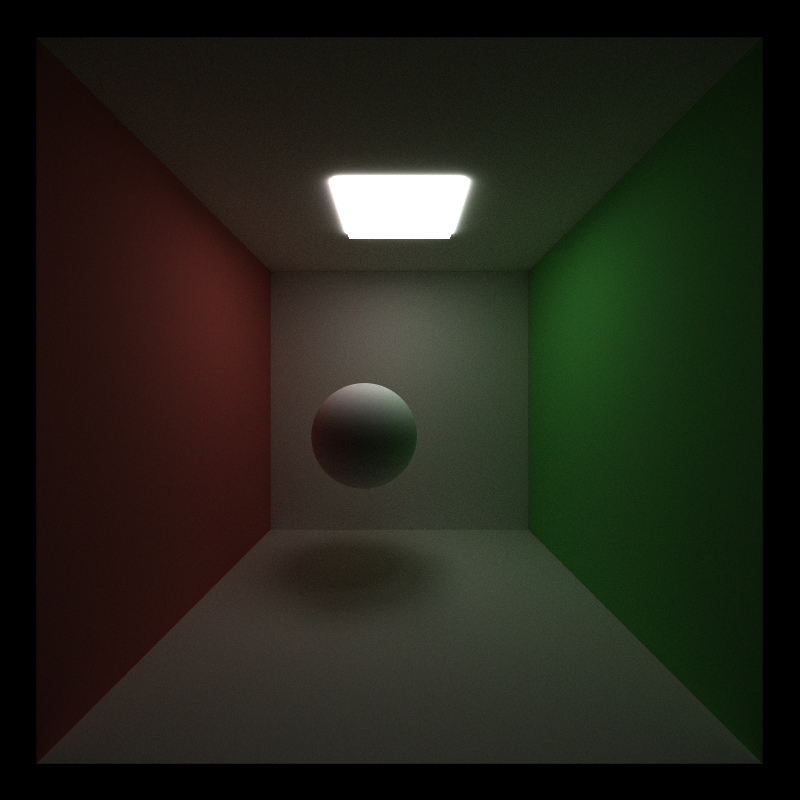
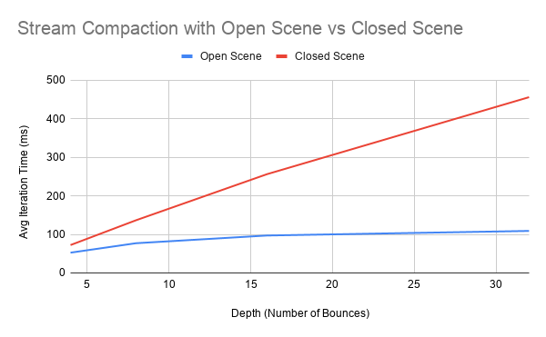
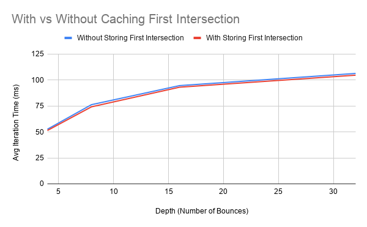
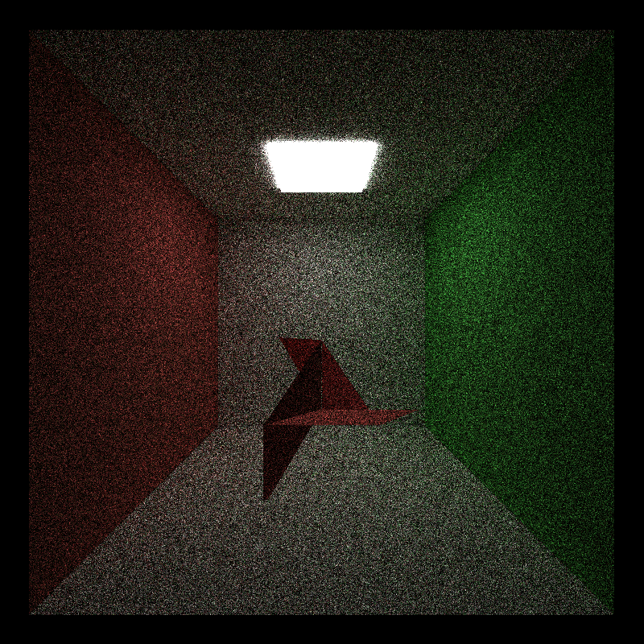
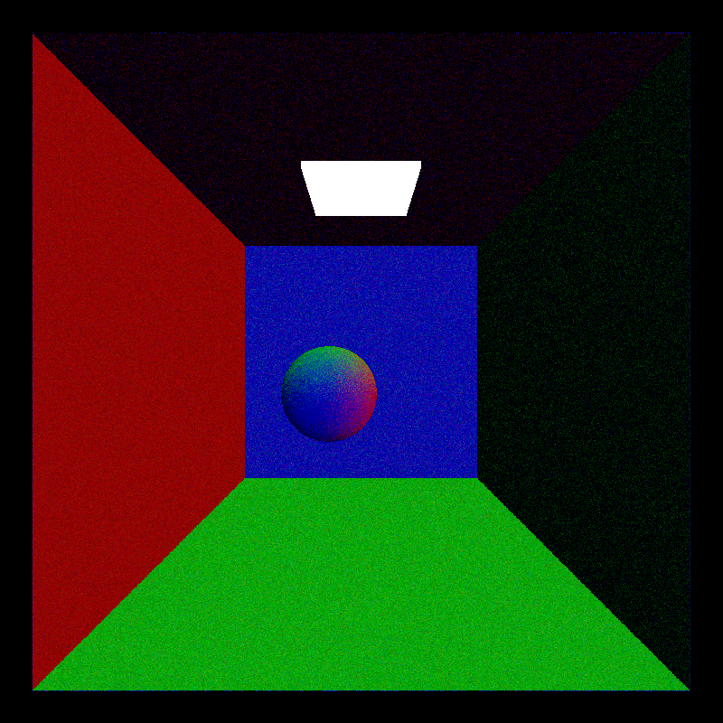
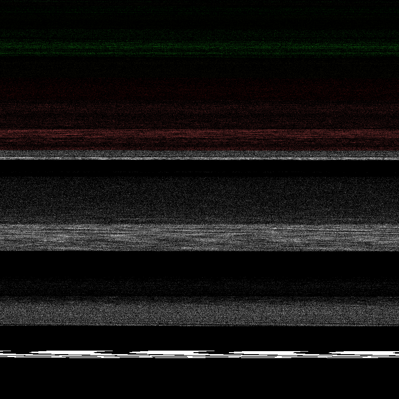

CUDA Path Tracer
================

**University of Pennsylvania, CIS 565: GPU Programming and Architecture, Project 3**

* Sydney Miller
  * [LinkedIn](https://www.linkedin.com/in/sydney-miller-upenn/)
* Tested on: GTX 222 222MB (CETS Virtual Lab)

Table of contents
=================
   * [Overview of Path Tracing](#Overview)
   * [Features Overview](#features)
      * [BSDF Evaluation: Diffuse, Specular-Reflective, Refractive](#bsdf-evaluation)
      * [Physically-based depth-of-field](#depth-of-field)
      * [Stochastic Sampled Antialiasing](#stochastic-sampled-antialiasing)
      * [Obj Mesh Loading](#obj-mesh-loading)
      * [Procedural Shapes](#procedural-shapes)
      * [Procedural Shapes](#procedural-shapes)
      * [Procedural Textures](#procedural-textures)
      * [Better Hemisphere Sampling](#better-hemisphere-sampling)
  * [Optimizations ](#optimizations)
    * [Stream Compaction](#stream-compaction)
    * [Materials Contigious in Memory](#materials-contigious-in-memory)
    * [Cache First Intersection](#cache-first-intersection)
    * [Mesh Bounding Box](#mesh-bounding-box)
  * [Performance Analysis](#performance-analysis)
    * [Steam Compaction with Open and Closed Scenes](#steam-compaction-with-open-an-closed-scenes)
    * [Chaching First Intersection with Varying Depths](#chaching-first-intersection-with-varying-depths)
  * [Bloopers](#bloopers)

# Overview

This is a CUDA-based path tracer capable of rendering globally-illuminated renders. Path Tracing is a technique to render scenes that shoots rays out of a camera and returns their color if they hit a light source. The goal of path tracing is to emulate the process of light rays bouncing around a scene and reaching the human eye.

# Features

## BSDF Evaluation

| Diffuse | Reflective | Refractive |
| ------------- | ----------- |----------- |
|   |  |  |
| Diffuse Blue | Reflective Blue | Refractive Blue |
|   |  |  |

I implemented diffuse, reflective, and refracting materials for my pathtracer. Diffuse materials will randomly choose the direction rays bounce next whereas reflective materials will reflect the ray across the normal, so there is only one option for the new direction of a ray. I implemented a refractive material with Frensel effects using Schlick's approximation. Each of these implementations in the scene above took around 76 ms per iteration.

## Physically-based Depth-of-Field
| No Depth of Field | Depth of Field |
| ------------- | ----------- |
|   |  |

I implemented physically bassed Depth-of-Field to create a focus effect on an object in the scene with a blurred background. This effect is also known as a thin lens approximation, which simulates a lens with a thickness much smalled than the radius of curvature to create the effect. The depth of field render shown took about 77 ms per iteration.

## Stochastic Sampled Antialiasing
| No Antialiasing | Antialiasing |
| ------------- | ----------- |
|   |  |

I implemented stochastic sampled antialiasing by randomly offseting the values used for a rays origin from the camera when calculating the rays direction. You can tell in the image above that the edges of the sphere in the antialiased image are smoother than the edges of the sphere in the non-antialiased image.

## Obj Mesh Loading

I implemented OBJ mesh loading using [tiny obj](https://github.com/syoyo/tinyobjloader). The mesh is loaded into the path tracer as individual triangles. The mesh shown above has 2576 polygons and took an average of 664 ms per iteration.

## Procedural Shapes
| Box Border Signed Distance Function | Sphere with Displacement Signed Distance Function |
| ------------- | ----------- |
|   |  |

I created two procedural shapes using signed distance functions and used ray marching to find the intersection of each ray with the shape. The average iteration time for the box sdf was 86 ms and the average iteration time for the displaced sphere sdf was 84 ms.

## Procedural Textures
| Based on Intersect Position | Based on Normal |
| ------------- | ----------- |
|   |  |

I created two procedural textures that can be applied to any shape in the scene. One texture uses the intersection position to manipulate the color and another uses the normal of the intersection to manipulate the color. The average iteration time for the box sdf with a procedural texture was 87 ms (diffuse was 86 ms) and the average iteration time for the displaced sphere sdf was 85 ms (diffuse was 84 ms).

## Better Hemisphere Sampling

| Cosine Weighted | Stratified |
| ------------- | ----------- |
|   |  |

I implemented stratified hemisphere sampling to get a better distribution of ray directions. Instead of rays being chosen to shoot through a random spot on the hemisphere, a cell is chosen for the ray to shoot out of based on the current iteration so that the hemisphere will be sampled from all areas. 

# Optimizations

## Stream Compaction

After each bounce of the rays, the array holding the rays will be partitioned so that the rays that have terminated will be at the end of the list. The next bounce in the current iteration will only consider rays that are not terminated, which are now next to each other in the array. We do this so all of the rays that are considered on the next bounce are next to each other in memory, meaning there won't be as many idle threads.

## Materials Contigious in Memory

There is an option to sort materials the intersections and path segments by material so that threads all following similar divergences in code will be next to each other in memory. This would increase performace. 

## Cache First Intersection

There is an option to save the intersections from the first bounce of the first iteration and use them with every subsequent first bounce. Since the rays are always shooting the same out of the camera, these intersections are alays the same so we do not neeed to recalculate them. 

## Mesh Bounding Box

When a mesh is loaded, the minimum and maximum x, y, and z values are saved to form an axiss aligned bounding box. When this option is turned on, a ray will first be tested against the bounding box of the mesh to see if there is an intersection. If there is, then all of the triangles in the ray will be tested. This optimization is significant when there are many triangles in a mesh. For the mesh I tested, the average time per iteration without a bounding box was 664 ms and the average time for iteration with a bounding box was 662 ms. 

# Performance Analysis

## Steam Compaction with Open and Closed Scenes

This chart shows the difference between render times of an open scene and a closed scene using stream compaction. As I predicted, closed scenes took a lot longer to render per iteration because rays are not terminating as quickly compared to an open scene. 

## Chaching First Intersection with Varying Depths

This graph shows that caching the first intersections takes less time to render consistantly across the tested depths. This matched my hypothesis because less work is being done at the beginning of each iteration. 

# Bloopers

| Incorrect OBJ loading | Incorrect Diffuse Shading | Sorting Intersections but Not Path Segments |
| ------------- | ----------- |----------- |
|   |  |  |

