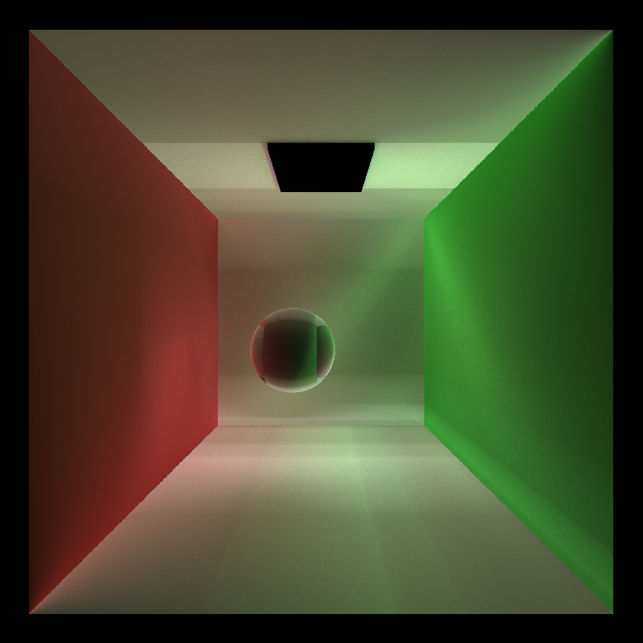
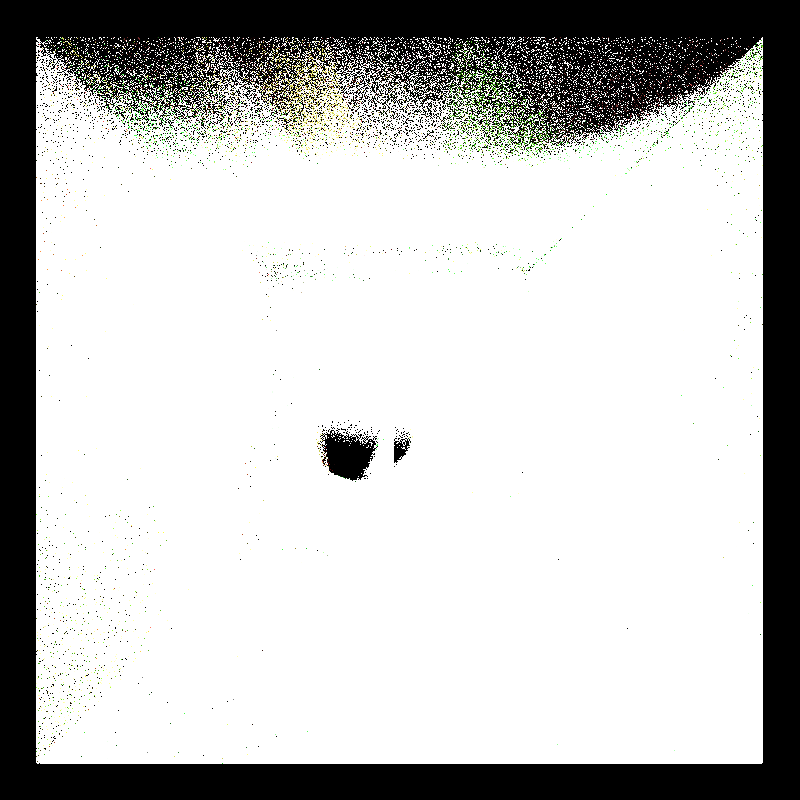

CUDA Path Tracer
================

**University of Pennsylvania, CIS 565: GPU Programming and Architecture, Project 3**

* Janine Liu
  * [LinkedIn](https://www.linkedin.com/in/liujanine/), [personal website](https://www.janineliu.com/).
* Tested on: Windows 10, i7-10750H CPU @ 2.60GHz 16GB, GeForce RTX 2070 8192 MB (personal computer)

## CUDA Pathtracer

This project revolved around a GPU-based pathtracer, its optimizations, and several distinct features.

## Performance Analysis Methods

Using the Performance Timer class provided in the [previous assignment](https://github.com/j9liu/Project2-Stream-Compaction/), I surrounded my `pathtrace` call with calls to start and stop the CPU timer. I then took the average of all these iterations to determine what the average iteration time would be. To save time, I limited the number of these recorded iterations to 20% of the total number of samples. 

## Optimizations

To improve performance, I implemented some optimizations with the intent to make each pathtracing iteration faster. These optimizations include:
* stream compaction,
* material sorting, and
* first bounce caching.

### Stream Compaction

Stream compaction is an algorithm that removes elements from an array that meet a certain condition and reorganizes the elements so they are contiguous in place. Here, I use the `stable_partition` function in Thrust's library to target the rays who have no bounces left and need to be terminated, removing them from the rest of the paths to be considered.

Unfortunately, I do not have a reliable baseline comparison without stream compaction because my pathtracer acts erroneously without it. Here are two bloopers from when I was trying to debug this issue:

The intense brightness of these renders comes from overcounting the dead rays in the final product. But despite consistent checks that the rays aren't terminated, the images produced are still taking too much light into account, light that shouldn't exist with the terminated rays. It may have to do with shading and overcounting *intersection* data; I would need to spend more time to figure out how.

In any case, the stream compaction optimization produces a correct result that is anticipated to improve performance. It removes rays that are no longer active from the list of paths to trace, so we do not needlessly trace terminated paths. In addition, the function puts the active rays closer together in memory, which should make accessing global memory much faster since the accesses will be continguous, instead of random.

### Material Sorting

Each material in the scene has a unique ID that scene intersections reference whenever they collide with a material. Continguous intersections in memory can have different materials between them, thus leading to random memory access in the materials' global memory bank. To improve memory access, intersections who share the same material can be sorted based on material ID, so intersections with the same materials are coalesced in memory.

 improve when there are more materials in the scene.

### Caching First Bounce

Improve performance by caching intersections from first bounce; same thing

## Features
### Refractive Materials and Imperfect Speculars
### Thin Lens Camera
### Anti-Aliasing
### OBJ Loading
### KD-Tree
