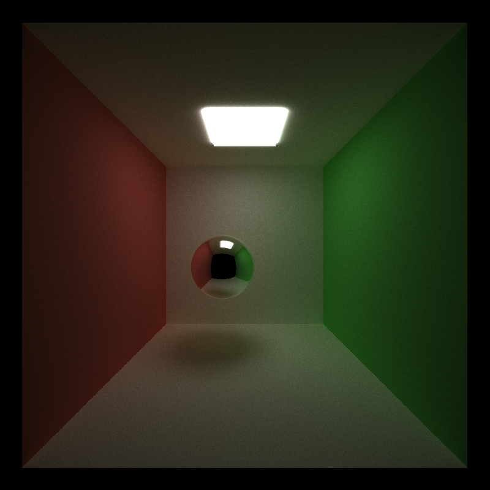
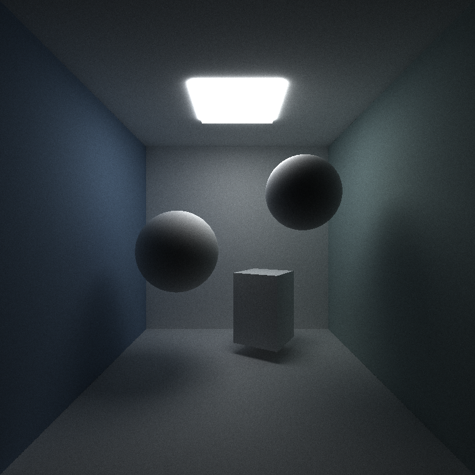

CUDA Path Tracer
================

**University of Pennsylvania, CIS 565: GPU Programming and Architecture, Project 3**

* Haoyu Sui
  	* [LinkedIn](http://linkedin.com/in/haoyu-sui-721284192)
* Tested on: Windows 10, i5-9600K @ 3.70GHz 16GB, RTX 2070 SUPER 8GB 
* SM：7.5

### Features
* Ideal diffuse surface
* Specular-reflective surface
* Stream compaction for path continue and termination 
* Sort rays with same material
* Cache first bounce

### Results

**Specular surface reflection & Diffuse surface reflection**

<left class="half">
    
    
</left>

### Performance Analysis

I calculated the average time spent in each depth loop in 200 iterations and got the result shown in the figure above. 

In terms of sorting rays, I originally thought that sorting would reduce the time it took because it would reduce the divergence in a thread warp, but from the results, on my computer, sorting actually reduced performance.

For caching the first bounce, it can be seen from the chart that there is a slight and stable improvement in performance, because the cache can only reduce the time to calculate the intersection for the first time, so the larger the depth, the smaller the performance improvement. And it has nothing to do with the number of iterations.

