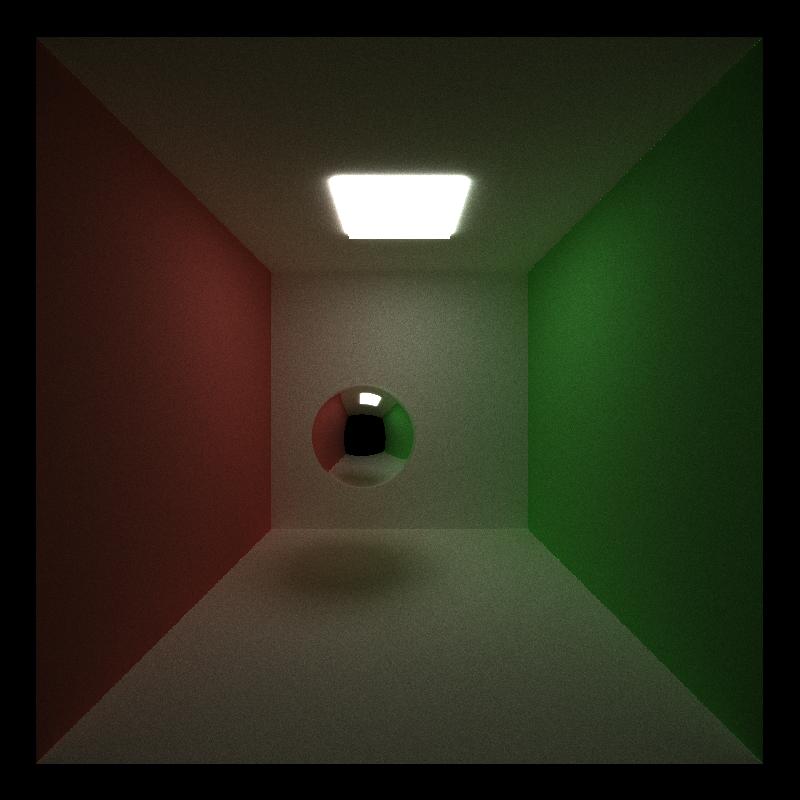

CUDA Path Tracer
================

**University of Pennsylvania, CIS 565: GPU Programming and Architecture, Project 3**

* Shenyue Chen
  * [LinkedIn](https://www.linkedin.com/in/shenyue-chen-5b2728119/), [personal website](http://github.com/EvsChen)
* Tested on: Windows 10, Intel Xeon Platinum 8259CL @ 2.50GHz 16GB, Tesla T4 (AWS g4dn-xlarge)

### Output

### Features
* Specular and diffuse shading
* Stream compaction to terminate rays
* Materials sorting
* First bounce cache

### Performance analysis
#### Stream compaction for path termination
Below is the change of paths in the first 10 iterations of the cornell box image, with the basic diffuse and specular shading.

From the plot we can observe that the number of paths reduces greatly when the depth increases, because many rays terminated by not intersecting or intersecting with a light source. The number of paths is equal to the number of threads we launched in each kernel run. Therefore we increase the thread utilization by reducing the number of threads in kernel launch configuration.