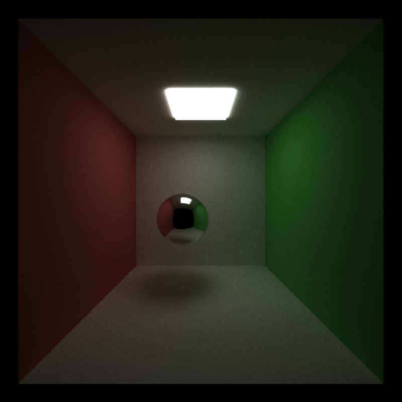
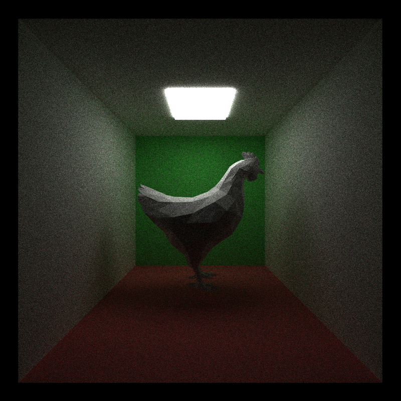
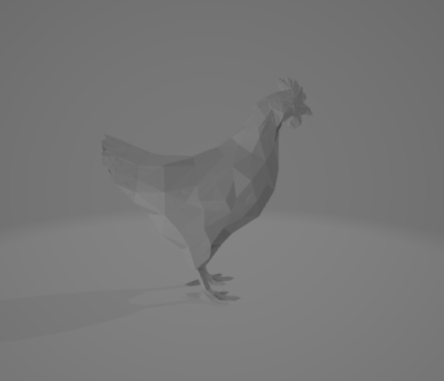
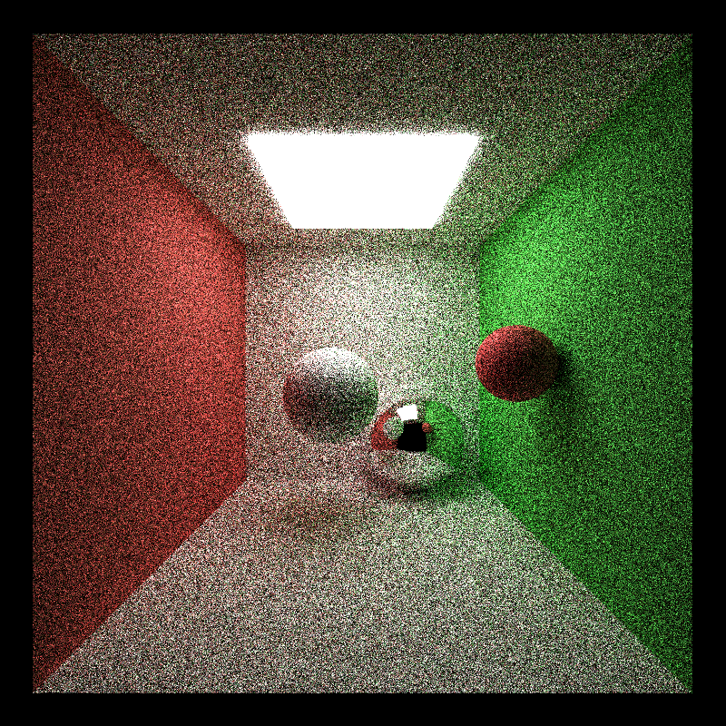
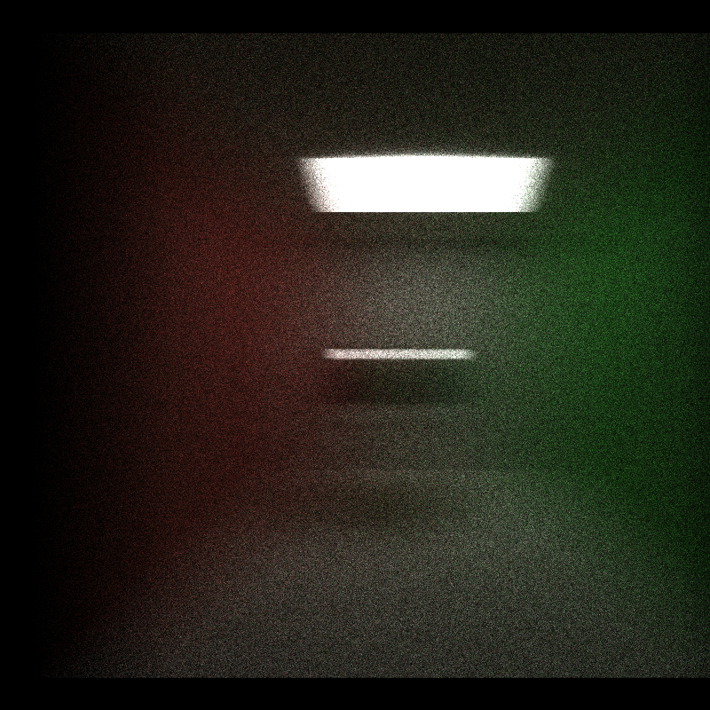
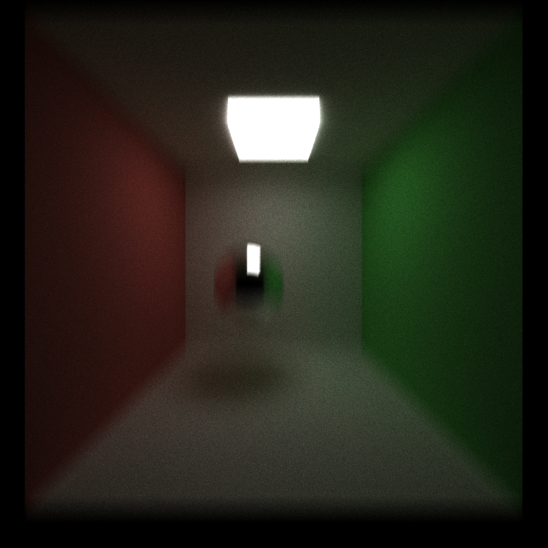

CUDA Path Tracer
================

**University of Pennsylvania, CIS 565: GPU Programming and Architecture, Project 3**

* Thy (Tea) Tran 
  * [LinkedIn](https://www.linkedin.com/in/thy-tran-97a30b148/), [personal website](https://tatran5.github.io/), [email](thytran316@outlook.com)
* Tested on: Windows 10, i7-8750H @ 2.20GHz 22GB, GTX 1070

### Path Tracer

## Depth of Field

The ball centered in the middle of the scene is clear and well-defined, while other objects are blurry.

## Mesh loading with bounding valume intersection culling

How the mesh is supposed to look like in a 3D program

## Better hemisphere smapling methods

Better sampling (stratified):

Random sampling:

The diffused sphere in the center is more converged with few random white specs, white those are visible in the random sampling method. The same thing happens on the back wall as well.

## Motion blur

### Performance Analysis

The problem with coloring every path segment in a buffer and performing BSDF evaluation using one big shading kernel is that there will be a lot of branches within the kernel due to different materials/BSDF evaluations resulting in different amounts of time to complete. Hence, threads within one branch (similar if not same material) in that kernel have to wait for other threads from a branch to finish executing the kernel first to continue execution. This means the performance time would not be optimal. However, in most scenes I've tested, the number of materials are only 4 - 10, with image picture of 500x500, which might be too small to see this effect.

Sorting the ray/path segments so that rays/paths interactinve with the same material are contiguous in memory before shading results in less random memory access. Hence, threads in a warp can access the memory related to one material faster.

Caching the first bounce intersections means the performance time per iteration is greatly reduced because the first bounce of each iteration is already calculated and cached. 

