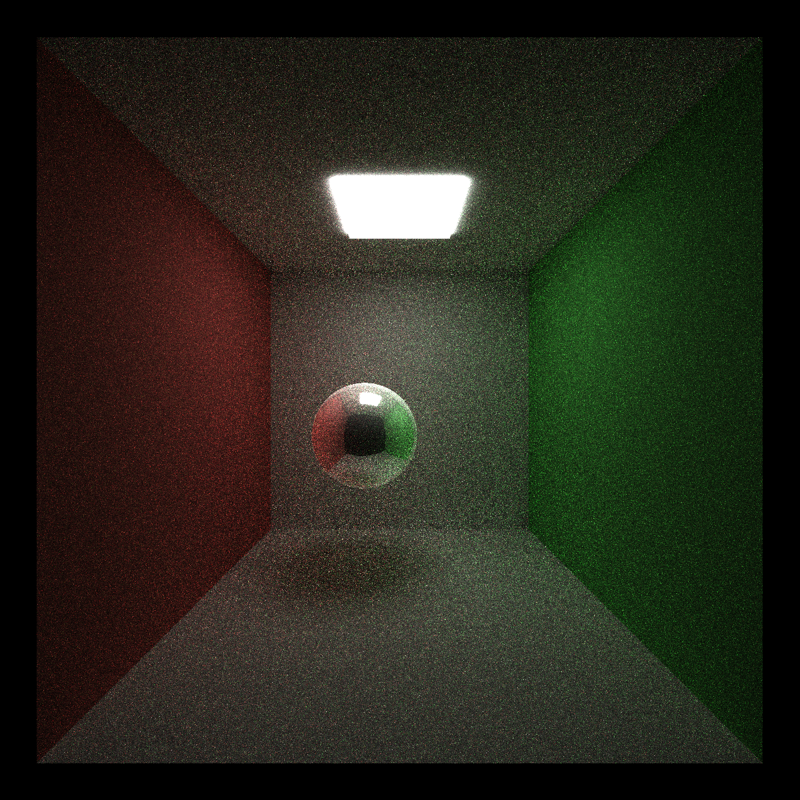

CUDA Path Tracer
================

# 

**University of Pennsylvania, CIS 565: GPU Programming and Architecture, Project 3**
* Haorong Yang
* [LinkedIn](https://www.linkedin.com/in/haorong-henry-yang/)
* Tested on: Windows 10 Home, i7-10750H @ 2.60GHz 16GB, GTX 2070 Super Max-Q (Personal)

Features implemented:
* BSDF for: ideal diffuse surfaces, specular surfaces
* Path termination using stream compaction
* Sorting pathSegments by material type
* Cache first bounce

Sorting the ray/path segments by material type will increase performance by making memory access contiguous hence more efficient; when there are a lot of materials, but not so much when there are limited materials, for example, in the conrell box test scene.

