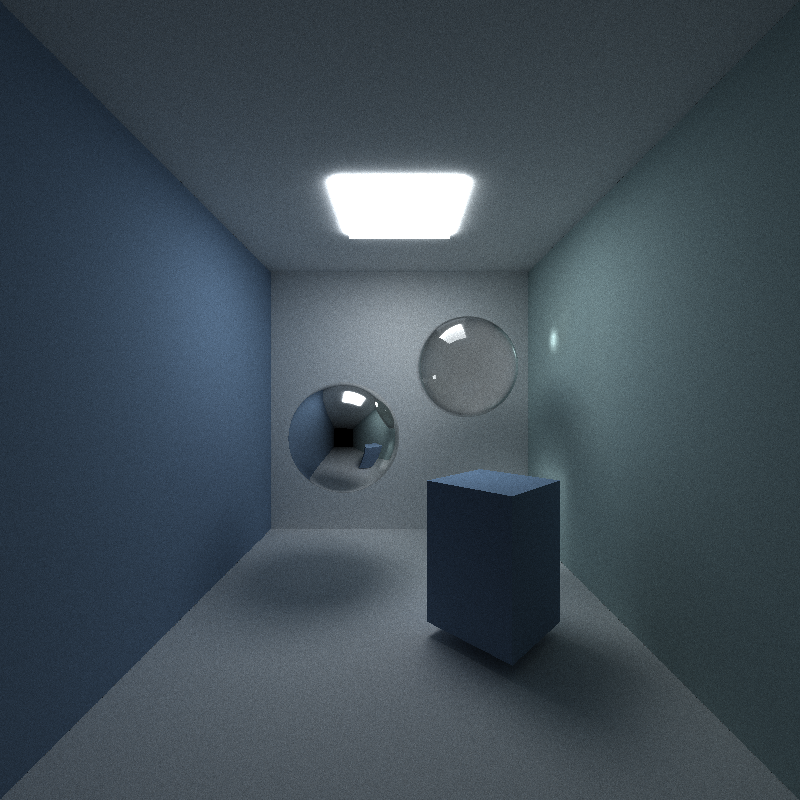
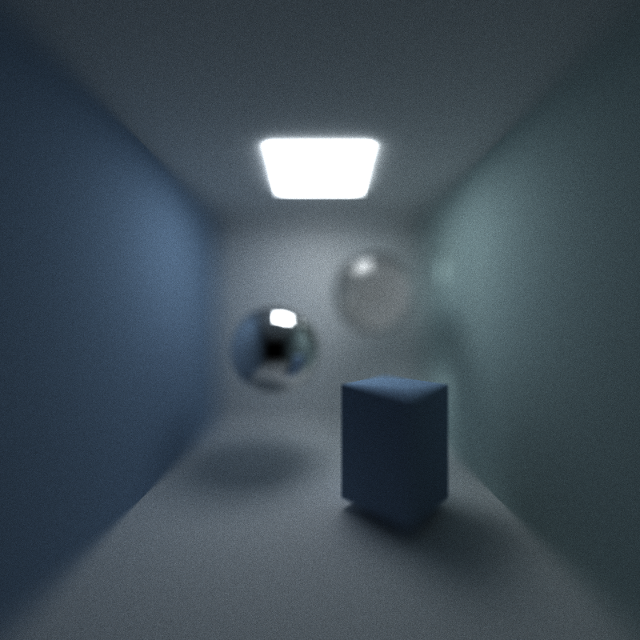
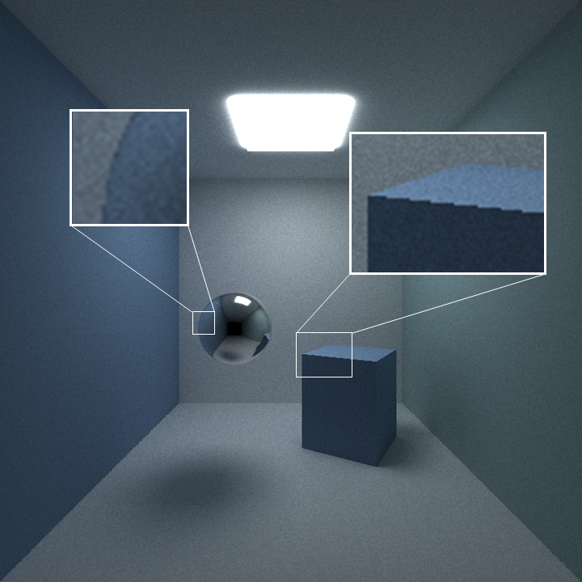
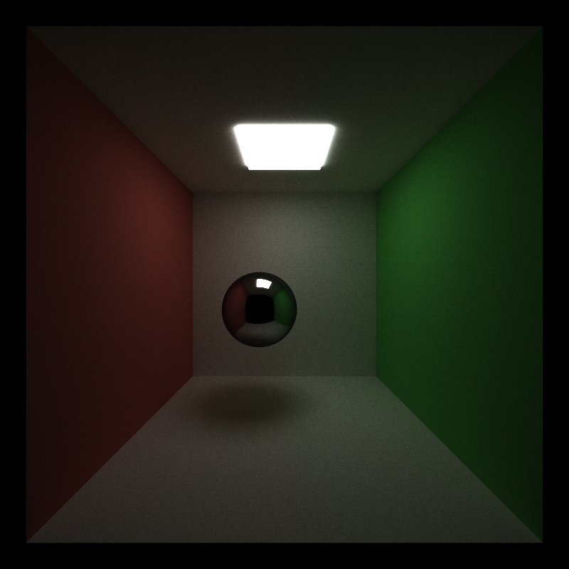
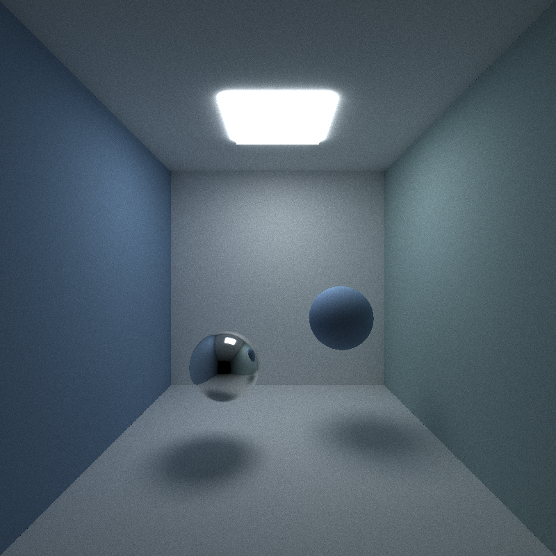
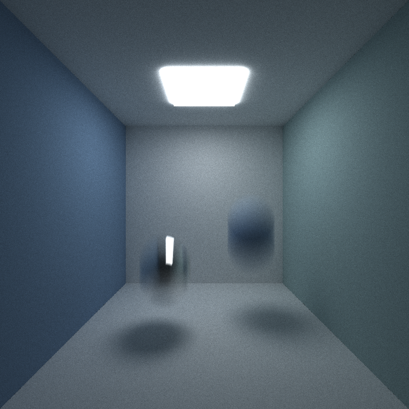

CUDA Path Tracer
================

**University of Pennsylvania, CIS 565: GPU Programming and Architecture, Project 3**

* Zijing Peng

  - [LinkedIn](https://www.linkedin.com/in/zijing-peng/); [Personal website](https://zijingpeng.github.io/)
* Tested on: Windows 22, i7-8750H@ 2.22GHz 16GB, NVIDIA GeForce GTX 1060

### Features

#### Materials

Implemented ideal diffuse surfaces, perfectly specular-reflective (mirrored) surfaces and refraction (glass) with Frensel effects in this project.

| Diffuse                           | Reflect                      | Refract               |
| --------------------------------- | ---------------------------- | --------------------- |
|              |         |  |

#### Depth of Field

Implemented physically-based depth-of-field by jittering rays within an aperture. 

The following figures shows the the scene with different lens radius. The focus of the camera is closed to the rectangular.

| Lens Radius: 0    | Lens Radius: 0.5    | Lens Radius: 1.0    |
| ----------------- | ------------------- | ------------------- |
|  |  |  |

#### Stochastic Sampled Antialiasing

For a given pixel we create different samples within that pixel by adding randomly offsets to the origin of the ray. The samples are then combined into one value for the pixel. Thus, the colors of these rays are averaged.

The following figures shows the difference with antialiasing on.

| Antialiasing Off | Antialiasing On |
| ------------------------ | ----------------------- |
|  |  |

#### Motion Blur

Motion Blur is achieved by sending each ray at some random time when the shutter is open. A random time within the interval is chosen and bonded with the ray. When testing the intersection with the moving object, we can add up an offset based on this time. Thus, the objects is 'moving'.

| Motion Blur Off          | Motion Blur On          |
| ------------------------ | ----------------------- |
|  |  |

#### OBJ Loading 

I implemented arbitrary OBJ mesh loading and rendering. I use [tinyObj](https://github.com/tinyobjloader/tinyobjloader) for loading the OBJ files. In order to accelerate the rendering, I create bounding volume for meshes and do intersection culling by first testing the bounding box before testing the triangles.

### Optimizations

##### Path termination using Stream Compaction

When doing path tracing, some path terminates earlier than others.  For instance, if a ray hit the light source only at its second bounce, no need to calculate it in the next iteration. I use `thrust::partition()` to reorder the path segments based on `remainingBounces`.  Only the path segments with `remaingBounces > 0` will perform BSDF in the next iteration.

##### Sorting Intersections by Material Type

Every path segment in a buffer and performing BSDF evaluation using one shading kernel: different materials/BSDF evaluations within the kernel will go into different branch, thus causing branch divergence. To avoid the divergence, the path segments and intersections are sorted by the material id so that the data with same material are contiguous in memory. 

##### Cache the First Bounce Intersections

The first bounce intersections will stay same if the camera doesn't change. A cache is made to save the intersection of the first bounce in the first iteration and the results can be directly fetch in later iterations. This cache should not be enable when doing antialiasing. 

### Performance Analysis

##### Performance of Different Optimizations

I test different [optimization methods](#Optimizations) with a [scene](./img/balls0.png) contains 328 spheres with randomly assigned different surface (diffuse, specular, transmissive, emissive), and this scene is an open scene. 

As is shown in the figure, stream compaction and first-bounce cache improve the performance. Stream compaction largely improve the performance by terminating the rays if they are useless. Less threads will be created and the performance accelerated. The first-bounce cache also improves 13% performance by caching the first intersection of the ray. In this profiling the max depth of path tracing is 8. First-bounce cache will help more if the max depth is smaller.

However, sorting material does not help improve the performance. As we have discussed before, sorting materials by material type will relive the branch divergence, which is beneficial to the performance in theory. I guess it has two reason:

- As we are casting the ray pixel by pixel, many of the adjacent intersections are already the same surface (with same materials), and the branch divergent is not so bad. In this circumstance, sorting the materials itself cause overload. 
- Now we only have 3 type of the materials. If there are more types of the surface such as micro surface material, subsurface scattering material, the branch divergent will be very proficient.

To compare with the result, I also attached the profiling that I've done last week for the mid-term submission of this assignment. This profiling is done with a simple [cornell box scene](./img/balls0.png).

As is shown in the figure, only first-bounce cache help improves the performance. Sorting material is so costly because we only include two materials in the scene. Compared with shading this very simple scene, the overload for sorting materials is very proficient. The stream compaction is also worse, one possible reason is that the scene is an closed cornell box, thus the ray will be more likely to bounce over and over again. It is less easy to early terminate its life compared to the open scene above.

##### Bounding Volume Culling with Different Mesh Scale

Profiling is done by rendering the [scene](./img/bunny.png) with a mesh of 5000 triangles. I also changed the scale of the bunny. As the figure shows, bounding volume intersection culling vastly improves the performance.  We can also conclude that culling performs better when applying to smaller mesh. When the mesh is as large as more than half of the screen, the culling might be even worse, since it has to testing with a bounding box before testing with triangles.

### Bloopers

There were more funny bloopers but I forgot to take that screenshots! 😫

  

