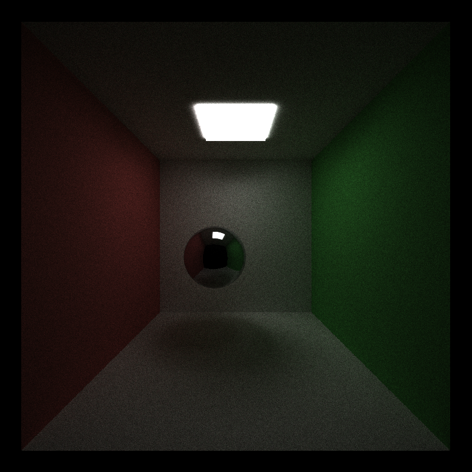
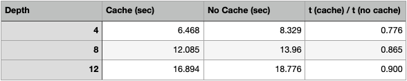
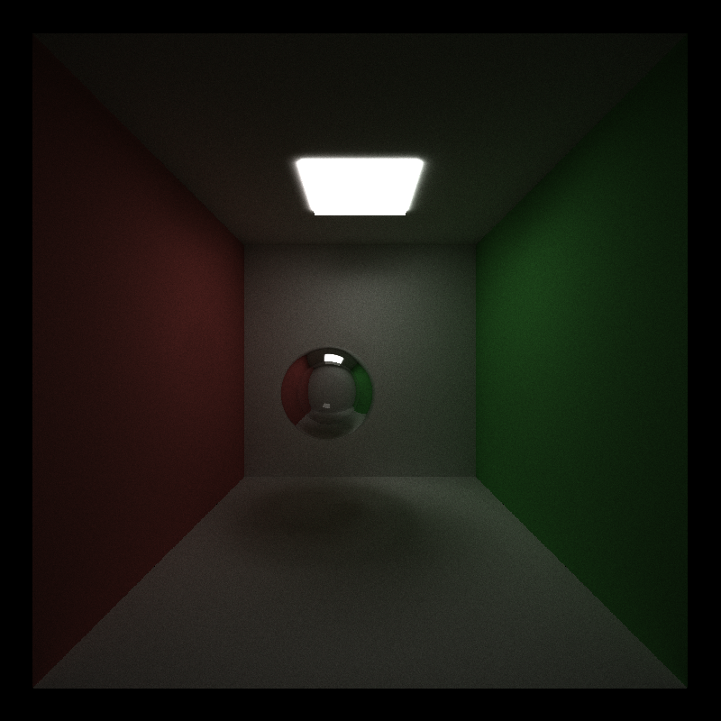
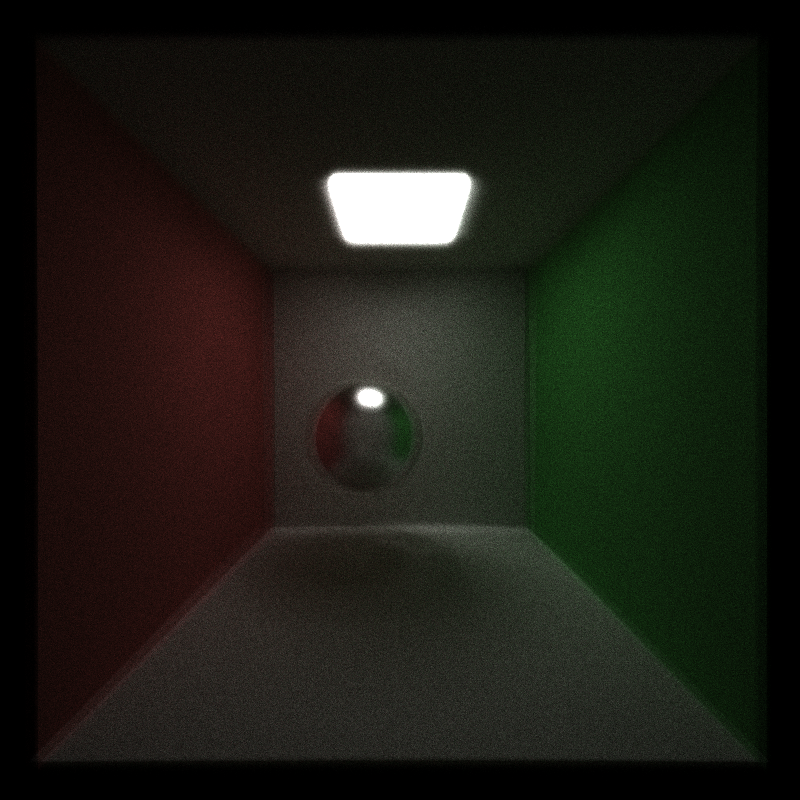
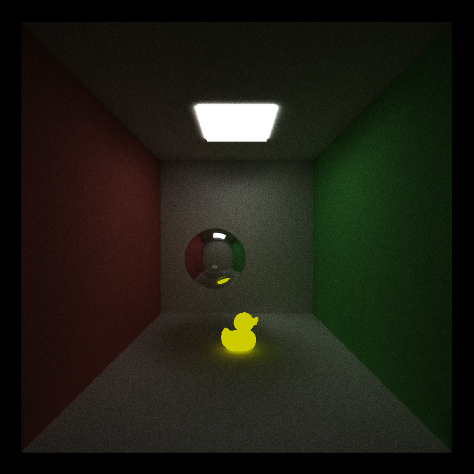
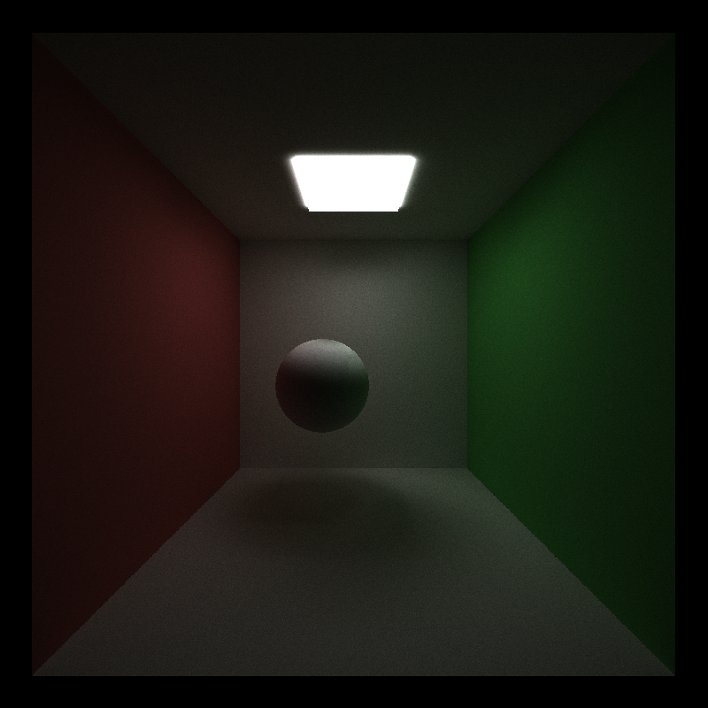
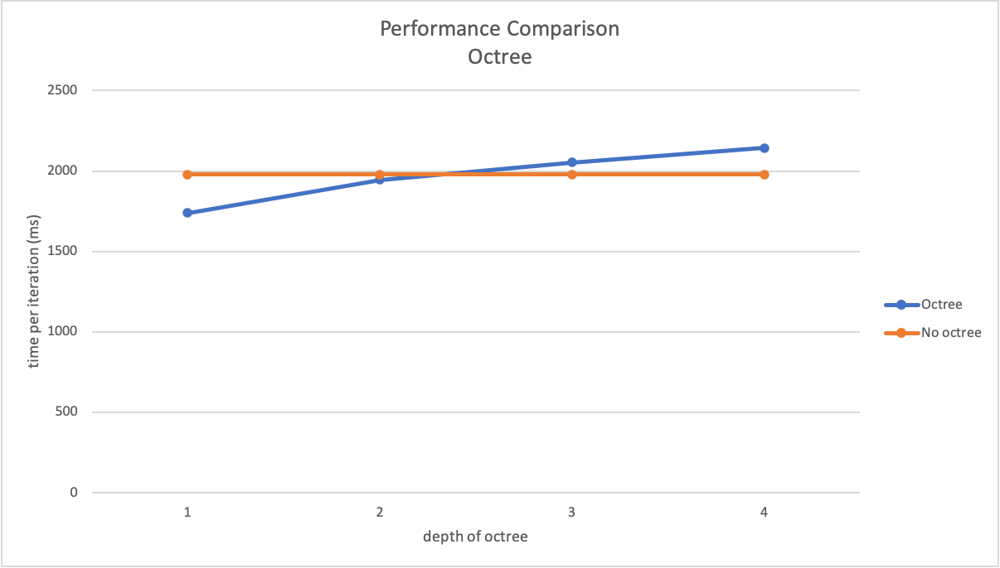
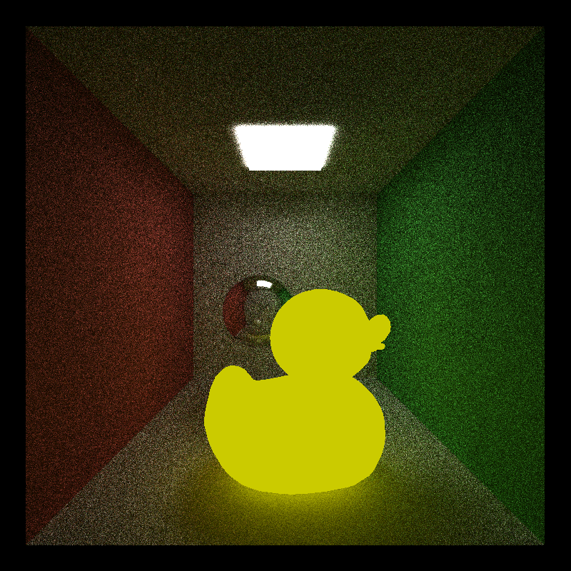

CUDA Path Tracer
================

**University of Pennsylvania, CIS 565: GPU Programming and Architecture, Project 3**

* Han Yan
* Tested on: CETS Virtual lab

## Part 1

Set the sphere to be reflective:

### Sort by materials

For cornell.txt, since there are only a few kinds of materials, sorting the rays by material does not boost the performance (even slows it down a little bit because it has to call sort function in every depth and iteration).

But I expect that as the number of materials grwos larger, sorting would have some effect on the overall performance.

### Cache the first bounce/intersections

I ran performance analysis with varying depth 4, 8, 12, with and without caching. Here are the total time taken in each case by the kernel function 'computeIntersections'. The improvement on performance diminishes as the depth increases. This makes sense because we are only caching the first intersection, which could become negligible with a large depth.

## Part 2

### Small features

 - Refraction
 
 The sphere is refractive and has a refraction ratio of 1.5.
 
 
 
 - Physically based depth-of-field
 
 I used Gaussian distribution jittering to loose camera focus.
 
 
 
### Arbitrary mesh loading - glTF 2.0

I implemented a gltf mesh loader that supports triangle meshes with embedded data buffers. The function is loadGltf() in scene.cpp. 

This is generated by loading both scenes/cornell.txt and scenes/duck.gltf

### Better hemisphere sampling method - Shirley random sampling

Original sampling provided:

Shirley random direction sampling:

## Part 3 - Performance improvement using Octree

Octree structure is stored as a vector inside "scene" maintained by index pointers. The OctreeNode array is then passed to device. Since each OctreeNode has to be static in size in order to be copied with cuda, I created another array of geometry indices, so that each OctreeNode can simply store the starting and ending indices in this array of geom indices, where the indices within this interval correspond to its intersecting meshes. 

To test intersection of bounding box and triangle, I used "separating axis theorem", described in http://fileadmin.cs.lth.se/cs/Personal/Tomas_Akenine-Moller/pubs/tribox.pdf.

The octree structure is traversed iterative by using an array as stack.

### Performance analysis

As the depth of the octree reaches 4, the performance begins to become worse than the original. In this case, I used the same duck but enlarged to affect more rays. If we test with a model with significantly more meshes, then I expected the octree would perform better with greater depth.

tested with model:

