CUDA Path Tracer
================

**University of Pennsylvania, CIS 565: GPU Programming and Architecture, Project 3**

## SIREESHA PUTCHA 
	
*    [ LinkedIn ](https://www.linkedin.com/in/sireesha-putcha/)

*   [ Facebook ](https://www.facebook.com/sireesha.putcha98/)

*    [ Portfolio ](https://sites.google.com/view/sireeshaputcha/home)

*   [ Mail ](sireesha@seas.upenn.edu)

* Tested on personal computer - Microsoft Windows 10 Pro, 
Processor : Intel(R) Core(TM) i7-9750H CPU @ 2.60GHz, 2601 Mhz, 6 Core(s), 12 Logical Processor(s)
 
GPU : NVIDIA GeForce RTX 2060

## FEATURES 

### DIFFUSE, REFLECTIVE AND REFRACTIVE OBJECTS 

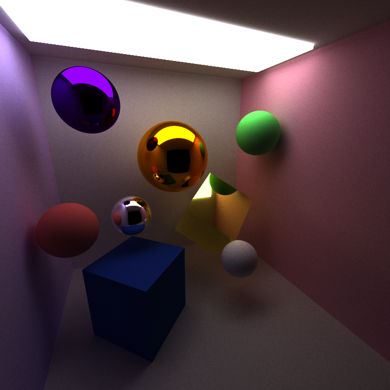 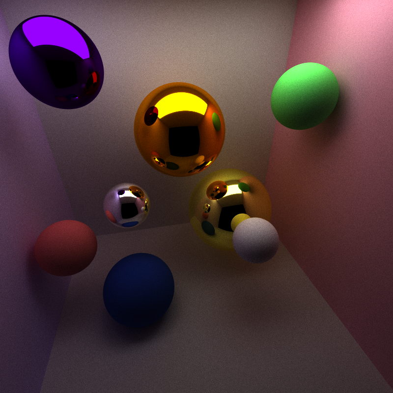

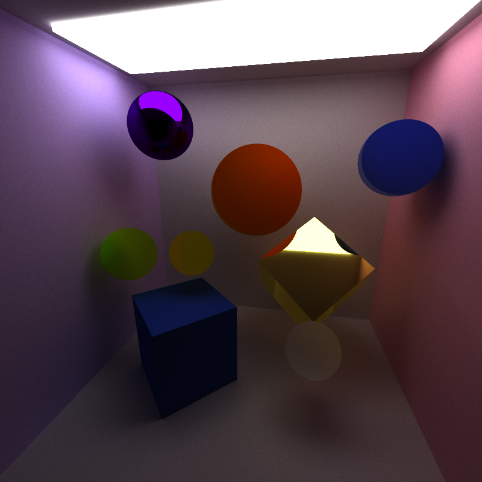  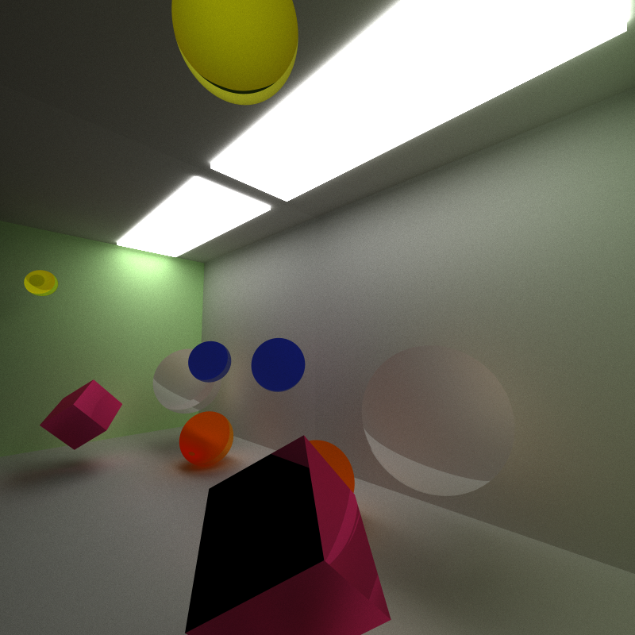

### DEPTH OF FIELD

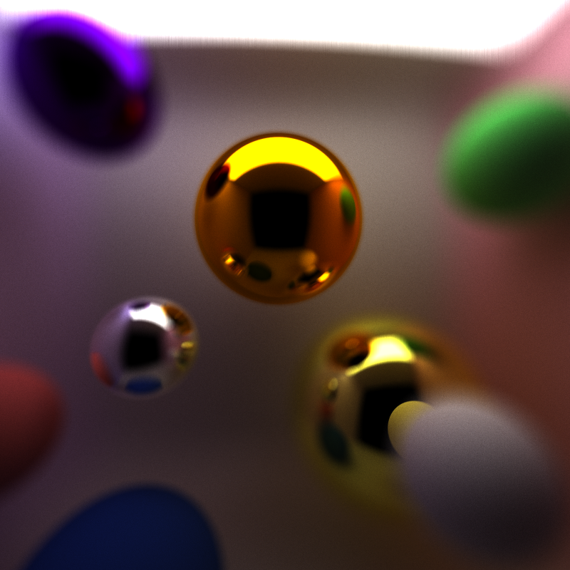  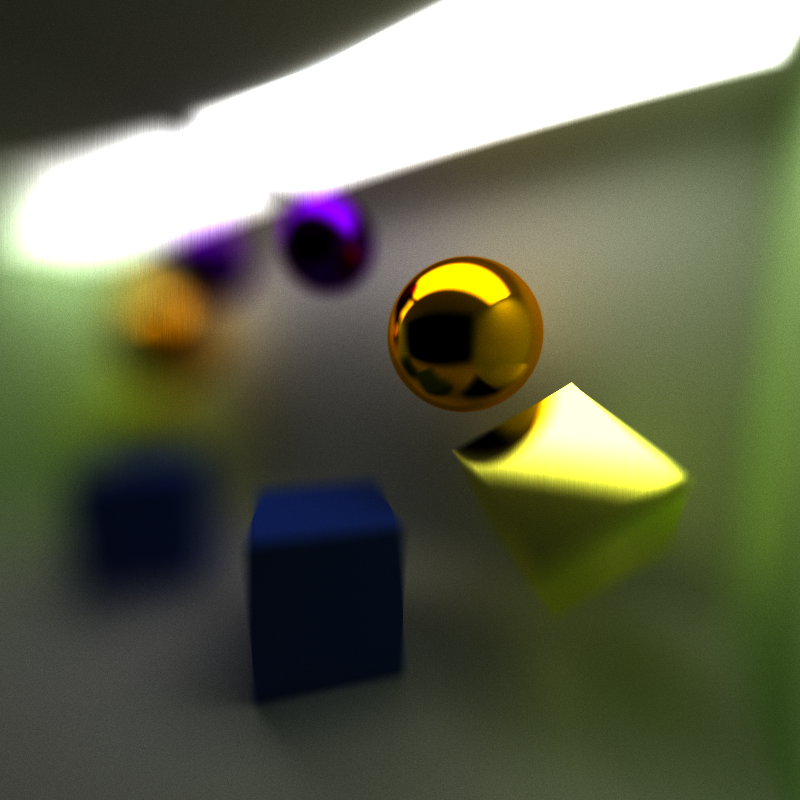  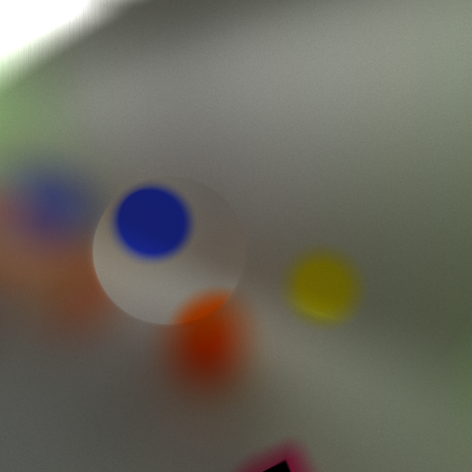 

### MOTION BLUR 

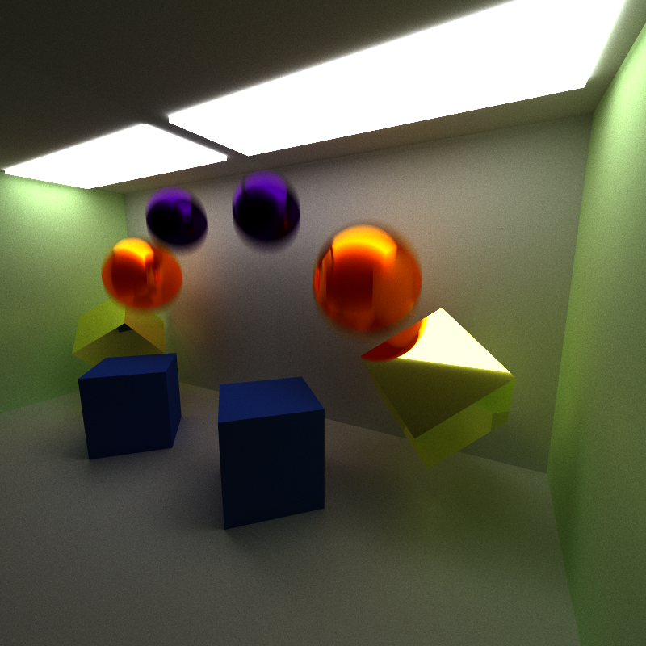  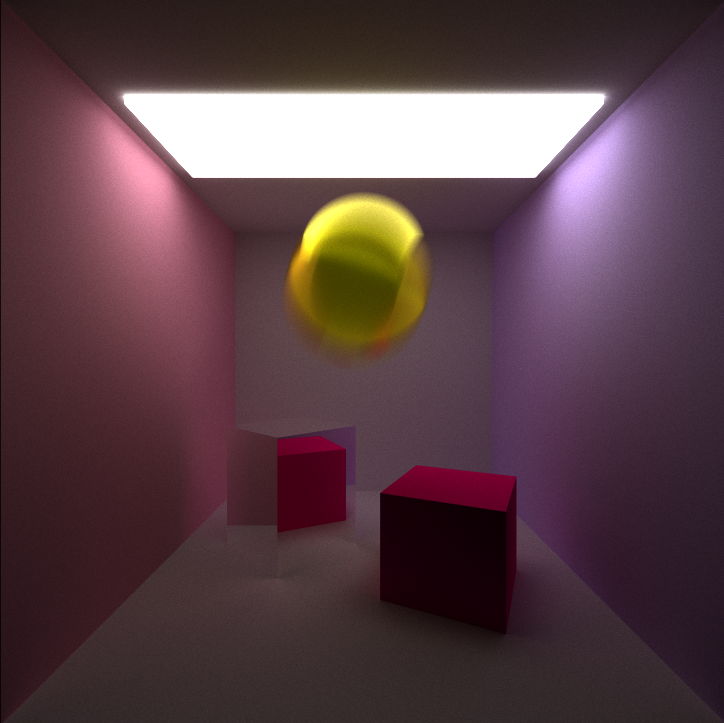 

### OBJ MESH LOADING 

#### Charizard 

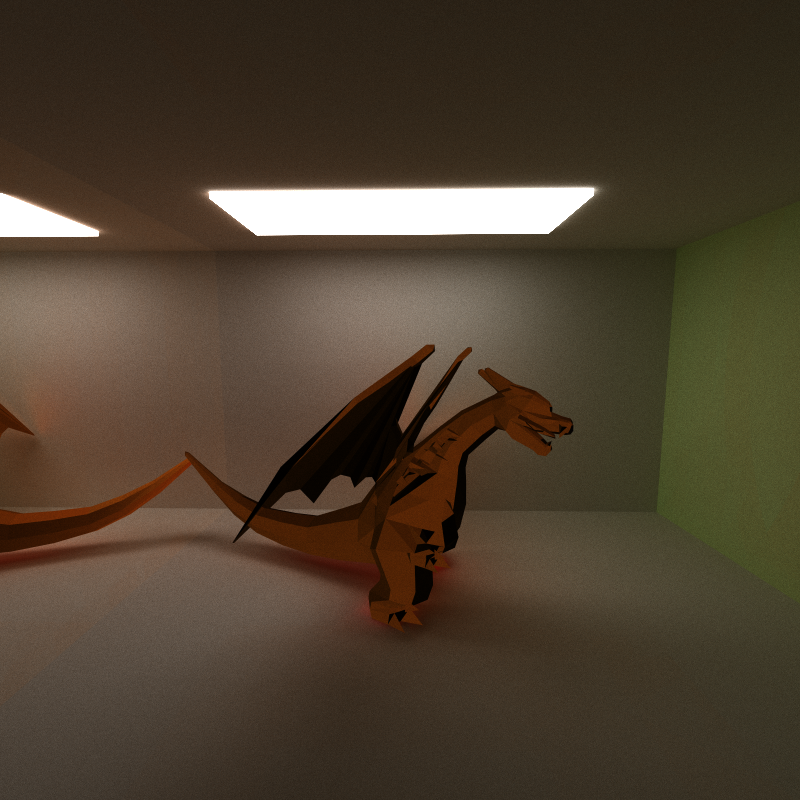  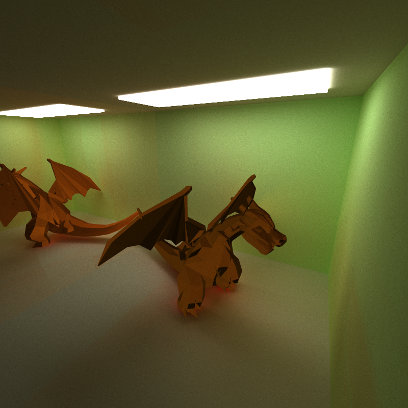

#### Deer 

- Outside the box                                      - Inside the box 

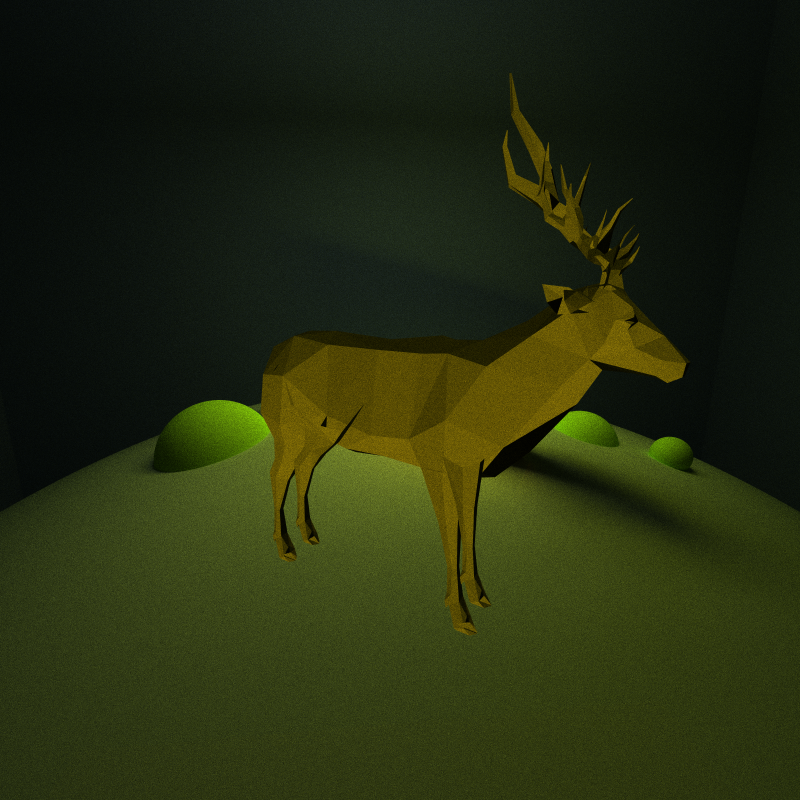      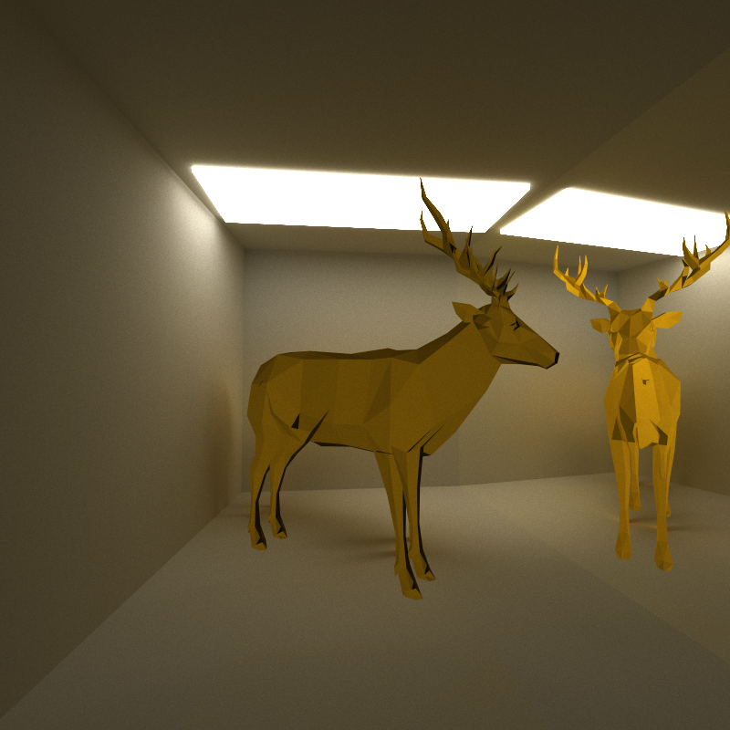

#### Unicorn 

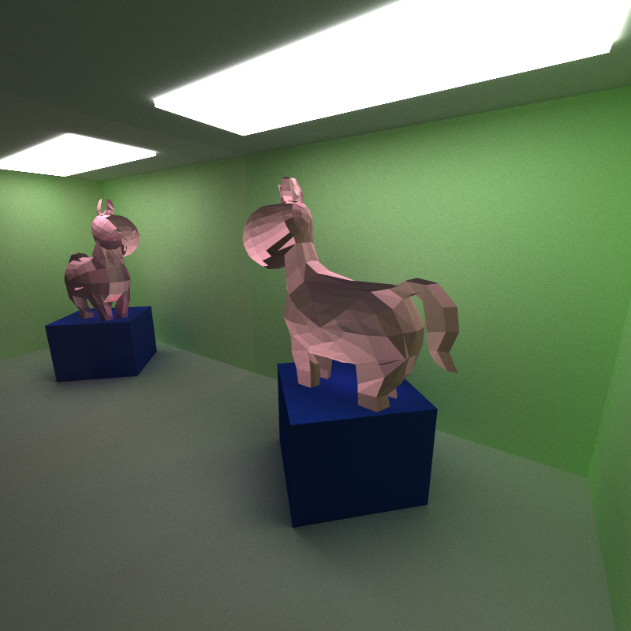     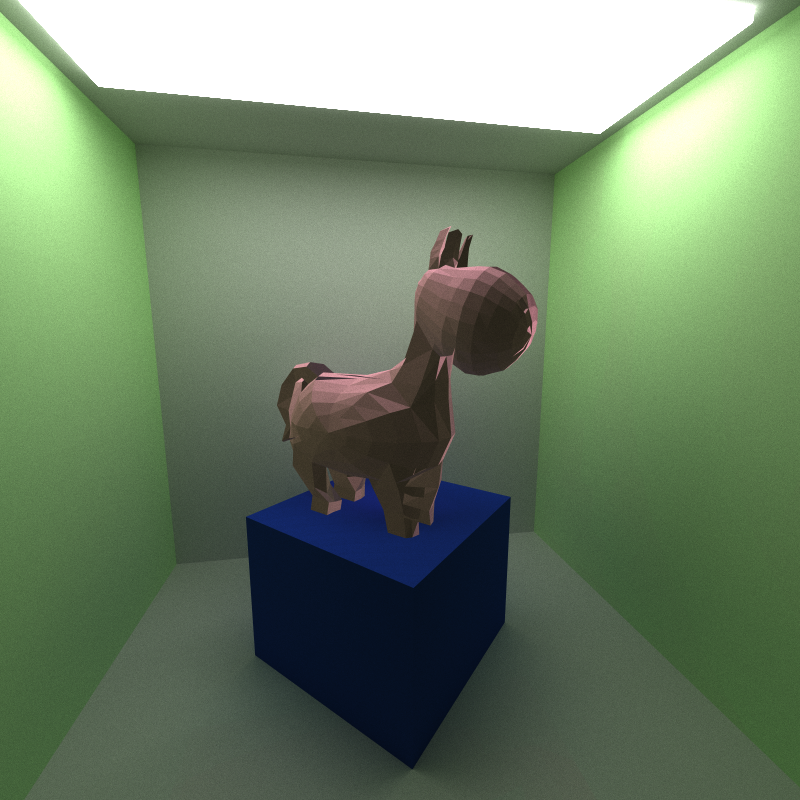

### DIRECT LIGHTING 

### ANTI ALIASING 

## OPTIMIZATIONS 

### Sorting Rays by materials 

### Steam Compacting dead rays 

### Caching first bounce 

## Bloopers 

