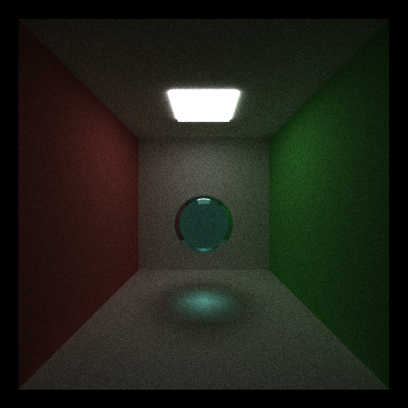
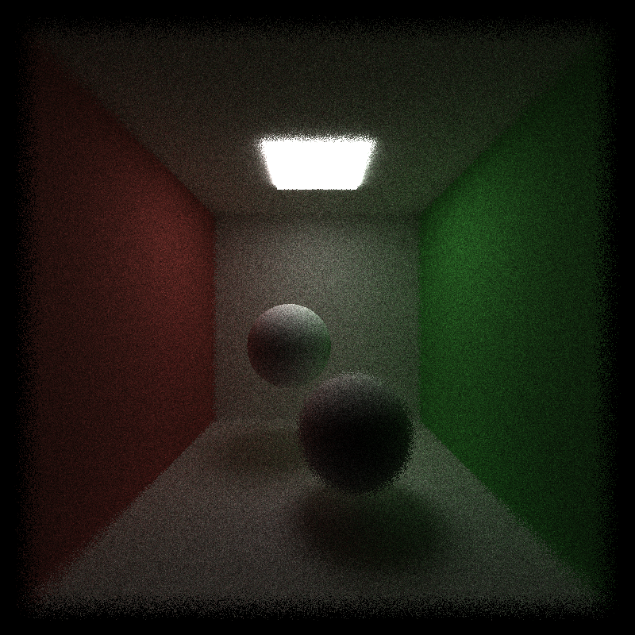
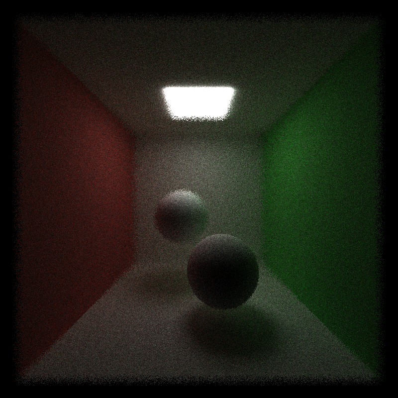
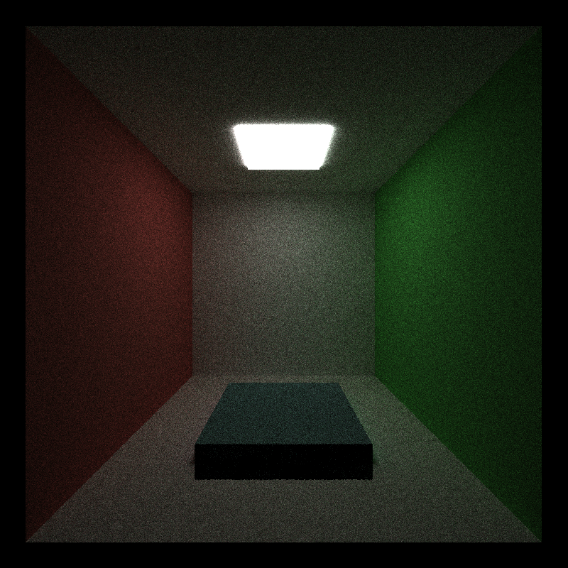
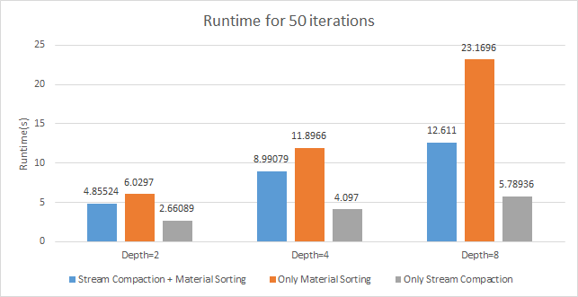

CUDA Path Tracer
================

**University of Pennsylvania, CIS 565: GPU Programming and Architecture, Project 3**

* Szeyu Chan
  * [LinkedIn](https://www.linkedin.com/in/szeyuchan11/)
* Tested on: Windows 10, i7-10510U @ 1.80GHz 16GB, MX250 2048MB (Personal Laptop)

### Features
* A shading kernel with BSDF evaluation for:
  * Ideal Diffuse surfaces
  * Perfectly specular-reflective (mirrored) surfaces
* Path continuation/termination using Stream Compaction (thrust::partition)
* Sorting rays/pathSegments/intersections contiguous in memory by material type (thrust::sort_by_key)
* The first bounce intersections cache for re-use across all subsequent iterations
* Refraction with Frensel effects using Schlick's approximation
* Physically-based depth-of-field
* OBJ mesh loader

### Results
#### Specular Sphere

#### Glass Sphere (IOR = 1.5)

#### Depth of Field
| Focal distance = 11.5 | Focal Distance = 8.5|
| :----:  | :----: |
|||

#### cube.obj

### Performance Analysis

#### Stream Compaction and Material Sorting

I tested the runtime for 50 iterations with different max ray depths.  
For stream compaction (compared the blue bars and the orange bars), it can save runtime especially with a higher max ray depth, because it can terminate the useless rays in advance.  
For material sorting (compared the blue bars and the gray bars), although it can sort the rays based on materials to reduce divergence, it costs much time in this Cornell box scene. My assumption is because there are few materials and objects in this scene, the overhead of sorting is not negligible.

### Third-Party Code
* [tinyObj](https://github.com/syoyo/tinyobjloader)
* [My CPU-based path tracer](https://github.com/CIS-461-2020/final-project-AsteriskChan)
  *  Triangle intersection 
  *  Depth of field with disk sampling

### Reference
* [PBRT] Physically Based Rendering, Second Edition: From Theory To Implementation. Pharr, Matt and Humphreys, Greg. 2010.
