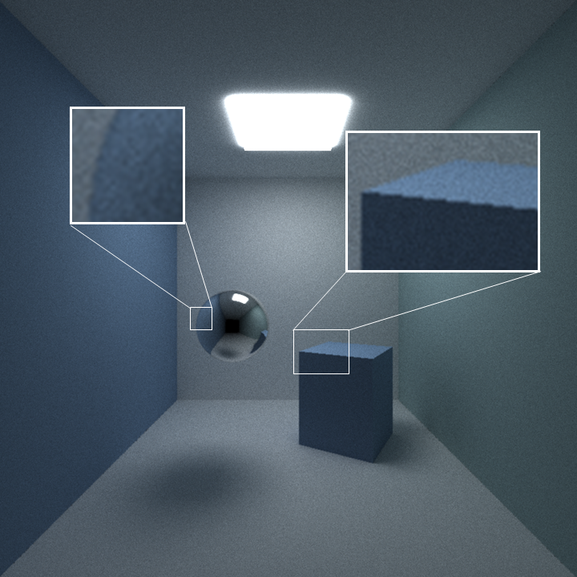

CUDA Path Tracer
================

**University of Pennsylvania, CIS 565: GPU Programming and Architecture, Project 3**

* Zijing Peng

  - [LinkedIn](https://www.linkedin.com/in/zijing-peng/)  [personal website](https://zijingpeng.github.io/)
* Tested on: Windows 22, i7-8750H@ 2.22GHz 16GB, NVIDIA GeForce GTX 1060

### Features

#### Materials

Implemented Ideal Diffuse surfaces, perfectly specular-reflective (mirrored) surfaces and refraction (glass) with Frensel effects in this project.

| Diffuse                           | Reflect                      | Refract               |
| --------------------------------- | ---------------------------- | --------------------- |
|              |         |  |

#### Depth of Field

Implemented physically-based depth-of-field by jittering rays within an aperture. 

| Lens Radius: 0    | Lens Radius: 0.5    | Lens Radius: 1.0    |
| ----------------- | ------------------- | ------------------- |
|  |  |  |

#### Stochastic Sampled Antialiasing

For a given pixel we create different samples within that pixel by adding randomly offsets to the origin of the ray. The samples are then combined into one value for the pixel. Thus, the colors of these rays are averaged.

| Antialiasing Off | Antialiasing On |
| ------------------------ | ----------------------- |
|  |  |

#### Motion Blur

Motion Blur is achieved by sending each ray at some random time when the shutter is open. A random time within the interval is chosen and bonded with the ray. When testing the intersection with the moving object, we can add up an offset based on this time. Thus, the objects is 'moving'.

| Motion Blur Off          | Motion Blur On          |
| ------------------------ | ----------------------- |
|  |  |

#### OBJ Loading 

I implemented arbitrary OBJ mesh loading and rendering. I use [tinyObj](https://github.com/tinyobjloader/tinyobjloader) for loading the OBJ files. In order to accelerate the rendering, I create bounding volume for meshes and do intersection culling by first testing the bounding box before testing the triangles.

### Optimizations

##### Path termination using Stream Compaction

Some path terminates earlier than others. For instance, if a ray hit the light source only at its second bounce, no need to calculate it in the next iteration. I use `thrust::partition()` to reorder the path segments based on `remainingBounces`. Only the path segments with `remaingBounces > 0` will perform BSDF in the next iteration.

##### Sort Intersections by Material Type

Every path segment in a buffer and performing BSDF evaluation using one shading kernel: different materials/BSDF evaluations within the kernel will take different amounts of time to complete. The path segments and intersections are sorted by the material id so that the same material are contiguous in memory, in order to avoid the situation that divergent branches are within a warp.

##### Cache the First Bounce Intersections

The first bounce intersections will stay same if the camera doesn't change. A cache is made to save the intersection of the first bounce in the first iteration and the results can be directly fetch in later iterations.

### Performance

Currently I only profile with the default scene. The performance is even worse when sorting material enabled, it is because there is only two kinds of materials, so latency of divergent branches seems trivial compared to sorting time. I'll replace this image after rebuilding a more complicated scene next week.

