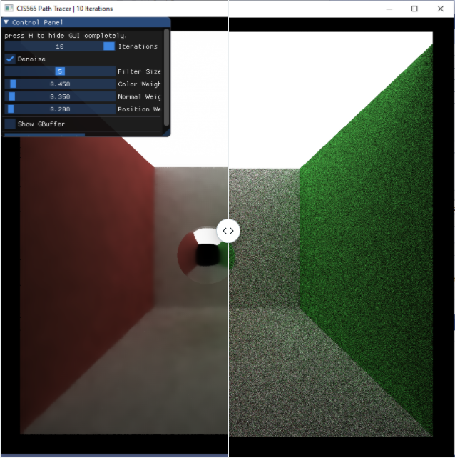
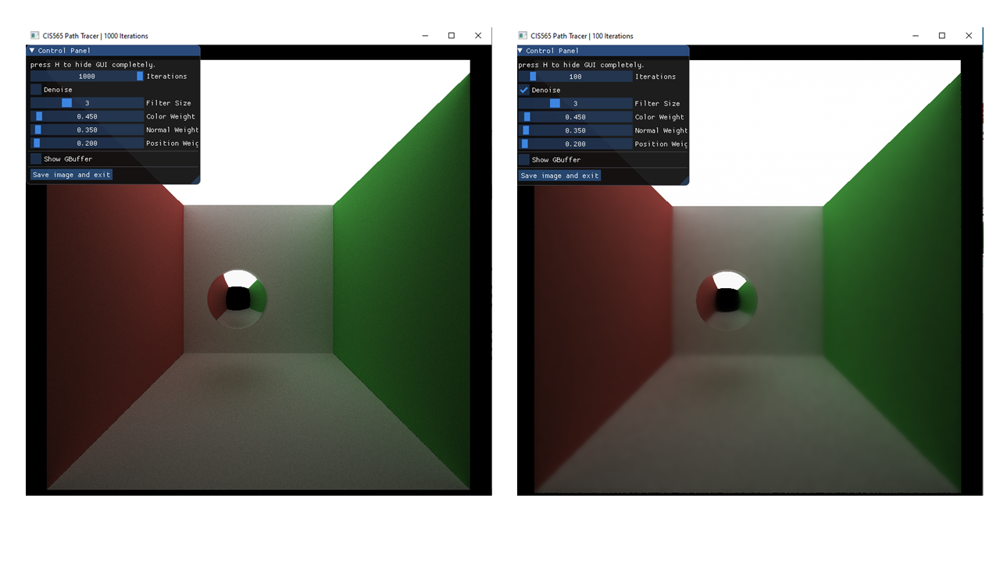

CUDA Denoiser
================

**University of Pennsylvania, CIS 565: GPU Programming and Architecture**

* Jiarui Yan
  * [LinkedIn](https://www.linkedin.com/in/jiarui-yan-a06bb5197?lipi=urn%3Ali%3Apage%3Ad_flagship3_profile_view_base_contact_details%3BvRlITiOMSt%2B9Mgg6SZFKDQ%3D%3D), [personal website](https://jiaruiyan.pb.online/), [twitter](https://twitter.com/JerryYan1997), etc.
* Tested on: Windows 10 Home, i7-9700K @ 3.60GHz 16GB DDR4 RAM, RTX 2070 SUPER 8GB Dedicated GPU memory (Personal desktop)

## Features

* A-trous wavelet filter

* Gaussian filtering

* Performance Analysis

## Result

## Performance analysis

### How much time denoising adds to renders

Here is an comparison between different filter size of A-Trous denoiser and a iteration of path trace.

As we can see from the graph above, the demoiser can be almost ignored in terms of performance by comparing to an iteration of the path tracer even though we increase the filter size to a large scale for the denoiser. 

### How denoising influences the number of iterations needed to get an "acceptably smooth" result

As for acceptably smooth result, I think for different scene it would be different. So, I choose the 'cornell_ceiling_light' under the scenes folder as benchmark here. For me, 1000 iterations for purely path tracer is good for me, while 100 iterations with denoiser that has a 17 width kernel is cool for me too. Here is the comparsion for these two images:

### How denoiser impacts runtime at different resolutions

According to the algorithm of A-Torus denoising, it is not heavily affected by the resolution because all the operations are relatively cheap by comare to an iteration of path tracing. Here is an experiment result:

These experiments are conducted under the environment that the dim of the filter is 17. As we can see, the percentage of one path trace iteration over a denoise process is decreasing as the resolution goes up. Therefore, we can conclude that high resolution can help to eliminate the time consumption of the denoiser. 

### How effective/ineffective it is with different material types

For different material types, the denoiser would produce different results. Here are some experiments conducted on 100 iterations and 1000 iterations with filter dim that is 17.

As we can see from the comparsion above, for reflective and frensel material, the denoiser would blur lots of subtle details like reflection and refraction of the nearby objects, which are important to imply their traits. However, for diffuse material, it almost recovers the appearance of the ground truth. Therefore, from my persepctive, A-Torus denoiser is effective for diffuse material, while ineffective for specular type materials. 

### Compare visual results and performance for varying filter sizes

All experiments in this section are conducted with 800x800 resolution and 100 iterations. Here is an example that illustrates the difference results of different kernel sizes.

As we can see from the comparsion above, when the kernel dimision is below 17, the artefacts are obvious. However, when we increase the filter size, these artefacts would dispear and the result quality would remain at the same level. 

Then, let's take a look at the performance of different kernel size.

As we can see from the graph above, the time-consumption of different kernel size are increasing when we increase the size of these kernels.

### Compare across different scenes

In the A-Trous denoiser, the variance would significantly affect the result of denoise. Therefore, with differnt G-Buffer from different angles for a same scene, we may get different results. Here are two comparsion for more involved scenes. All experiments in this section are conducted with 100 path tracer iterations and 65 dim filter size.

First of all, let's take a look at the open scene of the yellow duck. As we can see, from the bottom-up view, the result doesn't look good.

Besides, from the top-down view, the result is also not as good as the cloesd scene shown before.

Then, let's take a looks at the closed scene for the yellow class duck.

As we can see from the image above, it is acceptable but not as good as other material types like diffuse materials. 

### Compare A-trous and Gaussian filtering

According to the description of paper, A-Trous filter can significantly reduce the sample number of Gaussian filter and keep the quality of sampling. As a result, we can expect that with A-Torus filter can performs much better than the Gaussian filter. Here is an comparsion of the image quality of different filter.

As we can see from the comparsion above, with 17 dim filter size with both Gaussian and A-Torus, the difference between the quality of different kernel is not obvious. The only difference that I can tell is the subtle difference for the reflection material that I highlight in the image above. Therefore, firstly we can conclude that the difference of the result is not obvious. 

Then, let's look at the difference of their performance.

As we can see the plot above, the performance difference is obvious. Especially, when the filter size dim is above 33, the A-Torus filter would be obviously faster than the Gaussian filter. Meanwhile, their image quality doesn't have appearant difference. Therefore, we can guess that this is the reason why authors in this paper would choose to use the A-Torus filter instead of the Gaussian filter. 

## Configuration

In order to successfully use the features mentioned and produce the performance data presented, you may want to follow the instructions below.

### How to switch to gaussian filtering

If you search 'gauss_denoise' keywords in main.cpp, you can find that it has been commented out. Everything about gaussian filtering is written in this function. Meanwhile, 'denoise' function above it represents the A-Torus filter. 

### The calculation of variance for position map, normal map and color map

Owing to the fact that this paper mentions that the weight used in GUI represents variance for different maps and I found that it is time-consuming to adjust these parameters to generate an acceptable image, I decide to deprecate these parameters and calculate them by using these maps directly. It looks like it works well. So, I just keep them in this way. As a result, the weight parameters in GUI won't work.

## Reference

[Edge-Avoiding À-Trous Wavelet Transform for fast Global
Illumination Filtering](https://jo.dreggn.org/home/2010_atrous.pdf)