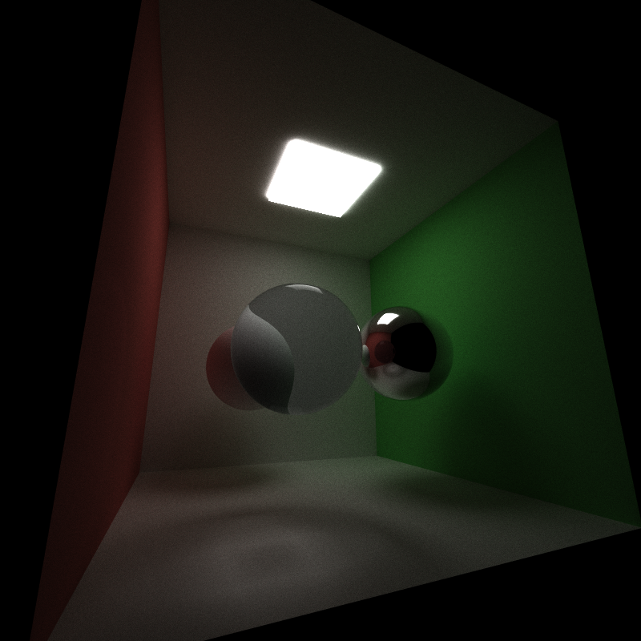
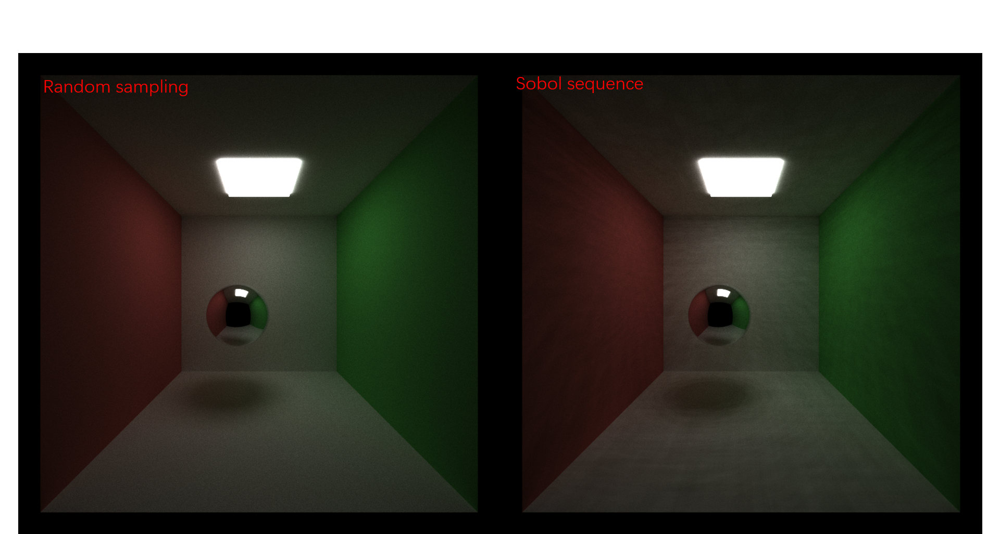
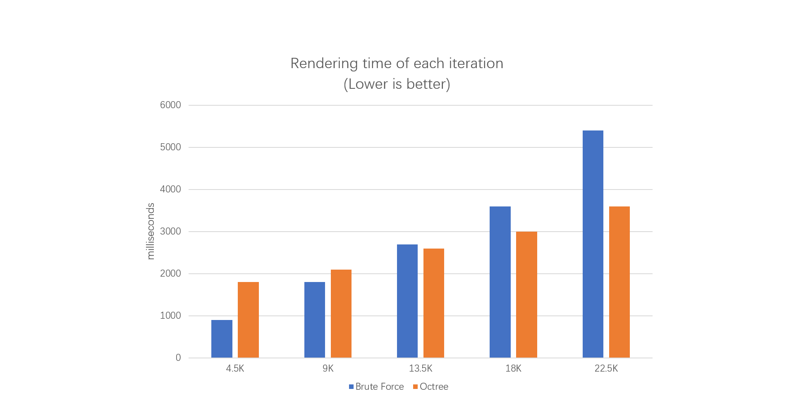

CUDA Path Tracer
================

**University of Pennsylvania, CIS 565: GPU Programming and Architecture, Project 3**

* Jilin Liu
  * [LinkedIn](https://www.linkedin.com/in/jilin-liu-61b273192/), [twitter](https://twitter.com/Jilin18043110).
* Tested on: Windows 10, i7-8750H @ 2.20GHz, 16GB, GTX 1050Ti 4096MB (personal)

## Features and Results

This is a GPU-based Monte Carlo path tracer implemented in C++ and CUDA. Below are some rendering examples.

The image below is showcasing a bug that I encountered when implementing the refraction. To avoid numerical error I just offsetted the intersection point a little bit over the surface, but resulting in some rays never entering the sphere.

Features:
1. A shading kernel with BSDF evaluation for diffuse material and perfect specular reflection material.
2. Path continuation/termination using Stream Compaction.
3. Sorting pathSegments based on material types to make the same material contiguous in memory. 
4. A cache for the first bounce intersections for re-use across all subsequent iterations.
5. Refraction with Fresnel effects.
6. Stochastic sampled antialiasing. (Does not work with first cache.)
7. Mesh loading and rendering with Hierarchical Spatial Data Structure(see below).
8. Octree culling of the entire scene.
9. Hemisphere sampling using Sobol sequence.

## Performance Analysis

### Sorting pathSegments based on material types

To avoid divergence of threads when processing different materials, we would like the same material to be contiguous in memory. However, after sorting the path segments, the algorithm runs actually much slower for Cornell Box. The reason is that this scene does not contain many different types of materials and sorting is very expensive. A much wiser implementation would be required to achieve better performance.

### Cache first bounce intersections for re-use

This idea is good, especially when our camera is still and want to get more iterations of path tracing. But the performance gain is still limited for Cornell Box. The reason is that there are merely few objects in the scene, thus doing a intersection check would not cost much, especially for a GPU implementation. This should be much more helpful when we add more objects or meshes to the scene.

### Stochastic sampled antialiasing

When applying antialiasing, the ray direction from camera is jittered along stratified sub-pixels in each iteration. This implementation is actually not mathematically correct, when the iteration number is not a multiplication of the sub-pixels, but the error is propotional to the reciprocal of the iteration number. The advantage is that we do not need to synchronize the rays of the same pixel because their execution is serialized in time.

### Sobol sequence

Sobol sequence is a low discrepency sequence generated using some direction vectors. I used the same vectors as those in Unreal Engine. The result is pretty "random" and it is distributed more uniformly in space.

Sobol sequence can to some extent make the ray tracing process converge faster. However, it is prone to some structural artifacts in the rendered image, as you can see below.

### Mesh loading with glTF and rendering using octree.

I used [tinygltf](https://github.com/syoyo/tinygltf/) to parse a glTF mesh model. I only utilized the position data of the triangles. Normals and UV coordinates will be added in the future.

As you can see below, I implemented an octree to accelerate the ray intersection test. The implementation may be a little different from a standard octree. To insert a geometry into the octree, we recursively check which child node does this geometry belong to and place it at the level where the entire bounding box of that geometry could be covered. This means there will be triangles stored in the intermediate node and the tree will just grow adaptively. This is a good property when there are many large triangles that span a large space of scene and effectively avoids intersection checking with many leaf node.

The performance gain using octree is rewarding. When there are about 15K or more triangles in the scene, using an octree becomes faster than a brute force method. And as the number of triangles doubles, the rendering time of brute force method increase linearly, while the rendering time using octree increases much slower.

Even the theoretical complexity of octree-accelerated ray intersection is logarithmic, my implementation has a large coefficient. It is slower than brute force method when there are only limited number of geometries in the scene. The reason is that ray segment intersections could be very different from each other, leading to huge warp divergence. One possible way to do this more efficiently is to break the intersection checking to smaller stages, for example, check one node of octree at a time. When a ray ends up hitting nothing, it could be removed early using stream compaction, just like what we did for one single iteration. Reducing granularity could reduce warp divergence.
