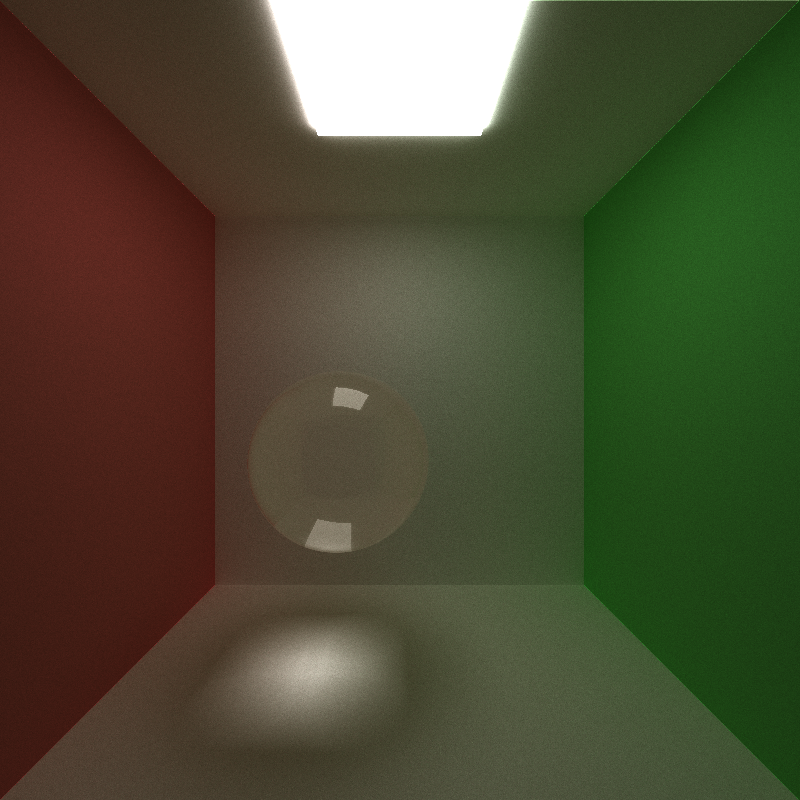

CUDA Path Tracer
================

**University of Pennsylvania, CIS 565: GPU Programming and Architecture, Project 3**

* Haoyu Sui
  	* [LinkedIn](http://linkedin.com/in/haoyu-sui-721284192)
* Tested on: Windows 10, i5-9600K @ 3.70GHz 16GB, RTX 2070 SUPER 8GB 
* SM：7.5

### Features
* Ideal diffuse surface
* Specular-reflective surface
* Stream compaction for path continue and termination 
* Sort rays with same material
* Cache first bounce
* Refraction with Frensel effects using Schlick's approximation
* Physically-based depth-of-field
* Stochastic Sampled Antialiasing
* Arbitrary .obj mesh loading
* Bounding volume intersection culling
* Stratified sampling method
* Object motion and motion blur

### Rendered images

**Arbitrary .obj mesh loading**

| Fallguys | Dragon |
| ------------------------ | ----------------------- |
|  |  |

**Specular surface reflection & Diffuse surface reflection & Refraction**

| Specular Surface | Diffuse Surface | Refraction |
| ---------------- | --------------- | -----------|
|  |  | 

**Physically-based depth-of-field (Focal Distance = 7.f)**

| Lens Radius 0.0 | Lens Radius 0.5 | Lens Radius 1.0 |
| ---------------- | --------------- | -----------|
|  |  | 

**Stochastic Sampled Antialiasing**

| With Antialiasing | Without Antialiasing |
| ------------------------ | ----------------------- |
|  |  |

**Stratified sampling method**

| Naive Sampling | Stratified Sampling |
| ------------------------ | ----------------------- |
|  |  |

For stratified sampling comparsion, it can be seen from the figure that the difference is not very large, but some subtle differences can be found, for example, the shadow of the stratified sampling is a little bit more concentrated.

**Object motion and motion blur**

| Without Motion | Motion and motion blur |
| ------------------------ | ----------------------- |
|  |  |

### Performance Analysis

I calculated the average time spent in each depth loop in 200 iterations and got the result shown in the figure above. 

In terms of sorting rays, I originally thought that sorting would reduce the time it took because it would reduce the divergence in a thread warp, but from the results, on my computer, sorting actually reduced performance. It may because there are relatively few existing materials. When there are many kinds of materials in the scene, the performance should be improved.

For caching the first bounce, it can be seen from the chart that there is a slight improvement in performance, because the cache can only reduce the time to calculate the intersection for the first time, so the larger the depth, the smaller the performance improvement. And I think it has nothing to do with the number of iterations.

For bounding volume intersection culling, I tested the meshes with different numbers of triangles. From the table, it can be seen that when the number of triangles is relatively small, the effect of the bounding box is not obvious. As the number of triangles increases, the bounding box improves the performance more significantly.

### Third-party code

[tinyObj](https://github.com/tinyobjloader/tinyobjloader)

