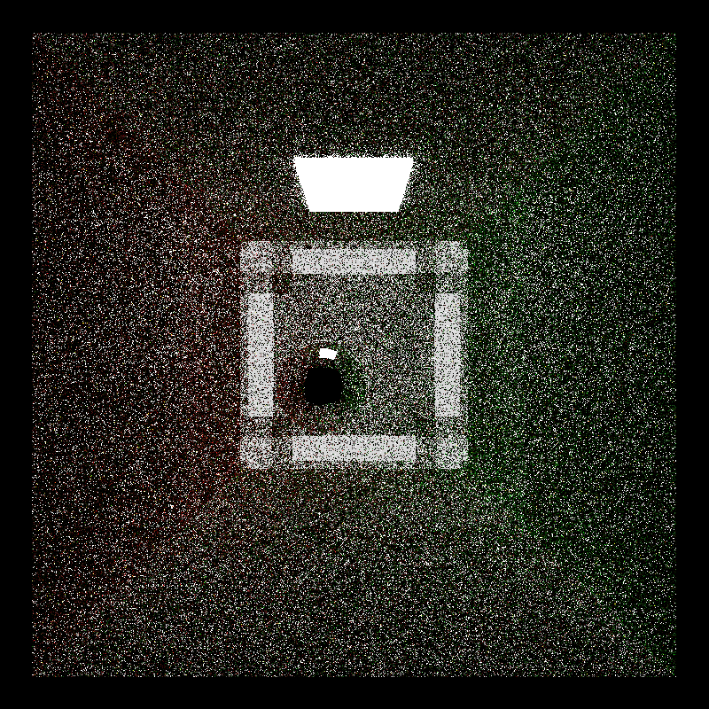

CUDA Path Tracer
================

**University of Pennsylvania, CIS 565: GPU Programming and Architecture, Project 3**

* SPENCER WEBSTER-BASS
  * [LinkedIn](https://www.linkedin.com/in/spencer-webster-bass/)
* Tested on: Windows 10, i7-6700 @ 3.40GHz 16GB, Quadro P1000 222MB (MOR100B-19)

### DESCRIPTION

Path tracers are programs that have th eability to simulate the physics of light to create photorealistic images. Path tracers are computationally expensive, but embarrasingly parallel; this quality lends them to implementations on the GPU to speed up run times. This project is a GPU implementation of a path tracer using CUDA and C++.

Features:
* Diffuse and specular shaders
* Path culling using stream compaction

### BLOOPERS

### REFERENCES

* Specular Highlight Formula: http://ogldev.org/www/tutorial19/tutorial19.html#:~:text=Let's%20finalize%20the%20formula%20of,the%20material%20('M').
