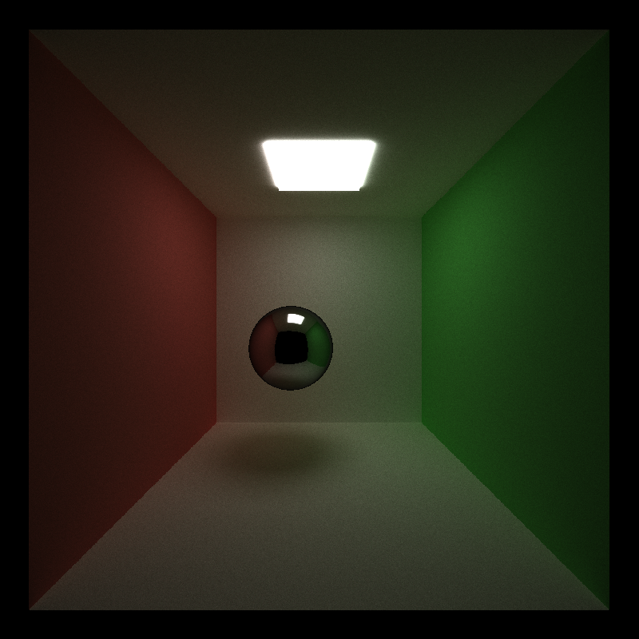

CUDA Path Tracer
================

**University of Pennsylvania, CIS 565: GPU Programming and Architecture, Project 3**

* Li Zheng
  * [LinkedIn](https://www.linkedin.com/in/li-zheng-1955ba169)
* Tested on: Windows CUDA10, i5-3600 @ 3.59GHz 16GB, RTX 2060 6GB (personal computer)

  

## Part 1 - Core Features
In this part, I implete
- A shading kernel with BSDF evaluation for ideal Diffuse surfaces and perfectly specular-reflective surfaces.
- Path continuation/termination using Stream Compaction from Project 2.
- Toggleable meaterial sort to make rays/pathSegments/intersections contiguous in memory.
- Toggle first bounce cache for re-use across all subsequent iterations

### Sort Material
Test on iterations of 5000 and depth of 8 with first bounce cache. The rendering with material sort takes 402.3s compared with 403.9s without material sort. The material sort is more efficient, because different materials take different time to complete. Compared with reflective material, diffusive material takes more time to complete BSDF evaluations. It’s better to make path segments continuous in memory by material type. Then the threads of the same warp are more likely to finish at the same time, avoiding the wait.

### First Bounce Cache
  
The diagram demonstrates the time to complete 5000 iterations of path tracing with different max depths. With the max depth increases, the time consumption of first-bounce-cache method is less than the case without the cache. It is predictable since the cache saves the time to calculate the first bounce of each iteration. 

## Part 2 - Advance Features
Implement refraction and depth-of-field
  

## Part 3 - Octree 
Tried to implement Octree, but there are some bugs haven't been fix.
