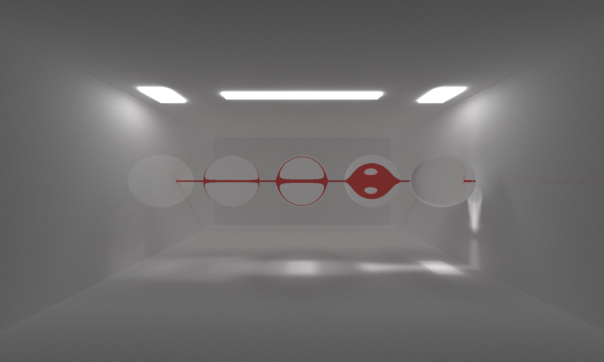
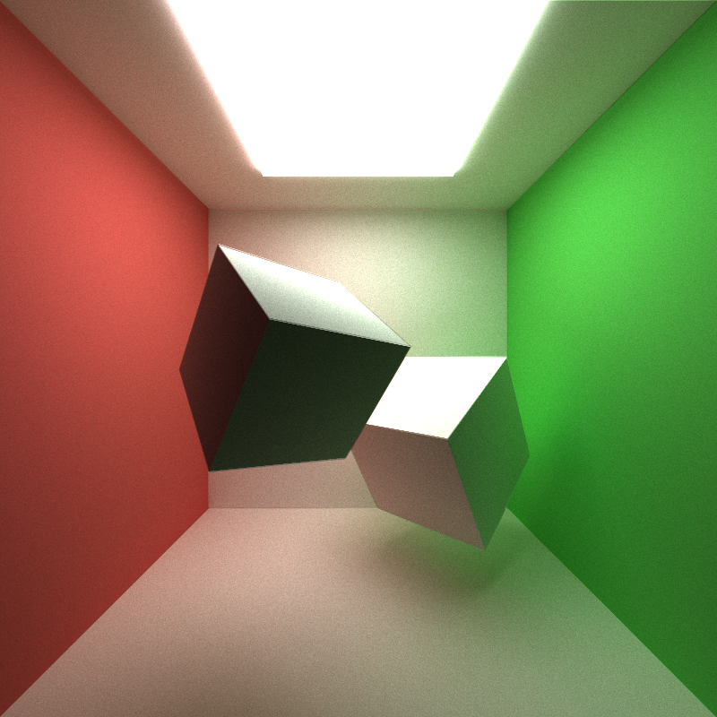
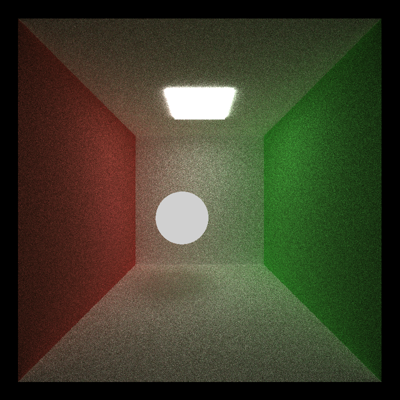

CUDA Path Tracer
================

**University of Pennsylvania, CIS 565: GPU Programming and Architecture, Project 3**

* Hanyu Liu
  - [personal website](http://liuhanyu.net/) 
* Tested on: Windows 10, Intel(R) Core(TM) i7-7700HQ CPU @ 2.80GHz 16.0GB, GeForce GTX 1050 (Personal)
* Modified CMakeLists.txt

### Visual Features

#### OBJ loading

The heart is an obj file with 1792 triangles, with perfect specular shader and rendered at ~1000 iterations.

#### Different Textures & Materials

Pictured here: file loaded texture, bump map, and basic procedural texture

#### Refraction

Sphere that reflects and refracts!

#### Black and White Vignette Post Process Shader

Used final rays to filter the image. Minimal performance impact.

#### Anti Aliasing

Jittered the rays to achieve a blurring effect around edges. Minimal performance impact. 

#### Stratified Hemisphere Sampling

Samples rays in kernels, spreading out the samples more evenly in the hemisphere, causing there to be less noise.

#### Camera Depth of Field

Blurring out everything that is before and after the focus length. 

### Performance Optimizations

#### Stream Compaction

Using stream compaction, we are able to eliminate the path segments with zero bounces remaining after every iteration. This speeds up the process because there will be less path segments to bounce in the next iteration. 

As we can see, the number of paths remaining exponentially decreases as the number of iterations increase, greatly speeding up the process. 

However, in a closed space, we will see that stream compaction becomes a lot less helpful as less rays are terminated early on. 

Here we see that the paths remaining in the closed box do not decrease as much as an open box. In this scenario, the effect of stream compaction on the overall performance is a lot less drastic.

#### First Bounce Caching

Increasing the max ray depth will slow the performance and result in rendering time. If we cache the first bounce, we avoid doing the first intersection calculation, which speeds up the rendering. 

#### Materials Sorting

For a scene with objects with many different materials, it is faster to have segments with the same material in contiguous memory in order to group similar runtimes together, reducing waiting time for threads in the same warp. However, if there are not many materials in the scene, the time it takes to sort the materials exceeds the benefit we get in performance, thus making the render time slower.

### Bloopers

Confetti?? (supposed to be the... cornell box, if you can't tell)...

Looks like an eyeball (supposed to be fresnel)

Where is the light coming from?? (supposed to be refraction only)

It's a disco in here....(supposed to be stratified hemisphere sampling)

### Basic Test Renders

Refraction only, no reflection 

Fresnel: Reflection + Refraction

Fresnel: Reflection + Refraction

Texture mapping from file

Simple Diffuse Box

Simple Specular Box

