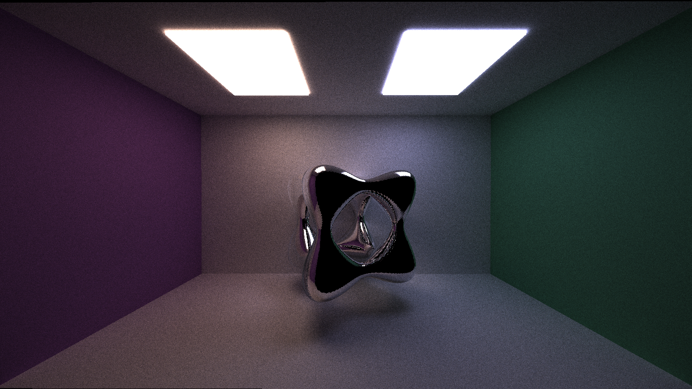

CUDA Path Tracer
================

**University of Pennsylvania, CIS 565: GPU Programming and Architecture, Project 3**

* Janine Liu
  * [LinkedIn](https://www.linkedin.com/in/liujanine/), [personal website](https://www.janineliu.com/).
* Tested on: Windows 10, i7-10750H CPU @ 2.60GHz 16GB, GeForce RTX 2070 8192 MB (personal computer)

Pathtracing is a rendering technique that traces numerous rays of light through a 3D scene. Rays start from the camera, pass through the space of the screen, and bounce between objects in the world; these bounces are determined by the properties of the materials they intersect.

In addition to building a GPU-based pathtracer, this project involved implementing optimizations and other features, including:

- [Reflective and refractive materials](#materials)
- [Depth of field based on a thin lens camera](#depth-of-field)
- [Stochastic Anti-Aliasing](#stochastic-anti-aliasing)
- [OBJ Loading](#obj-loading)
- [Procedural Shapes](#procedural-shapes)
- [Procedural Textures](#procedural-textures)

This pathtracer draws upon the [Physically-Based Rendering textbook](http://www.pbr-book.org/) for reference.

# Features

## Materials

In this pathtracer, three basic material types exist: **diffuse**, **reflective**, and **refractive**. Their interactions with rays of light are handled by bidirectional scattering distribution functions, or BSDFs, based on the directions of the input and output rays. The BSDF for each material type handles their light rays differently:

- **diffuse**: samples a hemisphere of space around the intersection normal that is incident to the surface.
- **reflective**: reflects the light ray about the surface normal. 
- **refractive**: refracts the ray through the material according to Snell's law of refraction.

In the spirit of the PBR textbook, I handle materials using BSDF "flags" that are parsed from the scene file. When an object has more than one material flag, all rays that hit it will choose randomly between the flagged materials, sample the randomly chosen material, then divide its contribution by the probability of choosing it (to upscale its contribution). This allows for mixed materials, such as a half specular, half diffuse material.

Here, a compound reflective and refractive effect is implemented through a [Fresnel](https://www.dorian-iten.com/fresnel/) material, which reflects light rays that are more tangent to its surface. This creates an effect where rays passing through the material are refracted, while rays grazing the sides of the material are reflected. Instead of directly calculating the Fresnel component, I estimate it using **Schlick's approximation**, just as [this raytracer's implementation](https://raytracing.github.io/books/RayTracingInOneWeekend.html#dielectrics/refraction) does.

For comparison, these renders below feature a **purely refractive** sphere on the left, and **Fresnel glass** spheres in the middle and right.

## Depth of Field

The basic implementation of a pathtracer interprets the world through a pinhole camera, which doesn't factor in any effects that would occur through a real camera lens. This results in an image where everything is in equal focus. Simulating a depth of field effect requires a bit more work: the rays need to simulate being passed through a **thin lens camera** that is focusing on objects on a plane some **focal distance** away. To achieve this, the pathtracer's initial rays are jittered on a circular space that represents the lens, and their directions are refocused to a point on the focal distance plane. This can then be used to give some blur to the foreground or background of our scenes.

## Stochastic Anti-Aliasing

The pathtracer shoots one ray through each pixel; color is strictly calculated for that ray and thus that pixel. Pixels doesn't account for the colors of the surrounding pixels, which results in discrete, pixelated edges in renders like this.

We can jitter the initial ray's direction by a small epsilon so it samples around its original trajectory each iteration. Then, over all iterations, this will average to an anti-aliased image with softer edges.

## OBJ Loading

To allow arbitrary meshes to be rendered by the pathtracer, I used the [TinyObj loader](https://github.com/tinyobjloader/tinyobjloader) to parse OBJ files as geometry in the scene. These are broken down into triangles of the same material that are tested against for intersections with every ray.

Of course, the more complex the mesh, the more triangles it has, and the longer it takes to render the scene. In the future, I would like to implement a hierarchal data structure to speed up the rendering process.

|  | 
|:--:| 
| Heart model from [here](https://www.turbosquid.com/3d-models/iconic-heart-3ds-free/389728); 1792 triangles.|

|  | 
|:--:| 
| Dog model from [here](https://www.cgtrader.com/free-3d-print-models/house/decor/doberman-dog-6140e3ce-7726-4c90-8133-e924d1f8ba49); 254 triangles.|

## Procedural Shapes

In contrast to the primitives and OBJs that are explicitly defined in the scene, implicit surfaces are defined by functions that equal zero for points that are on the surface. In order to find these points, we need to use a technique called **raymarching** to find points on or close to the surface.

Raymarching starts at the origin of a ray, then moves along the direction in fixed increments, testing for the function's value at each step. This keeps going until it takes a maximum number of steps or it finds a value within an epsilon to zero. This is then used as the surface intersection for the surface. One of the surfaces I decided to implement is a [tanglecube](https://mathworld.wolfram.com/Tanglecube.html).

These surfaces can be given specular materials, but there is noise due to the more approximated nature of the surface:

For an implicit surface with holes like this, a small enough step is required to properly capture the surface. Yet, the surface is a good distance away from the camera, and some rays may never hit the surface at all. This results in an extensive amount of time taken to process these surfaces, especially without a bounding volume hierarchy. There is a technique to find implicitly defined surfaces that contrasts this: **sphere-marching** using [signed distance functions](https://iquilezles.org/www/articles/distfunctions/distfunctions.htm) (SDFs).

|  | 
|:--:| 
| Image taken from [GPU Gems 2: Chapter 8](https://developer.nvidia.com/gpugems/gpugems2/part-i-geometric-complexity/chapter-8-pixel-displacement-mapping-distance-functions).|

A signed distance function also defines a surface depending on which points make its value equal zero, but its other values have utility: they inform us **how far a point is from the surface at any point in space**. This defines how large of a step we can take when we march along the ray, clearing a distance within a sphere just like the diagram. Surfaces rendered using spheremarching can be visualized much more efficiently than surfaces rendered with regular raymarching (depending on SDF calculation complexity, of course).

## Procedural Textures

In addition to procedural shapes, I implemented three procedural textures that can be used for any object. These textures are coded using **noise functions** from another [procedural graphics project](https://j9liu.github.io/terraingen/). My textures depend on the intersection point and normal to determine how to color their objects.

These can also be applied to the specular and refractive materials, though due to the different behavior of the light rays, they may not always look aesthetically pleasing.

# Performance Analysis

## Optimizations

To improve performance, I implemented some optimizations with the intent to make each pathtracing iteration faster. These optimizations include:
* stream compaction,
* material sorting, and
* first bounce caching.

The measurements for these performance changes are taken from the pathtracing process on the default Cornell Box image, show below. A chart of the performance changes as a result of these optimizations is shown at the end of the section.

## Methods
Using the Performance Timer class provided in the [previous assignment](https://github.com/j9liu/Project2-Stream-Compaction/), I surrounded my `pathtrace` call with calls to start and stop the CPU timer. I then took the average of all these iterations to determine what the average iteration time would be. To save time, I limited the number of these recorded iterations to 20% of the total number of samples.

For the Stream Compaction section, I simply collected data for the first iteration of the pathtracing process.

## Stream Compaction

Stream compaction is an algorithm that removes elements from an array that meet a certain condition and reorganizes the elements so they are contiguous in place. Here, I use the `stable_partition` function in Thrust's library to target the rays who have no bounces left and need to be terminated, removing them from the rest of the paths to be considered.

Unfortunately, I do not have a reliable baseline comparison without stream compaction because my pathtracer acts erroneously without it. Some bloopers associated with this bug can be found in the bloopers section below. In any case, the stream compaction optimization produces a correct result that is anticipated to improve performance. It removes rays that are no longer active from the list of paths to trace, so we do not needlessly trace terminated paths. In addition, the function puts the active rays closer together in memory, which should make accessing global memory much faster since the accesses will be continguous, instead of random. Below is a graph showcasing the decrease in rays with each subsequent bounce.

It's important to note that this optimization works best with open scenes; these scenes contain many rays that terminate early because they stop intersecting with geometry. In a closed scene, none of the rays terminate apart from those that hit a light source, because the enclosed space causes them to continually bounce and hit geometry. For comparison, I used a zoomed in version of the Cornell box and placed a wall behind the camera so the space was truly enclosed.

Using this scene, as opposed to the default one, creates a noticeable difference in performance between the two scene types. This is demonstrated below.

Indeed, the average iteration time for the open scene was **21.6799ms**, while that of the closed scene was **34.7032ms**.

## Material Sorting

Each material in the scene has a unique ID that scene intersections reference whenever they collide with a material. Continguous intersections in memory can have different materials between them, thus leading to random memory access in the materials' global memory bank. To improve memory access, intersections who share the same material can be sorted based on material ID, so intersections with the same materials are coalesced in memory.

The chart, pictured later, will actually demonstrate an increase in time when material sorting is used. This is because there are few materials in the default Cornell scene, and not enough to optimize to justify the overhead of sorting repeatedly. It is expected that this will improve when there are much more materials in the scene to manage. Scenes with more materials will experience greater latency with unsorted, random memory access.

## Caching First Bounce

Since the target pixel coordinates don't change with each iteration, the camera shoots the same rays into the scene and hits the same geometry every time, before using random sampling to scatter into different parts of the scene. Thus, the rays' intersections from the first bounce can be stored to improve performance, since they won't be repeatedly calculated with each iteration. A plot of the cache's performance against varying levels of maximum ray depth is shown below.

For the most part, using this optimization shaves off around 0.5ms from the average iteration speed, except for the outlier towards the end. Given 5000 iterations for the Cornell image, this amounts to a 0.5ms x 5000 = 2500ms = **2.5 second** difference in performance, which does not seem like much. I'm wondering if this requires more geometry in the scene (and thus more potential intersections) for this to be substantially optimized.

The performance of all the optimizations combined is shown below.

# Bugs and Bloopers
## Initial Implementation Bloopers

## Stream Compaction-less Issues

My pathtracer cannot render images properly without using stream compaction. Here are two bloopers from when I was trying to debug this issue:

The intense brightness of these renders comes from overcounting the dead rays in the final product. But despite consistent checks that the rays aren't terminated, the images produced are still taking too much light into account, light that shouldn't exist with the terminated rays. It may have to do with shading and overcounting *intersection* data; I would need to spend more time to figure out how.

## Refraction Bloopers

The process of implementing refractive materials gave me a headache with how many bloopers I got. Here's a sample of many similar-looking, erroneous renders.

## Depth of Field Bloopers

While implementing depth of field, I got some wonky renders that made it appear like the walls were twisting around each other.

## OBJ Loading Bloopers

I call this one, "Who knew OBJS were made of trapezoids?"

